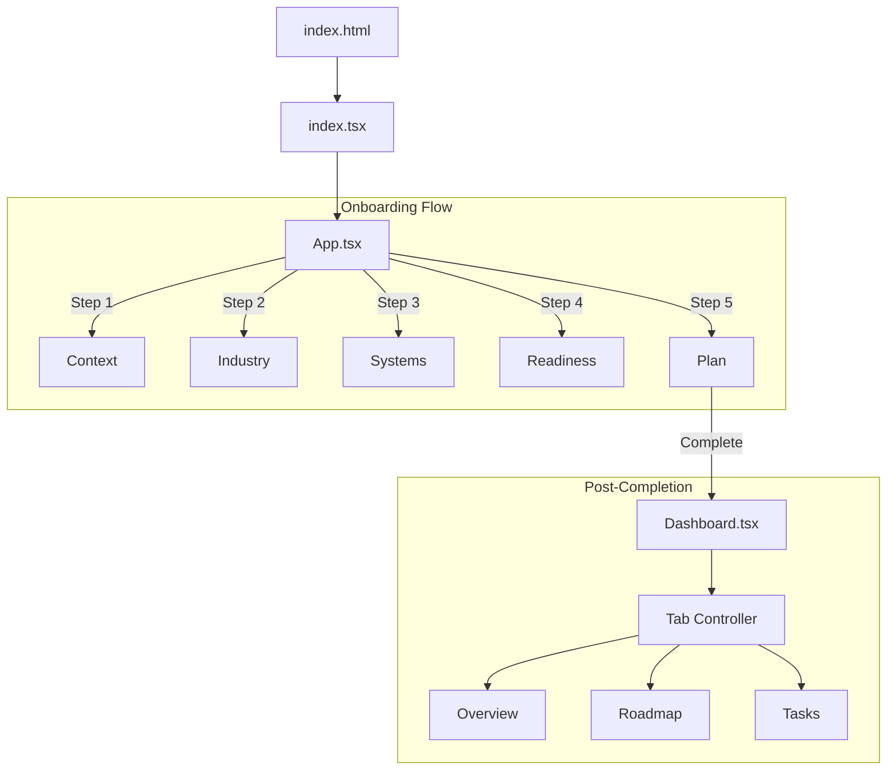
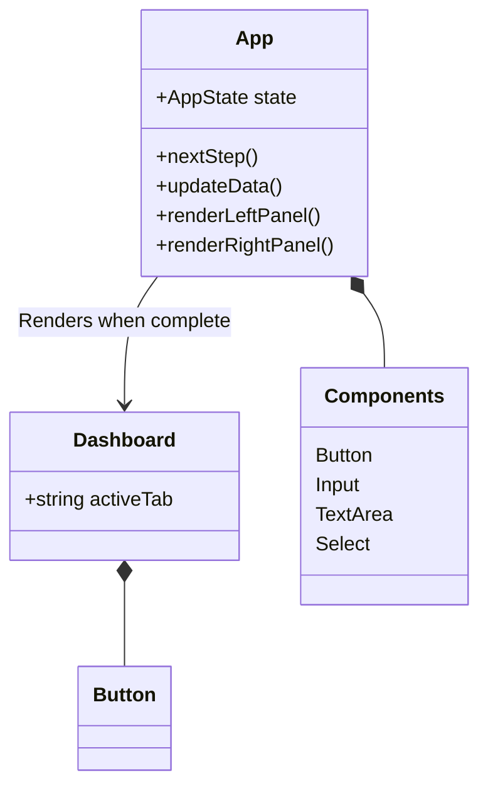
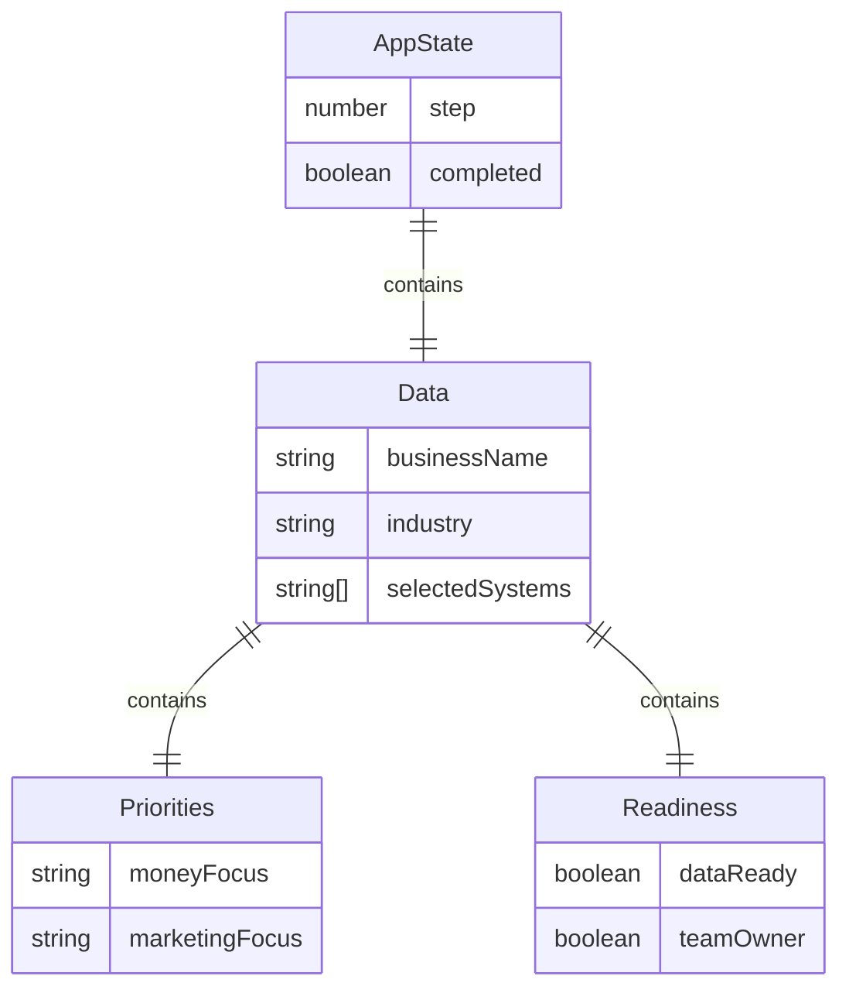

# Sun AI Agency - Application Overview

## 1. Tech Stack & Versions

### Core Frameworks
- **Runtime**: Browser (ES Modules)
- **Framework**: React `^19.2.3` (via ESM)
- **Language**: TypeScript (TSX)
- **Build Tool**: Vite (Implied)

### UI & Styling
- **Styling Engine**: Tailwind CSS (v3.x via CDN script)
- **Fonts**: 
  - Inter (Sans-serif)
  - Playfair Display (Serif)
  - Lora (Editorial)
- **Icons**: Lucide React `^0.562.0`
- **Charts**: Recharts `^3.6.0`

### Import Management
- **Strategy**: Native ES Modules via `<script type="importmap">` in `index.html`.
- **CDN**: `esm.sh` is used for React, ReactDOM, Recharts, and Lucide.

---

## 2. Directory Structure

```text
/
├── index.html              # Entry point, Import Maps, Tailwind Config
├── index.tsx               # React Root Mount
├── App.tsx                 # Main Application Logic & Wizard State Router
├── types.ts                # TypeScript Interfaces & Constants
├── metadata.json           # Application Metadata
├── docs/
│   └── 01-overview.md      # This documentation
└── components/
    ├── Button.tsx          # Reusable Button Component
    ├── Input.tsx           # Input, TextArea, Select Components
    ├── Dashboard.tsx       # Post-onboarding Dashboard View
```

---

## 3. Routing & Navigation

**Current Implementation: State-Based Routing**
The application currently operates as a strict Single Page Application (SPA) without an external routing library (like `react-router-dom`). Navigation is handled entirely via React State (`useState`) within `App.tsx`.

### Logic Flow
1.  **Entry**: `App.tsx` initializes `AppState`.
2.  **Wizard Phase**: 
    - `state.completed === false`
    - View relies on `state.step` (Integers 1-5).
3.  **Dashboard Phase**:
    - `state.completed === true`
    - View renders `<Dashboard />`.
    - Inside Dashboard, sub-views (Overview, Roadmap, etc.) are handled by `activeTab` state.

---

## 4. Workflows & Features

### A. The Core Wizard (Onboarding)
A 5-step process designed to qualify businesses and set up their AI strategy.

| Step | Screen Name | Feature Description |
| :--- | :--- | :--- |
| **01** | **Business Context** | Captures Name, Website, Industry, Description. Dynamic left/right panel context. |
| **02** | **Industry Deep Dive** | Dynamic questions based on `IndustryType` (SaaS, Fashion, Real Estate, etc.). |
| **03** | **System Selection** | Selection of up to 3 AI modules (Lead Gen, Content, CRM, etc.). |
| **04** | **Readiness Check** | Checklist for Data, Team, Tools, Budget. Visual Score calculation (0-100). |
| **05** | **30-Day Plan** | Strategic roadmap display based on previous inputs. |

### B. The Dashboard
Displayed after wizard completion. Contains placeholders for future functionality.

- **Overview**: KPI cards (System Status, Pending Tasks, Readiness) + Activity Feed.
- **Roadmap**: Placeholder tab.
- **Tasks**: Placeholder tab.
- **Systems**: Placeholder tab.
- **Settings**: Placeholder tab.

---

## 5. Architectural Diagrams (Mermaid)

### Application Flow


### Component Hierarchy


### Data Model (State)


## 6. Frontend / Backend Split

- **Frontend**: 100% Client-side. All state is held in memory. Refreshing the browser resets the wizard.
- **Backend**: Currently **None**. All logic is local.
- **API Integration**: None. The "AI Intelligence" text in the right panel is static/hardcoded based on conditional logic in `App.tsx`.
