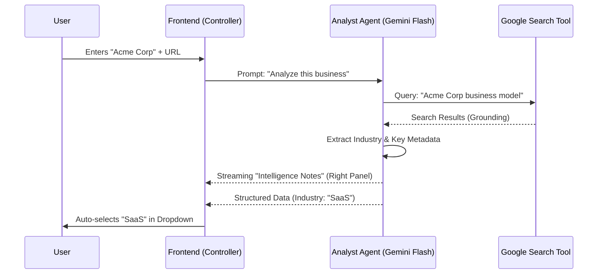
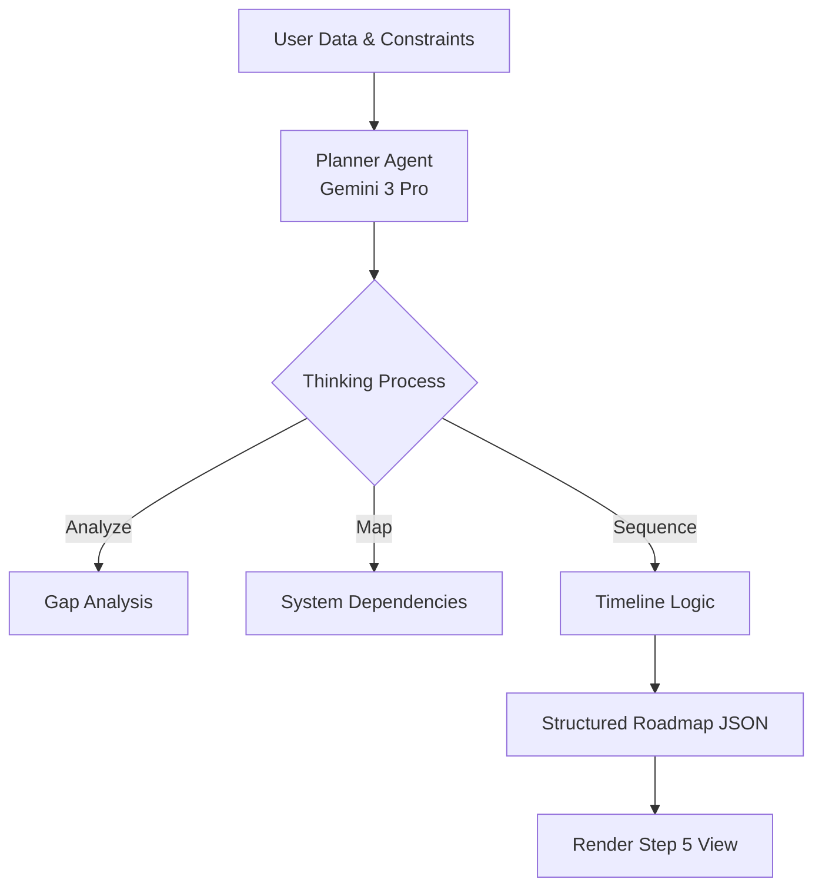

# Sun AI Agency - Intelligent Architecture & Roadmap v2

**Version:** 2.0 (Agentic Architecture)
**Focus:** Gemini 3 Integration & Autonomous Workflows

---

## 🟢 Live Progress Tracker

### Core Wizard Screens (Frontend + AI)
| Screen / Agent | UI Status | Logic | AI Model | Capabilities |
| :--- | :---: | :---: | :---: | :--- |
| **1. Business Context** | ✅ Ready | ✅ Ready | `gemini-3-flash` | Google Search Grounding, Analyst Agent |
| **2. Industry Deep Dive** | ✅ Ready | 🟡 Mocked | `gemini-3-flash` | Structured Outputs, Extractor Agent |
| **3. System Selection** | ✅ Ready | ✅ Ready | `gemini-3-flash` | Optimizer Agent |
| **4. Readiness Check** | ✅ Ready | 🟡 Basic | `gemini-3-flash` | Scorer Agent, Structured Outputs |
| **5. 30-Day Plan** | ✅ Ready | 🟡 Mocked | `gemini-3-pro` | **Gemini Thinking**, Planner Agent |

### Dashboard Screens
| View | UI Status | Data Source |
| :--- | :---: | :---: |
| **Overview** | ✅ Static | `AppState` |
| **Roadmap** | 🟡 Partial | Generated JSON |
| **Tasks** | 🟡 Partial | Generated JSON |

---

## 🧠 AI Agent Architecture

The application uses a **Multi-Agent Orchestration** pattern where the Frontend (`App.tsx`) acts as the **Controller**, dispatching tasks to specialized AI Agents based on user progress.

### Agent Types & Responsibilities

1.  **🕵️ Analyst Agent** (Step 1 & 2)
    *   **Role**: Research & Discovery.
    *   **Model**: `gemini-3-flash-preview`
    *   **Tools**: `googleSearch`, `URL Context`
    *   **Task**: Verify business existence, detect industry vertical, analyze website content.
    *   **Output**: Industry classification, business summary.

2.  **⚖️ Optimizer Agent** (Step 3)
    *   **Role**: Recommendation Engine.
    *   **Model**: `gemini-3-flash-preview`
    *   **Task**: Map user pain points (from Step 2) to predefined System solutions.
    *   **Output**: Ranked list of recommended systems with custom "Revenue Impact" justification.

3.  **💯 Scorer Agent** (Step 4)
    *   **Role**: Risk Assessment.
    *   **Model**: `gemini-3-flash-preview`
    *   **Capabilities**: **Structured Outputs** (JSON)
    *   **Task**: Analyze checklist data to calculate a weighted score and identify "Critical Gaps".
    *   **Output**: JSON object with `score`, `risks[]`, and `wins[]`.

4.  **📅 Planner Agent** (Step 5)
    *   **Role**: Strategic Execution.
    *   **Model**: `gemini-3-pro-preview`
    *   **Capabilities**: **Gemini Thinking** (`thinkingBudget: 1024`)
    *   **Task**: Generate a bespoke 30-day implementation roadmap.
    *   **Output**: Complex JSON structure for the Roadmap/Gantt view.

5.  **💬 Narrator Agent** (Right Panel)
    *   **Role**: User Experience & Trust.
    *   **Model**: `gemini-3-flash-preview`
    *   **Task**: Stream real-time observations to the Right Panel to transparently show the AI's reasoning.
    *   **Output**: Streaming text (Markdown).

---

## 📐 Workflow Diagrams

### 1. The "Analyst" Workflow (Step 1)
How the UI interacts with the AI to verify a business.



### 2. The "Planner" Workflow (Step 5)
Using Gemini Thinking to generate the roadmap.



---

## 🚀 Phased Execution Plan

### Phase 1: The Intelligent Core (Current)
**Goal:** Replace mock data with live Agent interactions.

*   **Step 1 Integration**:
    *   [ ] Implement `googleSearch` tool for URL verification.
    *   [ ] Stream responses to the Right Panel.
*   **Step 2 Integration**:
    *   [ ] Use `responseSchema` to generate 3 dynamic questions based on Industry.
*   **Step 5 Integration**:
    *   [ ] Implement `gemini-3-pro` with `thinkingConfig` to generate the final JSON plan.

### Phase 2: Deep Research & RAG
**Goal:** Allow the AI to read uploaded documents or crawl entire sites.

*   **Deep Research Agent**:
    *   [ ] **URL Context Tool**: Pass full website content to the model context.
    *   [ ] **Retriever**: Implement RAG for uploaded internal strategy PDFs.

### Phase 3: Dashboard & "Action" Agents
**Goal:** Turn the plan into action.

*   **Orchestrator Agent**:
    *   [ ] Monitors the "Tasks" tab in the dashboard.
    *   [ ] **Function Calling**: Triggers external APIs (e.g., "Draft Welcome Email", "Setup CRM").
*   **Code Execution**:
    *   [ ] Use Gemini's code execution to calculate complex ROI projections based on user data.

---

## 🛠 Technical Implementation Details

### API Configuration
All agents will share a common client wrapper but use different configs.

```typescript
// Example: Analyst Agent Config
const analystConfig = {
  model: 'gemini-3-flash-preview',
  tools: [{ googleSearch: {} }],
  generationConfig: { responseMimeType: 'application/json' }
};

// Example: Planner Agent Config
const plannerConfig = {
  model: 'gemini-3-pro-preview',
  config: {
    thinkingConfig: { thinkingBudget: 2048 } // Allow deep thought for strategy
  }
};
```

### State Management (`AppState`)
The `AppState` acts as the "Short-term Memory" for the agents.
1.  **Accumulation**: Each step adds data to `AppState`.
2.  **Context Window**: When calling the *Planner Agent* (Step 5), the entire `AppState` JSON is passed as context.

---

## 📉 Risks & Guardrails

1.  **Latency in Planning**:
    *   *Risk*: Gemini Thinking takes 5-10s.
    *   *Mitigation*: UI must show a "Building Strategy..." loader with streaming updates from the Narrator Agent.
2.  **Context Window Limits**:
    *   *Risk*: Deep crawling of websites exceeds tokens.
    *   *Mitigation*: Use the *Analyst Agent* to summarize site content into a compact abstract before passing to the *Planner*.
