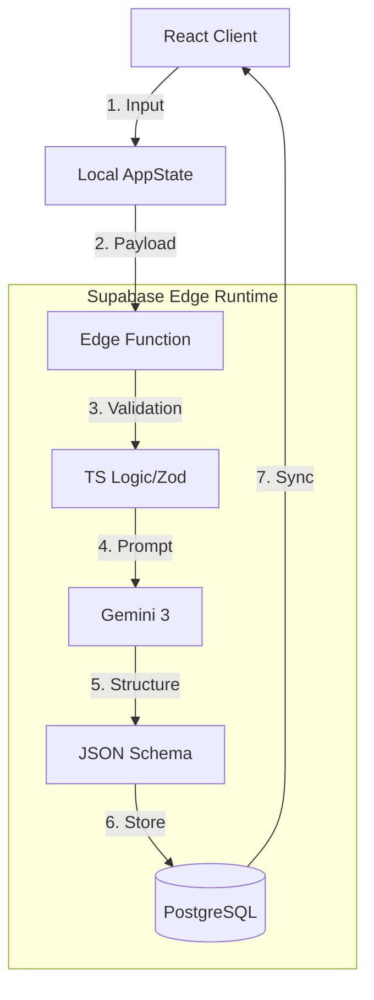

# 01. System Wiring Audit & Architecture

**Ref:** Original Plan 18
**Context:** Verifying data flow between React, Supabase, and Gemini.

---

## 1. System Wiring Overview

The architecture must enforce a **Deterministic Core** wrapping a **Probabilistic AI Layer**.

### Data Flow Diagram

### Critical Rules
1.  **Frontend:** Never speaks to Gemini directly (Security).
2.  **Backend:** Edge Functions act as the "Brain" and "Proxy".
3.  **Database:** Is the single source of truth; Frontend just renders DB state.

---

## 2. Wizard Wiring Audit

| Step | Inputs | Agent | Expected Output | Current Gap |
| :--- | :--- | :--- | :--- | :--- |
| **01 Context** | `url`, `name` | **Analyst** | `industry`, `maturity_score` | **CRITICAL:** Agent is running client-side. |
| **02 Diag** | `industry` | **Extractor** | `DiagnosticQuestion[]` | Data not saved to `wizard_answers` table. |
| **03 Sys** | `painPoints` | **Optimizer** | `recommendedIds[]` | Recommendations not persisted. |
| **04 Brief** | `checklist` | **Scorer** | `readinessScore` (0-100) | Score is calculated but not stored. |
| **05 Plan** | `FullState` | **Planner** | `RoadmapPhase[]` | Complex JSON plan lives only in memory. |

---

## 3. Dashboard Wiring Audit

### Data Hydration Issues
- **Source of Truth:** Currently `localStorage`. Must be `supabase.from('projects')`.
- **Realtime:** Missing `supabase.channel()` subscriptions for Tasks and Notifications.

### Interactive Elements
- **Optimistic UI:** CRM tab has good optimistic updates. Projects tab is read-only mocks.
- **Permissions:** No check for `org_id` isolation in current mock hooks.

---

## 4. Success Criteria for Production

- [ ] **Zero Client Secrets:** No `GOOGLE_API_KEY` in browser bundles.
- [ ] **Persistence:** Browser refresh restores state from DB, not LocalStorage.
- [ ] **Tracing:** Every AI action creates a row in `ai_run_logs`.
- [ ] **Type Safety:** Shared types between Edge Functions and React Client.
