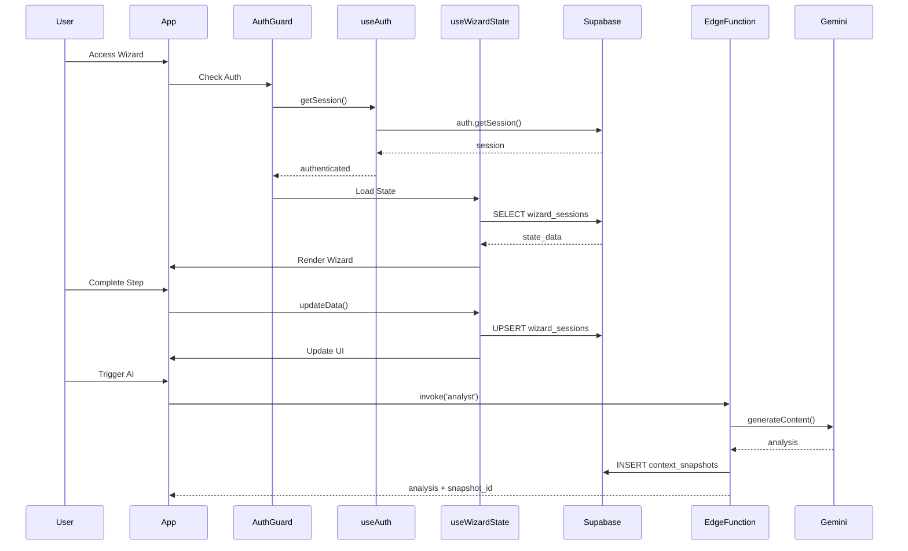
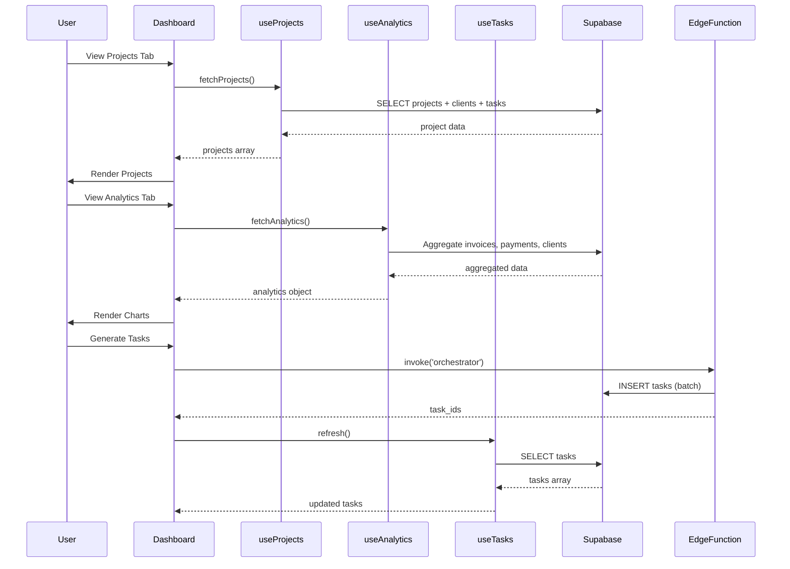
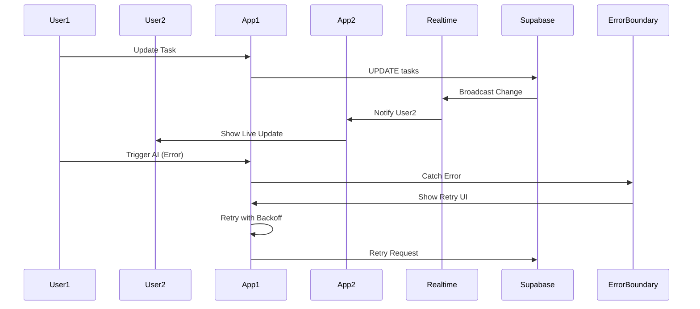

# 3-Phase Remediation Prompts

**Date:** January 9, 2025  
**Role:** Senior Full-Stack Architect  
**Project:** Sun AI Agency

---

#### Task 1.5: Migrate Wizard State to Database

**File:** `hooks/useWizardState.ts`

**Prompt:**
```
Refactor hooks/useWizardState.ts to use Supabase database instead of localStorage.

1. Remove all localStorage.getItem and localStorage.setItem calls (lines 10, 33)
2. Import supabase from services/supabase.ts
3. Import useAuth hook
4. Add state: saving (boolean), loading (boolean), error (string | null)
5. On mount (useEffect):
   - Get user from useAuth()
   - If user exists, query wizard_sessions table:
     * Filter by org_id = user.org_id (or user.user_metadata.org_id)
     * Order by updated_at desc, limit 1
     * If found: parse state_data JSONB and setState
     * If not found: use INITIAL_STATE
   - Set loading to false
6. Create saveState async function:
   - Get user from useAuth()
   - If no user, return early (don't save)
   - Upsert to wizard_sessions table:
     * org_id: user.org_id or user.user_metadata.org_id
     * user_id: user.id
     * current_step: state.step
     * state_data: JSON.stringify(state) as JSONB
     * updated_at: now()
   - Use conflict resolution on (org_id, user_id) or primary key
   - Handle errors and set error state
7. Call saveState:
   - Inside updateData (debounce 500ms)
   - Inside updateNestedData (debounce 500ms)
   - After setState step changes (immediate)
   - After setRoadmap (immediate)
8. Add debounce utility or use lodash.debounce
9. Show saving indicator in UI if needed
10. Handle errors: log to console, show user notification
```

#### Task 1.6: Persist Wizard Answers

**File:** `components/wizard/Step2Diagnostics.tsx`

**Prompt:**
```
Update components/wizard/Step2Diagnostics.tsx to save answers to database.

1. Import supabase from services/supabase.ts
2. Import useAuth hook
3. On each answer change (onChange handler):
   - Get user from useAuth()
   - Get wizard_session_id from parent (pass via props or context)
   - Debounce the save operation (300ms)
   - Upsert to wizard_answers table:
     * wizard_session_id: from parent
     * question_id: from question object
     * answer_value: JSON.stringify(answer) as JSONB
     * updated_at: now()
   - Use conflict on (wizard_session_id, question_id)
4. On component mount:
   - Load existing answers from wizard_answers table
   - Filter by wizard_session_id
   - Pre-populate form fields with saved answers
5. Handle loading and error states
6. Show save indicator if needed
```

#### Task 1.7: Persist Roadmap

**File:** `components/wizard/Step5Plan.tsx`

**Prompt:**
```
Update components/wizard/Step5Plan.tsx to save roadmap to database after generation.

1. Import supabase from services/supabase.ts
2. Import useAuth hook
3. After planner Edge Function returns roadmap JSON:
   - Get user from useAuth()
   - Get active context_snapshot_id (from state or query)
   - Insert into roadmaps table:
     * org_id: user.org_id
     * snapshot_id: active context_snapshot_id
     * roadmap_data: JSON.stringify(roadmap) as JSONB
     * created_at: now()
     * is_active: true
   - Get returned roadmap.id
   - For each phase in roadmap.phases array:
     * Insert into roadmap_phases table:
       - roadmap_id: from above
       - phase_number: index + 1
       - phase_name: phase.name
       - phase_data: JSON.stringify(phase) as JSONB
       - start_date: phase.startDate if exists
       - end_date: phase.endDate if exists
   - Deactivate previous roadmaps: UPDATE roadmaps SET is_active = false WHERE org_id = ? AND id != ?
   - Use transaction or batch operations for atomicity
4. Show save status: "Saving...", "Saved", or error message
5. Handle errors: show notification, allow retry
6. Store roadmap_id in state for later reference
```

---

### B. Edge Function Tasks

#### Task 1.8: Add Database Writes to Analyst Function

**File:** `supabase/functions/analyst/index.ts`

**Prompt:**
```
Update supabase/functions/analyst/index.ts to write analysis results to database.

1. After successful business analysis (in 'classify' mode):
   - Get user from request headers (Authorization Bearer token)
   - Extract org_id from user metadata or query profiles table
   - Insert into context_snapshots table:
     * org_id: from user
     * project_id: from request body if provided
     * snapshot_type: 'business_analysis'
     * snapshot_data: JSON.stringify(analysisResult) as JSONB
     * is_active: true
   - Deactivate previous snapshots: UPDATE context_snapshots SET is_active = false WHERE org_id = ? AND project_id = ? AND id != ?
   - Update clients table if client exists:
     * SET industry = analysisResult.detected_industry WHERE id = client_id
     * SET maturity_score = analysisResult.maturity_score WHERE id = client_id
2. Return snapshot_id in response JSON
3. Handle errors: log to console, return 500 with error message
4. Use Supabase client from _shared/supabase.ts
```

#### Task 1.9: Add Database Writes to Planner Function

**File:** `supabase/functions/planner/index.ts`

**Prompt:**
```
Update supabase/functions/planner/index.ts to write roadmap to database.

1. After successful roadmap generation:
   - Get user from request headers
   - Extract org_id from user
   - Get snapshot_id from request body
   - Insert into roadmaps table:
     * org_id: from user
     * snapshot_id: from request
     * roadmap_data: JSON.stringify(roadmap) as JSONB
     * created_at: now()
     * is_active: true
   - Get returned roadmap.id
   - For each phase in roadmap.phases:
     * Insert into roadmap_phases table with roadmap_id foreign key
   - Deactivate previous roadmaps for same project
   - Use transaction for atomicity (BEGIN/COMMIT)
2. Return { roadmap_id, phase_ids: [...] } in response
3. Handle errors with rollback
```

#### Task 1.10: Add Database Writes to Scorer Function

**File:** `supabase/functions/scorer/index.ts`

**Prompt:**
```
Update supabase/functions/scorer/index.ts to write readiness score to database.

1. After readiness analysis:
   - Get user and org_id from request
   - Find active context_snapshot for project (WHERE org_id = ? AND is_active = true)
   - If snapshot exists:
     * UPDATE context_snapshots SET:
       - readiness_score = analysisResult.score
       - metrics = JSON.stringify(analysisResult.metrics) as JSONB
       - updated_at = now()
   - If no snapshot exists:
     * INSERT new context_snapshot with readiness data
2. Return updated snapshot data in response
3. Handle errors gracefully
```

---

### C. Database/RLS Tasks

#### Task 1.11: Verify RLS Policies

**File:** Database migration (create new if needed)

**Prompt:**
```
Verify RLS policies exist and are correct for wizard persistence tables.

1. Check wizard_sessions table:
   - Policy: Users can SELECT/INSERT/UPDATE their own sessions (WHERE org_id = auth.jwt() ->> 'org_id')
   - Policy: Users can SELECT/INSERT/UPDATE sessions where user_id = auth.uid()
2. Check wizard_answers table:
   - Policy: Users can SELECT/INSERT/UPDATE answers linked to their wizard_sessions
   - Use JOIN with wizard_sessions for org_id check
3. Check roadmaps table:
   - Policy: Users can SELECT/INSERT/UPDATE roadmaps where org_id matches
4. Check context_snapshots table:
   - Policy: Users can SELECT/INSERT/UPDATE snapshots where org_id matches
5. Test policies with different user contexts
6. Create migration if policies are missing or incorrect
```

---

### Phase 1 Mermaid Diagram



---

## Phase 2: Dashboard Integration & Edge Function Database Writes

**Goal:** Connect all dashboard tabs to real database queries and add DB writes to Edge Functions  
**Timeline:** 5-6 days  
**Priority:** 🟡 HIGH

---

### A. Frontend Tasks

#### Task 2.1: Connect Projects Tab to Database

**File:** `hooks/useProjects.ts`

**Prompt:**
```
Refactor hooks/useProjects.ts to query Supabase instead of using MOCK_PROJECTS.

1. Remove MOCK_PROJECTS constant (line 6)
2. Import supabase from services/supabase.ts
3. Import useAuth hook
4. In useEffect:
   - Get user from useAuth()
   - Query projects table:
     * SELECT projects.*, clients.name as client_name, clients.*, tasks.*
     * FROM projects
     * LEFT JOIN clients ON projects.client_id = clients.id
     * LEFT JOIN tasks ON tasks.project_id = projects.id
     * WHERE projects.org_id = user.org_id
     * AND projects.status != 'archived'
     * ORDER BY projects.created_at DESC
   - Transform DB response to Project[] interface:
     * Map projects array
     * Group tasks by project_id
     * Handle null/undefined values
   - Set projects state
   - Set loading to false
5. Implement updateProjectStatus:
   - Use supabase.from('projects').update({ status }).eq('id', id)
   - Add optimistic update: setProjects immediately
   - On error: rollback optimistic update, show error
6. Implement updateTaskStatus:
   - Use supabase.from('tasks').update({ status }).eq('id', taskId)
   - Add optimistic update
   - Handle errors
7. Add error state handling
```

#### Task 2.2: Connect Analytics Tab to Database

**File:** `hooks/useAnalytics.ts`

**Prompt:**
```
Refactor hooks/useAnalytics.ts to query Supabase instead of using MOCK_ANALYTICS.

1. Remove MOCK_ANALYTICS constant (line 5)
2. Import supabase from services/supabase.ts
3. Import useAuth hook
4. Create async function fetchAnalytics():
   - Get user from useAuth()
   - Query invoices table:
     * SELECT status, SUM(amount) as total, COUNT(*) as count
     * FROM invoices
     * WHERE org_id = user.org_id
     * GROUP BY status
   - Query payments table:
     * SELECT DATE(created_at) as date, SUM(amount) as total
     * FROM payments
     * WHERE org_id = user.org_id
     * AND created_at >= NOW() - INTERVAL '90 days'
     * GROUP BY DATE(created_at)
     * ORDER BY date ASC
   - Query clients table:
     * SELECT COUNT(*) FILTER (WHERE status = 'active') as active_count
     * FROM clients
     * WHERE org_id = user.org_id
   - Query projects table:
     * SELECT status, COUNT(*) as count
     * FROM projects
     * WHERE org_id = user.org_id
     * GROUP BY status
   - Combine into AnalyticsData structure:
     * revenue: payments grouped by month
     * clients: client counts by month (use DATE_TRUNC)
     * summary: totals and growth calculations
     * insights: static array for now
5. Call fetchAnalytics in useEffect
6. Cache results for 5 minutes (use timestamp check)
7. Handle loading and error states
```

#### Task 2.3: Create Tasks Hook

**File:** `hooks/useTasks.ts` (create new)

**Prompt:**
```
Create hooks/useTasks.ts for task management with database persistence.

1. Import supabase, useAuth, useState, useEffect
2. State: tasks (Task[]), loading (boolean), error (string | null)
3. In useEffect:
   - Get user from useAuth()
   - Query tasks table:
     * SELECT tasks.*, roadmap_phases.phase_name
     * FROM tasks
     * LEFT JOIN roadmap_phases ON tasks.phase_id = roadmap_phases.id
     * WHERE tasks.org_id = user.org_id
     * ORDER BY tasks.priority DESC, tasks.created_at ASC
   - Set tasks state
4. Implement createTask(task: Partial<Task>):
   - Insert into tasks table with org_id, required fields
   - Add optimistic update
   - Handle errors
5. Implement updateTask(id: string, updates: Partial<Task>):
   - Update tasks table
   - Add optimistic update
   - Handle errors
6. Implement deleteTask(id: string):
   - Soft delete: UPDATE tasks SET status = 'archived' WHERE id = ?
   - Add optimistic update
7. Return { tasks, loading, error, createTask, updateTask, deleteTask }
```

#### Task 2.4: Connect Overview Tab to Database

**File:** `hooks/useOverview.ts` (create new)

**Prompt:**
```
Create hooks/useOverview.ts to query dashboard overview data.

1. Import supabase, useAuth, useState, useEffect
2. State: snapshot (ContextSnapshot | null), roadmap (Roadmap | null), loading, error
3. In useEffect:
   - Get user from useAuth()
   - Query context_snapshots:
     * SELECT * FROM context_snapshots
     * WHERE org_id = user.org_id AND is_active = true
     * ORDER BY created_at DESC LIMIT 1
   - Query roadmaps:
     * SELECT roadmaps.*, roadmap_phases.*
     * FROM roadmaps
     * LEFT JOIN roadmap_phases ON roadmap_phases.roadmap_id = roadmaps.id
     * WHERE roadmaps.org_id = user.org_id
     * AND roadmaps.is_active = true
     * ORDER BY roadmaps.created_at DESC LIMIT 1
   - Query tasks count:
     * SELECT COUNT(*) FROM tasks WHERE org_id = user.org_id AND status != 'archived'
   - Combine into overview data structure
4. Return { snapshot, roadmap, tasksCount, loading, error }
```

#### Task 2.5: Update Dashboard Components to Use Hooks

**Files:** `components/dashboard/Overview.tsx`, `components/dashboard/Projects/ProjectList.tsx`, `components/dashboard/Analytics/AnalyticsLayout.tsx`, `components/dashboard/TaskBoard.tsx`

**Prompt:**
```
Update dashboard components to use new database-connected hooks.

1. Overview.tsx:
   - Import useOverview hook
   - Replace state.aiState reads with useOverview()
   - Display real data from database
   - Show empty states when no data

2. ProjectList.tsx:
   - Import useProjects hook
   - Replace MOCK_PROJECTS with useProjects()
   - Connect task operations to database

3. AnalyticsLayout.tsx:
   - Import useAnalytics hook
   - Replace MOCK_ANALYTICS with useAnalytics()
   - Display real revenue and metrics

4. TaskBoard.tsx:
   - Import useTasks hook
   - Replace state.dashboardState.tasks with useTasks()
   - Connect task CRUD to database operations
```

---

### B. Edge Function Tasks

#### Task 2.6: Add Database Writes to Extractor Function

**File:** `supabase/functions/extractor/index.ts`

**Prompt:**
```
Update supabase/functions/extractor/index.ts to optionally save questions metadata.

1. After generating diagnostic questions:
   - If wizard_session_id provided in request:
     * Optionally store question metadata in wizard_answers or separate table
     * Link questions to session for reference
2. Return questions as before (no breaking changes)
3. Keep function idempotent
```

#### Task 2.7: Add Database Writes to Optimizer Function

**File:** `supabase/functions/optimizer/index.ts`

**Prompt:**
```
Update supabase/functions/optimizer/index.ts to save system recommendations.

1. After generating recommendations:
   - Get user and org_id from request
   - Get project_id from request body if available
   - For each recommended system:
     * Upsert into project_systems table:
       - project_id: from request
       - system_id: from recommendation
       - is_recommended: true
       - is_selected: false (user selects later)
       - recommendation_data: JSON.stringify(recommendation) as JSONB
     * Use conflict on (project_id, system_id)
2. Return recommendations as before
3. Handle errors gracefully
```

#### Task 2.8: Create Orchestrator Edge Function for Tasks

**File:** `supabase/functions/orchestrator/index.ts`

**Prompt:**
```
Update supabase/functions/orchestrator/index.ts to generate and save tasks to database.

1. Accept request body: { roadmap_id: string, phase_id?: string }
2. Get user and org_id from request headers
3. Query roadmap_phases to get phase details
4. Use Gemini to generate tasks based on phase:
   - Model: gemini-3-flash-preview
   - Prompt: Generate actionable tasks for phase {phase_name}
   - Use structured output schema for Task[]
5. For each generated task:
   - Insert into tasks table:
     * org_id: from user
     * phase_id: from request
     * roadmap_id: from request
     * title: from generated task
     * description: from generated task
     * status: 'todo'
     * priority: from generated task or 'medium'
     * created_at: now()
6. Return { task_ids: [...], count: number }
7. Handle errors and return appropriate status codes
8. Use transaction for atomicity
```

---

### C. Database/RLS Tasks

#### Task 2.9: Verify Dashboard Table RLS Policies

**Prompt:**
```
Verify RLS policies for dashboard tables.

1. projects table:
   - SELECT: WHERE org_id = auth.jwt() ->> 'org_id'
   - INSERT/UPDATE: Same org_id check
2. tasks table:
   - SELECT: WHERE org_id matches
   - INSERT/UPDATE: Same org_id check
3. invoices table:
   - SELECT: WHERE org_id matches
4. payments table:
   - SELECT: WHERE org_id matches
5. Test with different user contexts
6. Create migration if policies missing
```

---

### Phase 2 Mermaid Diagram



---

## Phase 3: Error Handling, Realtime & Polish

**Goal:** Add error resilience, real-time updates, and production polish  
**Timeline:** 4-5 days  
**Priority:** 🟢 MEDIUM

---

### A. Frontend Tasks

#### Task 3.1: Create Error Boundary

**File:** `components/ErrorBoundary.tsx` (create new)

**Prompt:**
```
Create components/ErrorBoundary.tsx React Error Boundary component.

1. Use React class component or react-error-boundary library
2. Implement componentDidCatch(error, errorInfo):
   - Log error to console with full context
   - Set error state
3. Render:
   - If error: Display user-friendly error message
   - Show "Retry" button that resets error state
   - Show error details in development mode only
   - Use app design system styling
4. Export as default component
```

#### Task 3.2: Add Error Boundaries to App

**File:** `App.tsx`

**Prompt:**
```
Wrap App.tsx with Error Boundaries for graceful error handling.

1. Import ErrorBoundary component
2. Wrap entire app in ErrorBoundary
3. Wrap wizard flow in separate ErrorBoundary
4. Wrap dashboard in separate ErrorBoundary
5. Each boundary should catch errors in its scope
6. Show appropriate error UI for each boundary
```

#### Task 3.3: Create Retry Utility

**File:** `utils/retry.ts` (create new)

**Prompt:**
```
Create utils/retry.ts with exponential backoff retry logic.

1. Export async function retryWithBackoff<T>:
   - Parameters: fn (() => Promise<T>), maxRetries (default 3), initialDelay (default 1000)
   - Implement exponential backoff: delay = initialDelay * 2^attempt
   - Retry on network errors or 5xx status codes
   - Return result on success
   - Throw final error after max retries
2. Support AbortController for cancellation
3. Add jitter to prevent thundering herd
4. Export type RetryOptions with configurable parameters
```

#### Task 3.4: Add Retry Logic to Services

**Files:** `services/gemini/*.ts` (all service files)

**Prompt:**
```
Add retry logic to all Edge Function calls in services/gemini/*.ts.

1. Import retryWithBackoff from utils/retry.ts
2. Wrap all supabase.functions.invoke() calls with retryWithBackoff
3. Wrap all fetch() calls (like analyst.analyzeBusinessStream) with retryWithBackoff
4. Show user notification on retry attempts
5. Show final error message if all retries fail
6. Allow manual retry button after failure
7. Use maxRetries: 3, initialDelay: 1000ms
```

#### Task 3.5: Add Timeout Handling

**Files:** `services/gemini/*.ts`

**Prompt:**
```
Add timeout handling to all AI service calls.

1. Create AbortController for each request
2. Set timeout:
   - Flash model: 30 seconds
   - Pro model: 60 seconds
3. Abort request on timeout
4. Show timeout error message to user
5. Allow retry after timeout
6. Clean up AbortController on component unmount
```

#### Task 3.6: Add Realtime Subscriptions to Tasks

**File:** `hooks/useTasks.ts`

**Prompt:**
```
Add Supabase Realtime subscriptions to hooks/useTasks.ts.

1. Import supabase and useAuth
2. In useEffect after initial data load:
   - Get user from useAuth()
   - Create channel: supabase.channel('tasks-channel')
   - Subscribe to postgres_changes:
     * Event: INSERT, UPDATE, DELETE
     * Schema: public
     * Table: tasks
     * Filter: org_id = user.org_id
   - On INSERT: add task to state
   - On UPDATE: update task in state
   - On DELETE: remove task from state
   - Handle conflicts with optimistic updates
3. Show connection indicator (connected/disconnected)
4. Clean up subscription on unmount
5. Handle reconnection automatically
```

#### Task 3.7: Add Realtime Subscriptions to Projects

**File:** `hooks/useProjects.ts`

**Prompt:**
```
Add Supabase Realtime subscriptions to hooks/useProjects.ts.

1. Create channel for projects table
2. Subscribe to UPDATE events on projects table
3. Filter by org_id
4. Update local state on realtime events
5. Handle connection errors
6. Show connection status
```

#### Task 3.8: Add Realtime Subscriptions to CRM

**File:** `hooks/useCRM.ts`

**Prompt:**
```
Add Supabase Realtime subscriptions to hooks/useCRM.ts.

1. Create channels for crm_contacts and crm_deals tables
2. Subscribe to INSERT, UPDATE, DELETE events
3. Filter by org_id
4. Update local state on realtime events
5. Update Kanban board in real-time
6. Show notification when contact/deal updated by another user
```

#### Task 3.9: Add Realtime Subscriptions to Analytics

**File:** `hooks/useAnalytics.ts`

**Prompt:**
```
Add Supabase Realtime subscriptions to hooks/useAnalytics.ts.

1. Create channels for invoices and payments tables
2. Subscribe to INSERT, UPDATE events
3. Recalculate analytics on realtime events
4. Debounce recalculations (500ms) to prevent excessive updates
5. Animate chart updates smoothly
6. Show indicator when data is live
```

#### Task 3.10: Create Input Validation Schemas

**File:** `utils/validation.ts` (create new)

**Prompt:**
```
Create utils/validation.ts with Zod schemas for all form inputs.

1. Install zod package if not already installed
2. Create schemas:
   - businessContextSchema: { businessName: string, website: string, description?: string }
   - diagnosticAnswerSchema: { question_id: string, answer_value: any }
   - systemSelectionSchema: { system_ids: string[] }
   - readinessChecklistSchema: { [key: string]: boolean }
   - taskSchema: { title: string, description?: string, priority: enum, phase: string }
3. Export validation functions for each schema
4. Include error message formatting
```

#### Task 3.11: Add Validation to Wizard Components

**Files:** All wizard step components

**Prompt:**
```
Add Zod validation to all wizard step components.

1. Import validation schemas from utils/validation.ts
2. Validate inputs on blur and before submission
3. Show clear error messages for invalid inputs
4. Prevent submission if validation fails
5. Highlight invalid fields with red border
6. Show inline error messages below fields
```

---

### B. Edge Function Tasks

#### Task 3.12: Add Request Validation to Edge Functions

**Files:** All `supabase/functions/*/index.ts`

**Prompt:**
```
Add Zod request validation to all Edge Functions.

1. Install zod in Edge Function (add to deno.json imports)
2. Create Zod schemas for each function's request body
3. Validate request body on function entry (before any processing)
4. Return 400 status with error details if validation fails
5. Log validation errors for debugging
6. Create _shared/validation.ts for common schemas
7. Reuse schemas across functions where applicable
```

---

### C. Database/RLS Tasks

#### Task 3.13: Enable Realtime on Tables

**Prompt:**
```
Enable Supabase Realtime on required tables.

1. In Supabase dashboard, enable Realtime for:
   - tasks table
   - projects table
   - crm_contacts table
   - crm_deals table
   - invoices table
   - payments table
2. Verify RLS policies allow realtime subscriptions
3. Test subscriptions with multiple users
```

---

### Phase 3 Mermaid Diagram



---

## Implementation Order


1. **Phase 1 Tasks 1.5-1.7** (Persistence) - Days 2-3
2. **Phase 1 Tasks 1.8-1.10** (Edge writes) - Day 4
3. **Phase 2 Tasks 2.1-2.5** (Dashboard hooks) - Days 5-6
4. **Phase 2 Tasks 2.6-2.8** (Edge writes) - Day 7
5. **Phase 3 Tasks 3.1-3.5** (Error handling) - Day 8
6. **Phase 3 Tasks 3.6-3.9** (Realtime) - Days 9-10
7. **Phase 3 Tasks 3.10-3.12** (Validation) - Day 11

---

## Success Criteria Per Phase


- [ ] Wizard state persists across browser refresh
- [ ] Wizard answers saved to database
- [ ] Roadmap saved to database
- [ ] Edge Functions write to database

### Phase 2
- [ ] Projects tab shows real data
- [ ] Analytics tab shows real revenue
- [ ] Tasks tab reads from database
- [ ] Overview tab shows real snapshot data
- [ ] No mock data remains

### Phase 3
- [ ] Error boundaries catch all errors
- [ ] Retry logic handles temporary failures
- [ ] Timeouts prevent hangs
- [ ] Realtime subscriptions work
- [ ] Input validation prevents bad data
