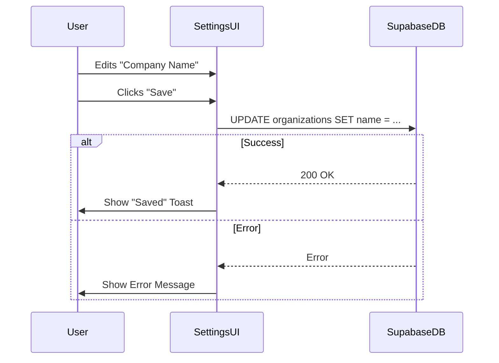

# 07. Final Production Execution Plan

**Date:** Current
**Status:** Pre-Launch
**Context:** Closing the final gaps (Settings, Storage, Deployment).

---

## 1. Progress Tracker & Screen Matrix

| Module | Screen | UI Status | Logic Status | Data Wiring | % Complete | Notes |
| :--- | :--- | :---: | :---: | :---: | :---: | :--- |
| **Wizard** | **Step 1 (Context)** | 🟢 | 🟢 | 🟢 | 100% | Full analysis & persistence working. |
| | **Step 2 (Diagnostics)** | 🟢 | 🟢 | 🟢 | 100% | Dynamic forms & answers saving. |
| | **Step 3 (Systems)** | 🟢 | 🟢 | 🟢 | 100% | Selection & ranking persistence. |
| | **Step 4 (Summary)** | 🟢 | 🟢 | 🟢 | 100% | Math scoring & snapshot saving. |
| | **Step 5 (Roadmap)** | 🟢 | 🟢 | 🟢 | 100% | Thinking mode & roadmap DB sync. |
| **Dashboard** | **Overview** | 🟢 | 🟢 | 🟢 | 100% | Reads snapshots & task counts. |
| | **CRM** | 🟢 | 🟢 | 🟢 | 100% | Full CRUD + AI Intelligence. |
| | **Projects** | 🟢 | 🟢 | 🟢 | 100% | Task & Phase management active. |
| | **Tasks** | 🟢 | 🟢 | 🟢 | 100% | Kanban & Realtime updates. |
| | **Analytics** | 🟢 | 🟢 | 🟢 | 100% | SQL Aggregations & AI Analysis. |
| | **Systems** | 🟢 | 🟡 | 🔴 | 50% | UI exists, but "Live Logs" are simulated. |
| | **Settings** | 🟢 | 🟡 | 🔴 | 30% | UI exists, but "Save" buttons do nothing. |

---

## 2. Remaining In-Progress Features

These are the final logic gaps that need to be closed before `npm run build`.

### A. Settings & Profile Management (Priority: High)
*   **Gap:** The `SettingsView.tsx` component renders user data but the "Save Configuration" buttons are not wired to Supabase `profiles` or `organizations` tables.
*   **Requirement:** Users need to be able to update their Name, Avatar, and Business Description post-wizard.

### B. System Monitor Wiring (Priority: Medium)
*   **Gap:** The `SystemsView.tsx` shows "Live Logs" which are currently hardcoded animations.
*   **Requirement:** Connect this to `ai_run_logs` table to show *actual* recent AI activity (token usage, agents run) for a "Matrix-style" effect that is real.

### C. Storage Buckets (Priority: Low/Optimization)
*   **Gap:** Step 1 file uploads currently convert to Base64 and send directly to Edge Functions. This hits payload limits for large PDFs.
*   **Requirement:** Implement Supabase Storage upload -> Generate URL -> Send URL to Edge Function.

---

## 3. Implementation Plan (Multistep Prompts)

Execute these prompts to finish the application.

### Prompt 1: Wire the Settings Tab
```text
Refactor `components/dashboard/SettingsView.tsx` to be fully functional.
1. Import `supabase` and `useAuth`.
2. Fetch `profiles` and `organizations` data on mount (or use a new `useSettings` hook).
3. Bind inputs (Name, Email, Business Name, Description) to state.
4. Implement `handleSaveProfile` to update the `profiles` table.
5. Implement `handleSaveOrg` to update the `organizations` table (if user is owner).
6. Add success/error toast notifications.
```

### Prompt 2: Real System Logs
```text
Update `components/dashboard/SystemsView.tsx`.
1. Create a subscription to the `ai_run_logs` table using Supabase Realtime.
2. Replace the hardcoded "System Logs" section with a live feed of the last 10 rows from `ai_run_logs`.
3. Display `model`, `token_count`, and `operation` (e.g., "Analyst Agent: 450 tokens").
4. Keep the visual "Terminal" aesthetic.
```

### Prompt 3: Final Deployment Config
```text
Prepare the project for deployment.
1. Create a `vercel.json` configuration file.
   - Set up rewrites for SPA (Client Side Routing).
2. Create a `supabase/config.toml` (if not exists) ensuring Edge Functions are configured.
3. Review `vite.config.ts` to ensure `env` variables are exposed correctly for production build.
```

---

## 4. Architecture Diagrams

### Final Deployment Architecture
```mermaid
graph TD
    User[Browser] -->|HTTPS| CDN[Vercel CDN]
    CDN -->|Serve| React[React App (Dist)]
    
    User -->|Data/Realtime| Supabase[Supabase Platform]
    
    subgraph Backend Services
        Supabase --> Auth[GoTrue Auth]
        Supabase --> DB[PostgreSQL]
        Supabase --> Edge[Edge Functions]
        Supabase --> Storage[File Storage]
    end
    
    Edge -->|AI Requests| Gemini[Google Gemini 3]
```

### Settings Data Flow


---

## 5. Success Criteria (Definition of Done)

### 1. Functionality
*   [ ] User can complete the Wizard (Steps 1-5) and land on Dashboard.
*   [ ] Dashboard data persists on refresh.
*   [ ] User can update their profile in Settings.
*   [ ] User can see real AI logs in the Systems tab.

### 2. Performance
*   [ ] Lighthouse Performance Score > 90.
*   [ ] First Contentful Paint < 1.5s.
*   [ ] Edge Function cold starts < 2s.

### 3. Security
*   [ ] No RLS violations in browser console.
*   [ ] No API Keys leaked in network requests.
*   [ ] "Client" role cannot see "Agency" internal notes.

---

## 6. Production Checklist

### Infrastructure
- [ ] **Environment Variables:**
    - `VITE_SUPABASE_URL`
    - `VITE_SUPABASE_ANON_KEY`
    - `SUPABASE_SERVICE_ROLE_KEY` (Edge Function Secrets)
    - `GOOGLE_API_KEY` (Edge Function Secrets)
- [ ] **Database:** Run `supabase db push` to ensure schema is live.
- [ ] **Functions:** Run `supabase functions deploy --all`.

### Quality Assurance
- [ ] **Cross-Browser:** Test in Chrome, Safari, Firefox.
- [ ] **Mobile:** Verify Wizard flow on mobile viewport (iPhone 14/15).
- [ ] **Error Handling:** Manually trigger a network error (Offline mode) and verify Error Boundary appears.

### Launch
- [ ] **Build:** Run `npm run build`.
- [ ] **Preview:** Run `npm run preview` and test the production build locally.
- [ ] **Deploy:** Connect git repository to Vercel/Netlify.
