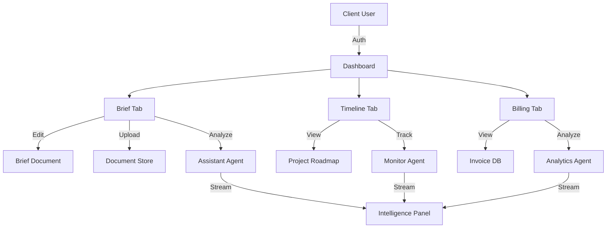
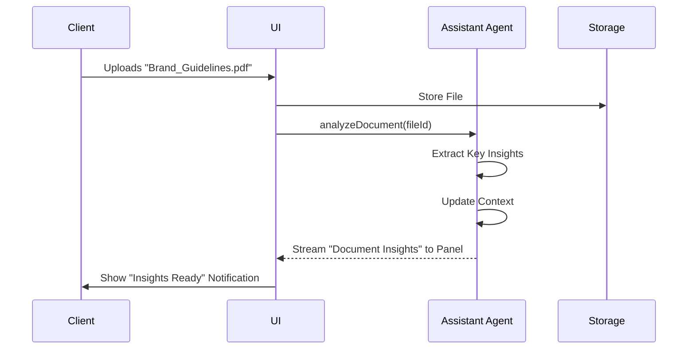

# Sun AI Agency — Client Dashboard Plan

**Date:** January 6, 2025  
**Status:** Client Dashboard Plan  
**Target Users:** External Clients  
**Access:** Shared Link or Client Authentication

---

## Client Dashboard Summary Table

| Screen | Content | Purpose | Goals | Gemini 3 Model | Google Search | Structured Output | Streaming | Function Calling | AI Agent |
|--------|---------|---------|-------|----------------|---------------|-------------------|-----------|------------------|----------|
| **Brief Tab** | Editable Brief + Document Upload | Client brief management | Review brief, make changes, upload documents, track changes | Flash | ❌ No | ❌ No | ✅ Optional | ✅ Optional | Assistant Agent |
| **Timeline Tab** | Project Timeline Visualization | Project timeline visibility | View phases, milestones, progress, dependencies | Flash | ❌ No | ❌ No | ❌ No | ❌ No | Monitor Agent |
| **Billing Tab** | Billing Information & Invoices | Billing transparency | View invoices, payment status, billing history | Flash | ❌ No | ❌ No | ❌ No | ❌ No | Analytics Agent |

---

## Architecture & Data Flow

---

## Screen 1: Brief Tab (Main Focus)

### Content

**Left Panel (20%):**
- Project summary (company name, industry, current phase)
- Brief status (draft, in review, approved)
- Last updated timestamp
- Change history indicator

**Center Panel (50%):**
- **Brief Editor Section:**
  - Editable brief content (rich text editor)
  - Executive summary (editable)
  - Project goals (editable bullet points)
  - Scope and requirements (editable)
  - Success criteria (editable)
  - Save button (saves changes, triggers notification to agency)
  
- **Document Upload Section:**
  - Drag-and-drop file upload area
  - File list showing uploaded documents
  - Document categories (Briefs, Requirements, Assets, Reference)
  - Document preview and download
  - Delete document option (with confirmation)
  - File type support (PDF, DOCX, XLSX, images, text files)
  - File size limit indicator (25MB per file)
  
- **Change Tracking:**
  - Version history (shows previous brief versions)
  - Change indicators (highlighted changes)
  - Compare versions option
  - Change comments (client and agency comments)

**Right Panel (30%):**
- **Intelligence Panel:**
  - Brief summary (AI-generated summary of current brief)
  - Change analysis (what changed in latest update)
  - Document insights (extracted insights from uploaded documents)
  - Recommendations (AI suggestions based on brief content)
  - Contextual help (how to use the brief editor)
  
- **Activity Feed:**
  - Recent brief updates
  - Document uploads
  - Agency comments
  - Status changes

### Purpose

Provide clients with the main hub for project brief management. This is the primary interface where clients can review and edit the strategic brief, upload supporting documents, and track changes over time. The brief tab serves as the single source of truth for project understanding and requirements.

### Goals

1. **Brief Management:** Allow clients to review, edit, and save project brief
2. **Document Organization:** Enable document upload, categorization, and management
3. **Change Tracking:** Track all brief changes with version history
4. **Collaboration:** Enable client-agency collaboration through comments
5. **Context Building:** Extract insights from uploaded documents automatically
6. **Transparency:** Show all changes, versions, and activity in one place
7. **AI Assistance:** Provide AI-generated summaries and recommendations

### Gemini 3 Tools

**Core Tools:**
- **Streaming:** Real-time brief summary generation in right panel
- **Function Calling:** Trigger document analysis when files are uploaded

**Optional Tools:**
- **Text Generation:** AI-generated brief summaries and insights
- **RAG (Retrieval Augmented Generation):** Search uploaded documents for context
- **Interactions API:** Client assistance chat (future feature)

**Model Selection:**
- **Gemini 3 Flash:** Fast response time for brief summaries and document insights

### Document Analysis Flow

### Features

**Brief Editor Features:**
- Rich text editor with formatting options
- Editable executive summary section
- Editable project goals (bullet points)
- Editable scope and requirements section
- Editable success criteria
- Auto-save functionality (saves every 30 seconds)
- Manual save button (sends notification to agency)
- Word count indicator
- Character limit warnings (if applicable)

**Document Upload Features:**
- Drag-and-drop file upload
- Click to browse files
- Multiple file selection
- File type validation (PDF, DOCX, XLSX, images, text)
- File size validation (25MB per file limit)
- Upload progress indicators
- File preview (images, PDFs)
- Document categorization (Briefs, Requirements, Assets, Reference)
- Document metadata (filename, size, upload date, uploaded by)
- Document download functionality
- Document delete functionality (with confirmation)

**Change Tracking Features:**
- Version history (all previous brief versions)
- Change highlighting (what changed between versions)
- Compare versions (side-by-side comparison)
- Change comments (client and agency comments on changes)
- Timestamp tracking (when each change was made)
- Author tracking (who made each change)

**Intelligence Features:**
- AI-generated brief summary (updated when brief changes)
- Change analysis (what changed in latest update)
- Document insights (extracted from uploaded documents)
- Recommendations (AI suggestions based on brief content)
- Contextual help (how to use the brief editor)

**Collaboration Features:**
- Client comments on brief sections
- Agency comments visible to client
- @mentions for team members (future)
- Notification when brief is updated by agency
- Email notification when client saves changes

### Functions

**Primary Functions:**
- `save-brief-changes` — Save client edits to brief
- `upload-document` — Handle document upload and storage
- `analyze-document` — Extract insights from uploaded documents
- `generate-brief-summary` — AI-generated brief summary
- `track-changes` — Version history and change tracking

**Supporting Functions:**
- `validate-file-type` — Ensure uploaded files are supported
- `validate-file-size` — Check file size limits
- `categorize-document` — Auto-categorize uploaded documents
- `extract-document-insights` — AI extraction from documents
- `compare-versions` — Version comparison functionality
- `send-change-notification` — Notify agency of brief changes

### AI Agent: Assistant Agent

**Agent Type:** ASSISTANT  
**Model:** Gemini 3 Flash  
**Primary Responsibility:** Brief summary generation and document insights

**Input:**
- Current brief content
- Uploaded documents (when available)
- Brief change history

**Processing:**
- Generate brief summary when brief content changes
- Analyze uploaded documents for insights
- Extract key information from documents
- Compare current brief to previous versions
- Generate recommendations based on brief content
- Use Streaming for real-time updates in right panel
- Use Function Calling for document analysis

**Output:**
- Brief summary (AI-generated)
- Change analysis (what changed)
- Document insights (extracted from uploads)
- Recommendations (AI suggestions)
- Contextual help (how-to guidance)

**Use Cases:**
- Client uploads requirements document → AI extracts key requirements
- Client edits brief → AI generates updated summary
- Client compares versions → AI highlights key differences
- Client asks for help → AI provides contextual guidance

---

## Screen 2: Timeline Tab

### Content

**Left Panel (20%):**
- Project overview (company name, industry, start date)
- Current phase indicator
- Overall progress percentage
- Key milestones summary

**Center Panel (50%):**
- **Timeline Visualization:**
  - Three-phase roadmap visualization (Foundation, Implementation, Optimization)
  - Phase 1: Days 1-30 (Foundation)
  - Phase 2: Days 31-60 (Implementation)
  - Phase 3: Days 61-90 (Optimization)
  - Gantt chart visualization (Phase 2+ enhancement)
  - Milestone markers
  - Dependency lines (if applicable)
  
- **Phase Details:**
  - Phase status indicators (LOCKED, ACTIVE, COMPLETED, PAUSED)
  - Phase goals list
  - Phase tasks list (with status indicators)
  - Phase deliverables list (with status indicators)
  - Phase duration and dates
  - Phase progress percentage
  
- **Milestone Tracking:**
  - Upcoming milestones (with dates)
  - Completed milestones (with completion dates)
  - Overdue milestones (highlighted in red)
  - Milestone descriptions

**Right Panel (30%):**
- **Intelligence Panel:**
  - Timeline summary (AI-generated project status)
  - Phase insights (observations about current phase)
  - Risk alerts (if timeline is at risk)
  - Progress predictions (expected completion dates)
  
- **Activity Feed:**
  - Phase status changes
  - Milestone completions
  - Deliverable submissions
  - Task completions

### Purpose

Provide clients with clear visibility into project timeline, phase progress, and milestone tracking. This tab shows the strategic roadmap generated during the wizard, tracks execution progress, and helps clients understand what's happening, when, and what's coming next.

### Goals

1. **Timeline Visibility:** Show complete three-phase roadmap with clear timeline
2. **Progress Tracking:** Display current phase progress and overall project progress
3. **Milestone Management:** Track key milestones with dates and status
4. **Phase Transparency:** Show what's happening in each phase (goals, tasks, deliverables)
5. **Dependency Visualization:** Show phase dependencies and critical path (Phase 2+)
6. **Risk Communication:** Alert clients to timeline risks or delays
7. **Expectation Setting:** Help clients understand realistic timelines

### Gemini 3 Tools

**Core Tools:**
- **Streaming:** Real-time timeline summary generation in right panel
- **Text Generation:** AI-generated timeline insights and progress predictions

**Model Selection:**
- **Gemini 3 Flash:** Fast response time for timeline summaries and insights

### Features

**Timeline Visualization Features:**
- Three-phase roadmap visualization
- Phase status indicators (LOCKED, ACTIVE, COMPLETED, PAUSED)
- Phase progress bars (percentage complete)
- Milestone markers on timeline
- Dependency lines (Phase 2+ enhancement)
- Gantt chart visualization (Phase 2+ enhancement)
- Zoom in/out functionality (Phase 2+ enhancement)

**Phase Details Features:**
- Expandable phase sections
- Phase goals list (with completion indicators)
- Phase tasks list (with status: Todo, In Progress, Done)
- Phase deliverables list (with status: Pending, In Review, Approved, Delivered)
- Phase duration and dates
- Phase progress percentage

**Milestone Tracking Features:**
- Upcoming milestones list (with countdown)
- Completed milestones list (with checkmarks)
- Overdue milestones highlighted (red)
- Milestone descriptions and context
- Milestone completion notifications

**Progress Features:**
- Overall project progress percentage
- Current phase progress percentage
- Phase-by-phase progress breakdown
- Progress predictions (expected completion dates)
- Progress history chart (Phase 2+ enhancement)

**Intelligence Features:**
- Timeline summary (AI-generated project status)
- Phase insights (observations about current phase)
- Risk alerts (if timeline is at risk)
- Progress predictions (expected completion dates)
- Milestone reminders (upcoming milestones)

### Functions

**Primary Functions:**
- `load-timeline` — Fetch project timeline data
- `calculate-progress` — Calculate phase and overall progress
- `track-milestones` — Monitor milestone status and dates
- `generate-timeline-summary` — AI-generated timeline summary
- `detect-timeline-risks` — Identify timeline risks or delays

**Supporting Functions:**
- `format-phase-data` — Format phase data for visualization
- `calculate-phase-progress` — Individual phase progress calculation
- `identify-upcoming-milestones` — Find milestones in next 30 days
- `highlight-overdue-milestones` — Identify overdue milestones
- `generate-progress-predictions` — AI predictions for completion dates

### AI Agent: Monitor Agent

**Agent Type:** MONITOR  
**Model:** Gemini 3 Flash  
**Primary Responsibility:** Timeline monitoring and progress insights

**Input:**
- Project timeline data (phases, tasks, milestones)
- Phase status and progress
- Milestone dates and completion status
- Task completion data

**Processing:**
- Calculate phase and overall progress percentages
- Identify upcoming milestones (next 30 days)
- Detect overdue milestones
- Analyze timeline risks or delays
- Generate progress predictions
- Create timeline summary
- Use Streaming for real-time updates in right panel

**Output:**
- Timeline summary (AI-generated)
- Phase insights (current phase observations)
- Risk alerts (timeline risks identified)
- Progress predictions (expected completion dates)
- Milestone reminders (upcoming milestones)

**Use Cases:**
- Phase 1 completes → AI generates Phase 2 preview
- Milestone approaches → AI generates reminder
- Progress slows → AI detects risk and alerts
- Client views timeline → AI generates current status summary

---

## Screen 3: Billing Tab

### Content

**Left Panel (20%):**
- Billing summary (total project cost, amount paid, amount due)
- Payment status indicator (Up to Date, Pending, Overdue)
- Next payment due date
- Payment method on file (if applicable)

**Center Panel (50%):**
- **Invoice List:**
  - Invoice table with columns:
    - Invoice number
    - Invoice date
    - Due date
    - Amount
    - Status (Paid, Pending, Overdue)
    - Payment method
    - Download PDF button
  - Filter options (All, Paid, Pending, Overdue)
  - Sort options (Date, Amount, Status)
  - Search invoices (by invoice number or date)
  
- **Invoice Details (When Selected):**
  - Invoice header (invoice number, date, due date)
  - Billing address
  - Project information
  - Line items (services, phases, deliverables)
  - Subtotal, taxes, total amount
  - Payment status
  - Payment history (if partial payments)
  - Download PDF button
  - Print invoice button
  
- **Billing History:**
  - Payment history table
  - Payment date, amount, method, confirmation number
  - Receipt download links

**Right Panel (30%):**
- **Intelligence Panel:**
  - Billing summary (AI-generated billing status)
  - Payment insights (payment patterns, upcoming payments)
  - Budget analysis (spend vs budget if applicable)
  
- **Payment Information:**
  - Payment method on file (credit card, bank account)
  - Update payment method option
  - Auto-pay status (enabled/disabled)
  - Billing preferences

### Purpose

Provide clients with complete transparency into project billing, invoices, and payment status. This tab enables clients to view all invoices, track payment history, download receipts, and manage payment methods. It builds trust through transparent financial communication.

### Goals

1. **Billing Transparency:** Show all invoices, payments, and billing history
2. **Payment Tracking:** Track payment status (Paid, Pending, Overdue)
3. **Invoice Management:** Enable invoice viewing, downloading, and printing
4. **Payment Management:** Allow payment method updates and auto-pay setup
5. **Budget Visibility:** Show spend vs budget (if applicable)
6. **Trust Building:** Transparent financial communication builds client trust
7. **Self-Service:** Enable clients to handle billing inquiries independently

### Gemini 3 Tools

**Core Tools:**
- **Text Generation:** AI-generated billing summaries and payment insights
- **Code Execution:** Budget calculations and spend analysis (if applicable)

**Model Selection:**
- **Gemini 3 Flash:** Fast response time for billing summaries and insights

### Features

**Invoice Features:**
- Invoice list with all project invoices
- Invoice filtering (All, Paid, Pending, Overdue)
- Invoice sorting (Date, Amount, Status)
- Invoice search (by invoice number or date)
- Invoice detail view (line items, totals, payment status)
- Invoice PDF download
- Invoice printing
- Invoice email forwarding (future)

**Payment Features:**
- Payment status tracking (Paid, Pending, Overdue)
- Payment history table
- Payment method management (credit card, bank account)
- Auto-pay setup (recurring payments)
- Payment confirmation numbers
- Receipt download links

**Billing Summary Features:**
- Total project cost display
- Amount paid display
- Amount due display
- Payment status indicator (Up to Date, Pending, Overdue)
- Next payment due date
- Payment method on file indicator

**Budget Features (If Applicable):**
- Budget vs actual spend comparison
- Budget breakdown by phase
- Budget alerts (if approaching limit)
- Budget analysis (AI-generated insights)

**Intelligence Features:**
- Billing summary (AI-generated billing status)
- Payment insights (payment patterns, upcoming payments)
- Budget analysis (spend vs budget if applicable)
- Payment reminders (upcoming due dates)

### Functions

**Primary Functions:**
- `load-invoices` — Fetch all project invoices
- `load-payment-history` — Fetch payment history
- `download-invoice-pdf` — Generate and download invoice PDF
- `update-payment-method` — Update payment method on file
- `calculate-billing-summary` — Calculate totals (paid, due, total)

**Supporting Functions:**
- `filter-invoices` — Filter invoices by status
- `sort-invoices` — Sort invoices by date, amount, or status
- `search-invoices` — Search invoices by number or date
- `generate-billing-summary` — AI-generated billing status
- `analyze-payment-patterns` — AI analysis of payment patterns
- `calculate-budget-analysis` — Budget vs actual spend calculation

### AI Agent: Analytics Agent

**Agent Type:** ANALYST  
**Model:** Gemini 3 Flash  
**Primary Responsibility:** Billing analysis and payment insights

**Input:**
- Invoice data (amounts, dates, status)
- Payment history (amounts, dates, methods)
- Budget data (if applicable)

**Processing:**
- Calculate billing summary (total, paid, due)
- Analyze payment patterns (timing, frequency)
- Identify upcoming payments (due dates)
- Calculate budget analysis (spend vs budget if applicable)
- Generate billing summary
- Detect payment issues (overdue, failed payments)
- Use Text Generation for insights
- Use Code Execution for budget calculations

**Output:**
- Billing summary (AI-generated)
- Payment insights (patterns, upcoming payments)
- Budget analysis (spend vs budget if applicable)
- Payment reminders (upcoming due dates)
- Payment alerts (overdue or failed payments)

**Use Cases:**
- Invoice created → AI generates billing summary update
- Payment received → AI updates payment insights
- Payment overdue → AI generates alert
- Client views billing → AI generates current status summary

---

## Real World Examples

### Example 1: Fashion Brand Dashboard
**Company:** Luxe Threads (DTC Fashion)
*   **Brief Tab:** Client uploads "Spring 2025 Collection Lookbook" (PDF). **Assistant Agent** extracts color palette and key themes, suggesting an update to the "Project Goals" to include "Sustainability Focus" based on the PDF content.
*   **Timeline Tab:** Client checks status of "Phase 1: Foundation". Sees "Data Integration" is 80% complete. **Monitor Agent** stream alerts: "Timeline risk: Product feed API credentials pending from IT team."
*   **Billing Tab:** Client downloads invoice for Phase 1. **Analytics Agent** panel shows: "Budget utilization: 30%. Next payment due in 5 days."

### Example 2: Real Estate Agency Dashboard
**Company:** Urban Properties (Commercial Real Estate)
*   **Brief Tab:** Client updates "Target Audience" in the rich text editor to include "First-time commercial buyers". **Assistant Agent** immediately updates the "Brief Summary" in the right panel and suggests refining the "Lead Gen System" configuration settings to match this new demographic.
*   **Timeline Tab:** Client views "Phase 2: Implementation". Milestones "WhatsApp Bot Setup" and "CRM Integration" are marked Active. **Monitor Agent** predicts: "Phase completion likely 2 days early based on current task velocity."

---

## Cross-Screen Features

### Navigation

**Tab Navigation:**
- Brief Tab (default, main focus)
- Timeline Tab (project timeline visualization)
- Billing Tab (billing and invoice management)

**Tab Indicators:**
- Active tab highlighted
- Notification badges (if updates in Brief or Billing)
- Tab icons for visual recognition

### Access Control

**Client Access:**
- Shared link (read-only, no authentication required)
- Or authenticated access (client account)

**Permissions:**
- Brief: Edit and upload documents
- Timeline: View only (no edits)
- Billing: View only (no payment processing in dashboard)

### Intelligence Panel (Right Panel)

**Consistent Across All Tabs:**
- AI-generated summaries and insights
- Activity feed (relevant to current tab)
- Contextual help
- Recommendations

**Tab-Specific Intelligence:**
- Brief Tab: Brief summary, document insights, recommendations
- Timeline Tab: Timeline summary, phase insights, risk alerts
- Billing Tab: Billing summary, payment insights, budget analysis

### Real-Time Updates

**Supabase Realtime (Phase 2+):**
- Brief changes (when agency updates brief)
- Timeline updates (when phases complete, milestones reached)
- Billing updates (when invoices created, payments received)
- Activity feed updates (real-time activity stream)

### Notifications

**Email Notifications:**
- Brief updated by agency
- Phase completed
- Milestone reached
- Invoice created
- Payment received
- Payment overdue

---

## User Journey

### Complete Client Dashboard Journey

**1. Client Receives Access**
- Client receives dashboard link via email (or logs in)
- Client opens dashboard link

**2. Brief Tab (Default Landing)**
- Client views current brief
- Client reviews executive summary, goals, scope
- Client makes edits to brief sections
- Client uploads supporting documents
- Client saves changes (triggers notification to agency)
- Client views document insights in right panel
- Client reviews change history

**3. Timeline Tab**
- Client switches to Timeline tab
- Client views three-phase roadmap
- Client checks current phase progress
- Client reviews upcoming milestones
- Client views phase details (goals, tasks, deliverables)
- Client sees timeline summary in right panel

**4. Billing Tab**
- Client switches to Billing tab
- Client views billing summary (total, paid, due)
- Client reviews invoice list
- Client opens invoice detail view
- Client downloads invoice PDF
- Client views payment history
- Client reviews billing insights in right panel

**5. Ongoing Engagement**
- Client checks dashboard regularly for updates
- Client makes brief changes as needed
- Client uploads documents throughout project
- Client monitors timeline progress
- Client tracks billing and payments

---

## Success Criteria

### Functional Requirements

- ✅ Clients can view, edit, and save brief
- ✅ Clients can upload documents (PDF, DOCX, XLSX, images, text)
- ✅ Clients can view timeline with phase progress
- ✅ Clients can view invoices and payment history
- ✅ Change tracking works for brief edits
- ✅ Document insights extracted automatically

### Performance Requirements

- ✅ Brief loads in <2s
- ✅ Timeline loads in <2s
- ✅ Invoice list loads in <1s
- ✅ Document upload completes in <10s (for files under 25MB)
- ✅ Brief summary generates in <3s

### User Experience Requirements

- ✅ Brief editor is intuitive and easy to use
- ✅ Document upload is drag-and-drop friendly
- ✅ Timeline is clear and easy to understand
- ✅ Billing information is transparent and accessible
- ✅ Intelligence panel provides valuable insights
- ✅ Real-time updates work smoothly

---

## Future Enhancements

### Phase 2 Enhancements

**Brief Tab:**
- Collaborative editing (multiple users)
- Real-time comments and suggestions
- Document version control
- Document approval workflow

**Timeline Tab:**
- Interactive Gantt chart (drag-and-drop)
- What-if scenario planning
- Timeline adjustments (with approval)

**Billing Tab:**
- Payment processing (credit card, ACH)
- Auto-pay setup
- Budget tracking and alerts

### Phase 3 Enhancements

**Brief Tab:**
- AI document analysis (RAG for document search)
- Automated brief generation from documents
- Brief templates for different project types

**Timeline Tab:**
- Real-time collaboration on timeline
- Timeline notifications and reminders
- Timeline export (PDF, CSV)

**Billing Tab:**
- Multi-currency support
- Expense tracking
- Budget forecasting

---

**Last Updated:** January 6, 2025  
**Status:** Client Dashboard Plan  
**Next Review:** After Brief Tab implementation