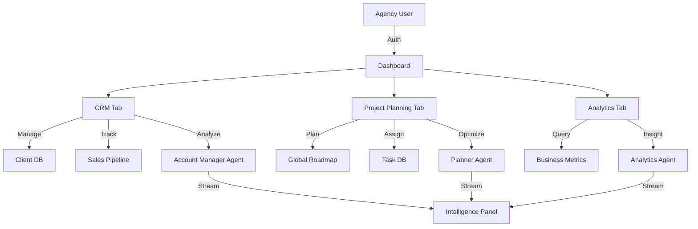
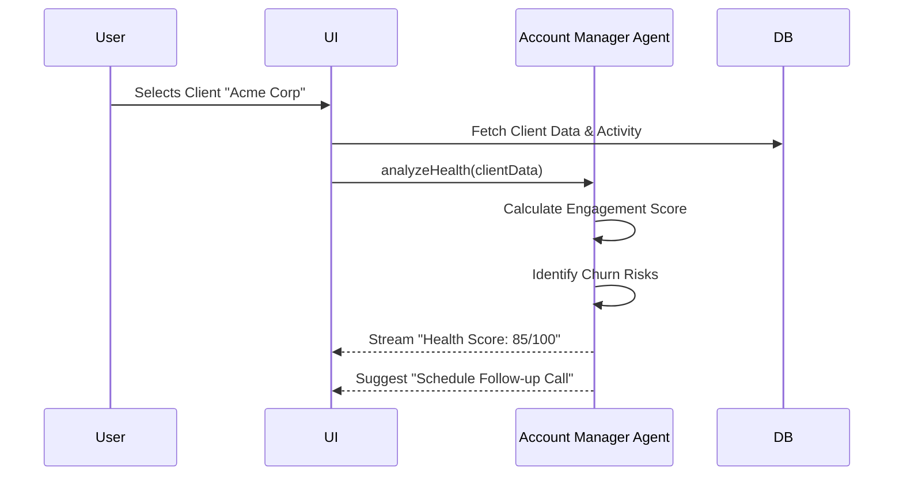

# Sun AI Agency — Agency Dashboard Plan

**Date:** January 6, 2025  
**Status:** Agency Dashboard Plan  
**Target Users:** Internal Agency Team  
**Access:** Agency Authentication (Admin/Team Members)

---

## Agency Dashboard Summary Table

| Screen | Content | Purpose | Goals | Gemini 3 Model | Google Search | Structured Output | Streaming | Function Calling | AI Agent |
|--------|---------|---------|-------|----------------|---------------|-------------------|-----------|------------------|----------|
| **CRM Tab** | Client & Lead Management | Client relationship management | Manage leads, clients, projects, contacts, pipeline | Flash | ❌ No | ✅ Required | ✅ Optional | ✅ Required | Account Manager Agent |
| **Project Planning Tab** | Team Project Management | Project planning and execution | Plan projects, assign tasks, track progress, manage team | Pro | ❌ No | ✅ Required | ✅ Optional | ✅ Required | Planner Agent |
| **Analytics Tab** | Performance & Insights | Business intelligence | Track KPIs, revenue, project health, team performance | Flash | ⚠️ Optional | ✅ Required | ❌ No | ❌ No | Analytics Agent |

---

## Architecture & Data Flow

---

## Screen 1: CRM Tab (Client Management)

### Content

**Left Panel (20%):**
- Pipeline summary (total leads, active clients, revenue)
- Quick filters (All, Leads, Clients, Prospects, Closed)
- Team member filter (assign leads/clients to team members)
- Status indicators (New, Contacted, Qualified, Proposal, Won, Lost)

**Center Panel (50%):**
- **Client/Lead List:**
  - Table view with columns:
    - Company name
    - Industry
    - Contact person
    - Status (Lead, Client, Prospect)
    - Pipeline stage (New, Contacted, Qualified, Proposal, Won, Lost)
    - Assigned to (team member)
    - Last activity date
    - Value (potential revenue)
    - Actions (view, edit, delete)
  - Filter options (Status, Industry, Assigned To, Pipeline Stage)
  - Sort options (Name, Last Activity, Value, Status)
  - Search clients/leads (by company name, contact person, industry)
  - Bulk actions (assign, change status, export)
  
- **Client/Lead Detail View (When Selected):**
  - **Overview Section:**
    - Company information (name, website, industry, size)
    - Contact information (primary contact, email, phone)
    - Status and pipeline stage
    - Assigned team member
    - Value and revenue
    - Last activity timestamp
    
  - **Timeline Section:**
    - Activity timeline (all interactions, notes, status changes)
    - Add note (with timestamp)
    - Log call (date, duration, summary)
    - Log email (subject, date, summary)
    - Log meeting (date, attendees, summary)
    - Status change history
    
  - **Project Section:**
    - Active projects list (if client)
    - Project status (Active, Completed, On Hold)
    - Project value and timeline
    - Create new project button
    
  - **Documents Section:**
    - Uploaded documents (proposals, contracts, briefs)
    - Document preview and download
    - Document categories (Proposals, Contracts, Briefs, Other)
    - Upload document button
    
  - **Communication Section:**
    - Email history (sent and received)
    - Call history (logged calls)
    - Meeting history (scheduled and completed)
    - Send email button (future integration)
    - Schedule meeting button (future integration)

**Right Panel (30%):**
- **Intelligence Panel:**
  - Client summary (AI-generated client overview)
  - Pipeline insights (next steps, risks, opportunities)
  - Activity recommendations (suggested actions based on timeline)
  - Relationship health score (0-100, based on engagement)
  
- **Quick Actions:**
  - Change status dropdown
  - Assign to team member dropdown
  - Add note button
  - Log call button
  - Create project button
  - Generate proposal button (future)

### Purpose

Provide agency team with comprehensive client relationship management (CRM) system. This tab enables team members to manage leads, track client interactions, monitor pipeline, and maintain client relationships. It serves as the central hub for all client-related activities.

### Goals

1. **Client Management:** Manage all leads, clients, and prospects in one place
2. **Pipeline Tracking:** Track client journey from lead to closed deal
3. **Activity Management:** Log all client interactions (calls, emails, meetings, notes)
4. **Team Collaboration:** Assign clients to team members and track assignments
5. **Project Linking:** Link clients to active projects
6. **Document Management:** Store and organize client documents (proposals, contracts, briefs)
7. **AI Assistance:** Get AI-generated insights and recommendations for client relationships

### Gemini 3 Tools

**Core Tools:**
- **Structured Output:** Client summary generation, pipeline insights, activity recommendations
- **Streaming:** Real-time client summary updates in right panel
- **Function Calling:** Trigger actions (change status, assign client, create project)

**Optional Tools:**
- **Text Generation:** AI-generated client summaries and recommendations
- **Interactions API:** Client assistance chat for CRM questions (future)

**Model Selection:**
- **Gemini 3 Flash:** Fast response time for client summaries and pipeline insights

### Client Analysis Flow

### Features

**Client/Lead Management Features:**
- Client/lead list with table view
- Client/lead detail view (overview, timeline, projects, documents, communication)
- Client/lead creation form (company name, industry, contact, status)
- Client/lead edit functionality
- Client/lead deletion (soft delete with confirmation)
- Client/lead duplication (create similar client)
- Bulk operations (assign multiple clients, change status, export)

**Pipeline Features:**
- Pipeline stages (New, Contacted, Qualified, Proposal, Won, Lost)
- Status change tracking (who changed, when, why)
- Pipeline visualization (kanban board view, Phase 2+)
- Pipeline metrics (conversion rates, average time in stage)
- Pipeline filtering (filter by stage, assignee, industry)

**Activity Features:**
- Activity timeline (all interactions chronologically)
- Add note (rich text, timestamp, author)
- Log call (date, duration, summary, outcome)
- Log email (subject, date, summary, attachments)
- Log meeting (date, attendees, summary, follow-up actions)
- Status change logging (automatic when status changes)
- Activity search (search all activities)

**Team Collaboration Features:**
- Assign clients to team members
- Team member filter (view clients assigned to specific team member)
- Assignment history (who was assigned, when)
- Team workload visualization (clients per team member)
- Team activity feed (recent activities by team members)

**Project Linking Features:**
- Link clients to active projects
- Active projects list (for each client)
- Project status display (Active, Completed, On Hold)
- Create new project from client detail view
- Project value and timeline display

**Document Management Features:**
- Document upload (proposals, contracts, briefs, other)
- Document categorization (Proposals, Contracts, Briefs, Other)
- Document preview (PDFs, images)
- Document download
- Document deletion (with confirmation)
- Document metadata (filename, upload date, uploader)

**Communication Features:**
- Email history (sent and received, future integration)
- Call history (logged calls)
- Meeting history (scheduled and completed)
- Send email button (future integration)
- Schedule meeting button (future integration)

**Intelligence Features:**
- Client summary (AI-generated overview)
- Pipeline insights (next steps, risks, opportunities)
- Activity recommendations (suggested actions based on timeline)
- Relationship health score (0-100, based on engagement)
- Win/loss analysis (for closed deals)

### Functions

**Primary Functions:**
- `load-clients` — Fetch all clients and leads
- `load-client-detail` — Fetch detailed client information
- `create-client` — Create new client/lead
- `update-client` — Update client information
- `change-client-status` — Change pipeline stage
- `assign-client` — Assign client to team member
- `log-activity` — Log client interaction (note, call, email, meeting)
- `generate-client-summary` — AI-generated client overview
- `analyze-pipeline` — AI pipeline insights and recommendations

**Supporting Functions:**
- `filter-clients` — Filter clients by status, industry, assignee
- `search-clients` — Search clients by name, contact, industry
- `calculate-relationship-health` — Calculate relationship health score (0-100)
- `identify-pipeline-risks` — Identify clients at risk of churn
- `suggest-next-actions` — AI suggestions for next client actions
- `export-clients` — Export client list to CSV/Excel

### AI Agent: Account Manager Agent

**Agent Type:** ACCOUNT_MANAGER  
**Model:** Gemini 3 Flash  
**Primary Responsibility:** Client relationship management and pipeline insights

**Input:**
- Client/lead data (company, industry, status, pipeline stage)
- Activity timeline (notes, calls, emails, meetings)
- Project data (active projects linked to client)
- Team assignments (who is assigned to client)

**Processing:**
- Generate client summary when client is selected
- Analyze pipeline health and identify risks
- Calculate relationship health score (0-100)
- Suggest next actions based on activity timeline
- Identify clients at risk of churn
- Recommend status changes based on activity patterns
- Use Structured Output for consistent summaries
- Use Streaming for real-time updates in right panel
- Use Function Calling for actions (change status, assign, log activity)

**Output:**
- Client summary (AI-generated overview)
- Pipeline insights (next steps, risks, opportunities)
- Activity recommendations (suggested actions based on timeline)
- Relationship health score (0-100)
- Win/loss analysis (for closed deals)

**Use Cases:**
- Client selected → AI generates client summary
- Activity logged → AI suggests next actions
- Status changes → AI analyzes pipeline health
- Client inactive → AI identifies churn risk
- Team member views client → AI provides relationship insights

---

## Screen 2: Project Planning Tab (Team Project Management)

### Content

**Left Panel (20%):**
- Projects summary (active projects, completed projects, total revenue)
- Project filters (All, Active, On Hold, Completed, Archived)
- Team member filter (view projects assigned to team member)
- Status indicators (Planning, Active, On Hold, Completed, Archived)

**Center Panel (50%):**
- **Project List:**
  - Table/Grid view with project cards:
    - Project name
    - Client name
    - Industry
    - Status (Planning, Active, On Hold, Completed, Archived)
    - Assigned team members
    - Current phase (Phase 1, Phase 2, Phase 3)
    - Progress percentage
    - Start date / End date
    - Project value
    - Actions (view, edit, archive)
  - Filter options (Status, Industry, Assigned To, Phase)
  - Sort options (Name, Start Date, Progress, Value)
  - Search projects (by project name, client name, industry)
  - Bulk actions (assign, change status, archive)
  
- **Project Detail View (When Selected):**
  - **Overview Section:**
    - Project information (name, client, industry, value)
    - Status and current phase
    - Assigned team members
    - Project timeline (start date, end date, duration)
    - Progress percentage
    - Budget vs actual (if applicable)
    
  - **Phases Section:**
    - Three-phase roadmap display (Phase 1, Phase 2, Phase 3)
    - Phase status indicators (LOCKED, ACTIVE, COMPLETED, PAUSED)
    - Phase progress bars
    - Phase goals and deliverables
    - Phase timeline (start date, end date)
    - Unlock/lock phase controls
    - Complete phase button
    
  - **Tasks Section:**
    - Kanban board view (Todo, In Progress, Done)
    - Task cards with details:
      - Task title and description
      - Assigned to (team member)
      - Effort estimation (S, M, L, XL)
      - Due date
      - Phase assignment (Phase 1, Phase 2, Phase 3)
      - Tags (foundation, implementation, optimization)
    - Drag-and-drop task management
    - Filter tasks (by phase, assignee, status)
    - Search tasks
    - Create task button
    
  - **Deliverables Section:**
    - Deliverables list with status:
      - Deliverable name
      - Status (PENDING, IN_PROGRESS, IN_REVIEW, APPROVED, DELIVERED)
      - Assigned to (team member)
      - Due date
      - Phase assignment
    - Deliverable detail view (description, acceptance criteria)
    - Update deliverable status
    - Create deliverable button
    
  - **Team Section:**
    - Assigned team members list
    - Team member workload (tasks assigned, workload percentage)
    - Assign team member to project
    - Remove team member from project
    - Team member roles (Project Manager, Developer, Designer, etc.)

**Right Panel (30%):**
- **Intelligence Panel:**
  - Project summary (AI-generated project overview)
  - Progress insights (completion predictions, risk alerts)
  - Resource insights (team workload, capacity planning)
  - Timeline insights (milestone tracking, delays)
  
- **Quick Actions:**
  - Change status dropdown
  - Assign team member dropdown
  - Create task button
  - Create deliverable button
  - Complete phase button
  - Generate report button (future)

### Purpose

Provide agency team with comprehensive project planning and management system. This tab enables project managers and team members to plan projects, assign tasks, track progress, manage deliverables, and coordinate team activities. It serves as the execution hub for client projects.

### Goals

1. **Project Management:** Manage all client projects from planning to completion
2. **Phase Tracking:** Track three-phase roadmap progress (Phase 1, Phase 2, Phase 3)
3. **Task Management:** Assign tasks, track progress, manage priorities
4. **Deliverable Management:** Track deliverables through approval workflow
5. **Team Coordination:** Assign team members, track workload, manage capacity
6. **Progress Monitoring:** Track project progress, identify risks, predict completion
7. **AI Assistance:** Get AI-generated insights and recommendations for project management

### Gemini 3 Tools

**Core Tools:**
- **Structured Output:** Project summary generation, progress insights, resource insights
- **Streaming:** Real-time project summary updates in right panel
- **Function Calling:** Trigger actions (create task, assign team member, complete phase)
- **Thinking Mode:** Deep analysis for progress predictions and risk assessment (1024 tokens)

**Optional Tools:**
- **Text Generation:** AI-generated project summaries and recommendations
- **Code Execution:** Progress calculations and timeline predictions

**Model Selection:**
- **Gemini 3 Pro:** Deep reasoning for project planning, progress analysis, risk assessment

### Features

**Project Management Features:**
- Project list with table/grid view
- Project detail view (overview, phases, tasks, deliverables, team)
- Project creation form (name, client, industry, value, timeline)
- Project edit functionality
- Project archive functionality (soft delete)
- Project duplication (create similar project)
- Bulk operations (assign multiple projects, change status, archive)

**Phase Management Features:**
- Three-phase roadmap display (Phase 1, Phase 2, Phase 3)
- Phase status indicators (LOCKED, ACTIVE, COMPLETED, PAUSED)
- Phase progress bars (percentage complete)
- Phase goals and deliverables display
- Phase timeline (start date, end date)
- Unlock/lock phase controls
- Complete phase functionality
- Phase progression logic (Phase 1 must complete before Phase 2 unlocks)

**Task Management Features:**
- Kanban board view (Todo, In Progress, Done)
- Task cards with details (title, description, assignee, effort, due date, phase, tags)
- Drag-and-drop task management (move tasks between columns)
- Task creation form
- Task edit functionality
- Task assignment (assign to team member)
- Task filtering (by phase, assignee, status)
- Task search
- Task dependencies (future enhancement)
- Effort estimation (S, M, L, XL)
- Task tags (foundation, implementation, optimization)

**Deliverable Management Features:**
- Deliverables list with status (PENDING, IN_PROGRESS, IN_REVIEW, APPROVED, DELIVERED)
- Deliverable detail view (description, acceptance criteria)
- Deliverable creation form
- Deliverable status updates
- Deliverable assignment (assign to team member)
- Deliverable filtering (by phase, status, assignee)
- Deliverable approval workflow
- Deliverable notifications (when status changes)

**Team Management Features:**
- Assigned team members list
- Team member workload visualization (tasks assigned, workload percentage)
- Assign team member to project
- Remove team member from project
- Team member roles (Project Manager, Developer, Designer, etc.)
- Team capacity planning (identify overloaded team members)
- Team activity feed (recent activities by team member)

**Progress Tracking Features:**
- Overall project progress percentage
- Phase-by-phase progress breakdown
- Task completion tracking
- Deliverable completion tracking
- Milestone tracking (phase milestones)
- Progress history chart (Phase 2+ enhancement)
- Progress predictions (expected completion dates)

**Intelligence Features:**
- Project summary (AI-generated overview)
- Progress insights (completion predictions, risk alerts)
- Resource insights (team workload, capacity planning)
- Timeline insights (milestone tracking, delays)
- Risk identification (projects at risk of delay)
- Bottleneck detection (identify blockers)

### Functions

**Primary Functions:**
- `load-projects` — Fetch all projects
- `load-project-detail` — Fetch detailed project information
- `create-project` — Create new project
- `update-project` — Update project information
- `unlock-phase` — Unlock phase (when previous phase completes)
- `complete-phase` — Mark phase as completed
- `create-task` — Create new task
- `update-task` — Update task (status, assignee, etc.)
- `create-deliverable` — Create new deliverable
- `update-deliverable-status` — Update deliverable status
- `assign-team-member` — Assign team member to project
- `generate-project-summary` — AI-generated project overview
- `analyze-progress` — AI progress insights and predictions
- `analyze-resources` — AI resource insights and capacity planning

**Supporting Functions:**
- `filter-projects` — Filter projects by status, industry, assignee
- `search-projects` — Search projects by name, client, industry
- `calculate-project-progress` — Calculate overall project progress
- `calculate-phase-progress` — Calculate individual phase progress
- `calculate-team-workload` — Calculate team member workload
- `identify-project-risks` — Identify projects at risk of delay
- `detect-bottlenecks` — Identify project bottlenecks
- `predict-completion` — Predict project completion dates
- `export-project-report` — Export project report (PDF, CSV)

### AI Agent: Planner Agent

**Agent Type:** PLANNER  
**Model:** Gemini 3 Pro  
**Primary Responsibility:** Project planning, progress analysis, and resource management

**Input:**
- Project data (name, client, status, phase, timeline)
- Phase data (status, progress, goals, deliverables)
- Task data (status, assignee, effort, due date, phase)
- Deliverable data (status, assignee, due date, phase)
- Team data (assigned team members, workload)

**Processing:**
- Generate project summary when project is selected
- Analyze project progress and predict completion dates
- Identify projects at risk of delay
- Analyze team workload and capacity
- Detect bottlenecks and blockers
- Recommend task prioritization
- Suggest resource reallocation
- Use Structured Output for consistent summaries
- Use Streaming for real-time updates in right panel
- Use Function Calling for actions (create task, assign team member, complete phase)
- Use Thinking Mode for deep analysis (progress predictions, risk assessment)

**Output:**
- Project summary (AI-generated overview)
- Progress insights (completion predictions, risk alerts)
- Resource insights (team workload, capacity planning)
- Timeline insights (milestone tracking, delays)
- Risk identification (projects at risk)
- Bottleneck detection (blockers identified)

**Use Cases:**
- Project selected → AI generates project summary
- Phase completes → AI analyzes progress and unlocks next phase
- Task created → AI suggests assignment based on workload
- Progress slows → AI detects risk and alerts team
- Team member overloaded → AI suggests resource reallocation
- Project manager views project → AI provides management insights

---

## Screen 3: Analytics Tab (Performance & Insights)

### Content

**Left Panel (20%):**
- Analytics summary (total revenue, active clients, team capacity)
- Date range filter (Last 30 days, Last 90 days, Last year, Custom)
- Industry filter (All Industries, Fashion, Real Estate, Tourism, Events)
- Team member filter (All Team Members, Specific Team Member)

**Center Panel (50%):**
- **Revenue Analytics:**
  - Total revenue chart (line chart over time)
  - Revenue by industry (bar chart)
  - Revenue by client (bar chart)
  - Revenue by project (table/list)
  - Revenue trends (growth percentage)
  
- **Client Analytics:**
  - Total clients (count)
  - Active clients (count)
  - New clients this month (count)
  - Client retention rate (percentage)
  - Average client value
  - Client lifetime value (LTV)
  
- **Pipeline Analytics:**
  - Pipeline stages breakdown (funnel chart)
  - Conversion rates (percentage by stage)
  - Average time in stage (days)
  - Win/loss ratio
  - Pipeline value (total potential revenue)
  
- **Project Analytics:**
  - Active projects (count)
  - Completed projects (count)
  - Average project duration (days)
  - Average project value
  - On-time completion rate (percentage)
  - Project profitability (revenue vs costs)
  
- **Team Analytics:**
  - Team member workload (tasks assigned per team member)
  - Team capacity utilization (percentage)
  - Task completion rate (percentage by team member)
  - Average task completion time (hours/days)
  - Team productivity trends (over time)

**Right Panel (30%):**
- **Intelligence Panel:**
  - Business summary (AI-generated business overview)
  - Key insights (important findings from analytics)
  - Recommendations (AI suggestions for improvement)
  - Alerts (revenue drops, client churn, project delays)
  
- **Quick Insights:**
  - Top performing clients
  - Top performing projects
  - Top performing team members
  - Revenue trends (up/down indicators)
  - Risk alerts (clients at risk, projects at risk)

### Purpose

Provide agency team with business intelligence and performance insights. This tab enables agency leaders and project managers to track KPIs, monitor revenue, analyze client relationships, measure team performance, and make data-driven decisions.

### Goals

1. **Business Intelligence:** Track key business metrics (revenue, clients, projects)
2. **Performance Monitoring:** Monitor team performance and productivity
3. **Revenue Analysis:** Analyze revenue trends, sources, and profitability
4. **Client Analysis:** Track client retention, lifetime value, and health
5. **Pipeline Analysis:** Monitor sales pipeline and conversion rates
6. **Project Analysis:** Track project performance and profitability
7. **AI Insights:** Get AI-generated insights and recommendations for business improvement

### Gemini 3 Tools

**Core Tools:**
- **Structured Output:** Business summary generation, key insights, recommendations
- **Text Generation:** AI-generated business insights and recommendations
- **Code Execution:** Analytics calculations (averages, percentages, trends)

**Optional Tools:**
- **Google Search Grounding:** Industry benchmark comparisons (optional)
- **Interactions API:** Analytics assistant chat (future)

**Model Selection:**
- **Gemini 3 Flash:** Fast response time for business summaries and insights

### Features

**Revenue Analytics Features:**
- Total revenue chart (line chart over time)
- Revenue by industry (bar chart)
- Revenue by client (bar chart)
- Revenue by project (table/list)
- Revenue trends (growth percentage, up/down indicators)
- Revenue filtering (by date range, industry, team member)

**Client Analytics Features:**
- Total clients (count)
- Active clients (count)
- New clients this month (count)
- Client retention rate (percentage)
- Average client value (revenue per client)
- Client lifetime value (LTV, total revenue per client)
- Client churn rate (percentage)
- Client growth trends (over time)

**Pipeline Analytics Features:**
- Pipeline stages breakdown (funnel chart)
- Conversion rates (percentage by stage: New → Contacted → Qualified → Proposal → Won)
- Average time in stage (days)
- Win/loss ratio (won deals vs lost deals)
- Pipeline value (total potential revenue in pipeline)
- Pipeline velocity (average time from lead to closed deal)

**Project Analytics Features:**
- Active projects (count)
- Completed projects (count)
- Average project duration (days)
- Average project value (revenue per project)
- On-time completion rate (percentage)
- Project profitability (revenue vs costs, if applicable)
- Project success rate (percentage of successful projects)

**Team Analytics Features:**
- Team member workload (tasks assigned per team member)
- Team capacity utilization (percentage of capacity used)
- Task completion rate (percentage by team member)
- Average task completion time (hours/days)
- Team productivity trends (over time)
- Team member performance rankings

**Intelligence Features:**
- Business summary (AI-generated business overview)
- Key insights (important findings from analytics)
- Recommendations (AI suggestions for improvement)
- Alerts (revenue drops, client churn, project delays)
- Benchmark comparisons (industry averages, if available)

**Reporting Features:**
- Export analytics (PDF, CSV, Excel)
- Schedule reports (email reports periodically, future)
- Custom date ranges (last 30 days, last 90 days, last year, custom)
- Filter analytics (by industry, team member, client, project)

### Functions

**Primary Functions:**
- `load-revenue-data` — Fetch revenue data for analytics
- `load-client-data` — Fetch client data for analytics
- `load-pipeline-data` — Fetch pipeline data for analytics
- `load-project-data` — Fetch project data for analytics
- `load-team-data` — Fetch team data for analytics
- `calculate-revenue-trends` — Calculate revenue trends and growth
- `calculate-client-metrics` — Calculate client retention, LTV, churn
- `calculate-pipeline-metrics` — Calculate conversion rates, pipeline velocity
- `calculate-project-metrics` — Calculate project performance metrics
- `calculate-team-metrics` — Calculate team productivity and performance
- `generate-business-summary` — AI-generated business overview
- `identify-key-insights` — AI identification of key findings
- `generate-recommendations` — AI recommendations for improvement
- `detect-alerts` — Identify revenue drops, churn, delays

**Supporting Functions:**
- `filter-analytics` — Filter analytics by date range, industry, team member
- `aggregate-data` — Aggregate data for charts and visualizations
- `calculate-averages` — Calculate averages (client value, project duration, etc.)
- `calculate-percentages` — Calculate percentages (retention rate, completion rate, etc.)
- `calculate-trends` — Calculate trends over time
- `compare-benchmarks` — Compare metrics to industry benchmarks (if available)
- `export-report` — Export analytics report (PDF, CSV, Excel)

### AI Agent: Analytics Agent

**Agent Type:** ANALYST  
**Model:** Gemini 3 Flash  
**Primary Responsibility:** Business intelligence and performance insights

**Input:**
- Revenue data (total revenue, revenue by client, revenue by project)
- Client data (total clients, active clients, retention rate, LTV)
- Pipeline data (stages, conversion rates, pipeline value)
- Project data (active projects, completed projects, completion rate, profitability)
- Team data (workload, capacity, productivity, task completion)

**Processing:**
- Aggregate analytics data for visualization
- Calculate key metrics (revenue trends, client retention, pipeline conversion, project profitability, team productivity)
- Identify key insights from analytics
- Generate business summary
- Detect anomalies (revenue drops, client churn, project delays)
- Recommend improvements based on analytics
- Use Structured Output for consistent summaries
- Use Text Generation for insights and recommendations
- Use Code Execution for calculations (averages, percentages, trends)

**Output:**
- Business summary (AI-generated business overview)
- Key insights (important findings from analytics)
- Recommendations (AI suggestions for improvement)
- Alerts (revenue drops, client churn, project delays)
- Benchmark comparisons (industry averages, if available)

**Use Cases:**
- Analytics tab opened → AI generates business summary
- Revenue drops → AI detects alert and recommends actions
- Client churn increases → AI identifies risk and suggests retention strategies
- Project delays → AI detects pattern and recommends process improvements
- Team capacity high → AI suggests resource planning
- Agency leader views analytics → AI provides strategic insights

---

## Real World Examples

### Example 1: Agency Managing DTC Brands
**Company:** Elevate Commerce (Marketing Agency)
*   **CRM Tab:** Agent views "Luxe Threads" client. **Account Manager Agent** suggests: "Client engagement dropped 15% this month. Schedule check-in." Pipeline shows 3 new leads from Fashion industry.
*   **Project Planning Tab:** Project Manager views "Fall Collection Launch" project. **Planner Agent** alerts: "Content tasks are blocked by pending photography. Risk of 2-day delay." Resource view shows Design team at 95% capacity.
*   **Analytics Tab:** Agency Owner views revenue report. **Analytics Agent** highlights: "Fashion industry clients have 20% higher LTV than other segments. Recommend focusing sales efforts on Fashion vertical."

### Example 2: Agency Managing Real Estate Brokerages
**Company:** Property Partners (Real Estate Tech Agency)
*   **CRM Tab:** Sales rep views "Urban Properties" lead. **Account Manager Agent** summarizes: "High-value prospect. Key pain point is lead response time. Suggest emphasizing WhatsApp automation in proposal."
*   **Project Planning Tab:** Implementation Specialist views "CRM Integration" project. **Planner Agent** confirms: "Phase 1 complete. Phase 2 unlocked. All tasks on schedule."
*   **Analytics Tab:** Operations Manager views team performance. **Analytics Agent** notes: "Implementation team efficiency up 10% since introducing new project templates."

---

## Cross-Screen Features

### Navigation

**Tab Navigation:**
- CRM Tab (client management, default)
- Project Planning Tab (team project management)
- Analytics Tab (performance and insights)

**Tab Indicators:**
- Active tab highlighted
- Notification badges (if updates in CRM or Project Planning)
- Tab icons for visual recognition

### Access Control

**Agency Access:**
- Agency authentication required (admin and team members)
- Role-based permissions (admin vs team member)
- Team member assignments (clients and projects assigned to team members)

**Permissions:**
- **Admin:** Full access (all clients, all projects, all analytics)
- **Team Member:** Limited access (assigned clients, assigned projects, personal analytics)
- **Project Manager:** Extended access (all projects, team analytics)

### Intelligence Panel (Right Panel)

**Consistent Across All Tabs:**
- AI-generated summaries and insights
- Activity feed (relevant to current tab)
- Quick actions (relevant to current tab)
- Contextual help

**Tab-Specific Intelligence:**
- CRM Tab: Client summary, pipeline insights, activity recommendations
- Project Planning Tab: Project summary, progress insights, resource insights
- Analytics Tab: Business summary, key insights, recommendations

### Real-Time Updates

**Supabase Realtime (Phase 2+):**
- CRM updates (when clients are created, status changes, activities logged)
- Project updates (when tasks are created, phases complete, deliverables approved)
- Analytics updates (real-time metrics as data changes)
- Activity feed updates (real-time activity stream)

### Notifications

**In-App Notifications:**
- New client assigned
- Project status change
- Task assigned
- Deliverable approval required
- Revenue milestone reached
- Client churn risk alert

**Email Notifications:**
- New client created
- Project assigned
- Task assigned
- Deliverable approval required
- Weekly analytics summary (future)
- Monthly revenue report (future)

---

## User Journey

### Complete Agency Dashboard Journey

**1. Agency Team Member Logs In**
- Team member logs in with agency credentials
- Team member lands on CRM Tab (default)

**2. CRM Tab (Client Management)**
- Team member views client/lead list
- Team member selects client from list
- Team member views client detail (overview, timeline, projects, documents)
- Team member logs activity (note, call, email, meeting)
- Team member changes client status (pipeline stage)
- Team member assigns client to team member
- Team member views client summary in right panel
- Team member creates project from client detail view

**3. Project Planning Tab (Team Project Management)**
- Team member switches to Project Planning tab
- Team member views project list
- Team member selects project from list
- Team member views project detail (overview, phases, tasks, deliverables, team)
- Team member creates task (assigns to team member)
- Team member updates task status (Todo → In Progress → Done)
- Team member completes phase (unlocks next phase)
- Team member updates deliverable status
- Team member views project summary in right panel

**4. Analytics Tab (Performance & Insights)**
- Team member switches to Analytics tab
- Team member views revenue analytics (total revenue, revenue by industry, revenue trends)
- Team member views client analytics (total clients, retention rate, LTV)
- Team member views pipeline analytics (conversion rates, pipeline velocity)
- Team member views project analytics (active projects, completion rate, profitability)
- Team member views team analytics (workload, capacity, productivity)
- Team member views business summary in right panel
- Team member exports analytics report (PDF, CSV)

**5. Ongoing Team Collaboration**
- Team members collaborate on client management (assignments, activities)
- Team members collaborate on project planning (task assignment, progress tracking)
- Team members monitor analytics for business insights
- Project managers use analytics for resource planning
- Agency leaders use analytics for strategic decisions

---

## Success Criteria

### Functional Requirements

- ✅ Team can manage all clients and leads in CRM
- ✅ Team can track pipeline from lead to closed deal
- ✅ Team can plan projects and assign tasks
- ✅ Team can track project progress and phases
- ✅ Team can monitor team workload and capacity
- ✅ Team can view analytics and business insights
- ✅ AI provides client insights and recommendations
- ✅ AI provides project insights and recommendations
- ✅ AI provides business insights and recommendations

### Performance Requirements

- ✅ CRM loads in <2s
- ✅ Project list loads in <2s
- ✅ Analytics load in <3s
- ✅ Client summary generates in <3s
- ✅ Project summary generates in <3s
- ✅ Business summary generates in <3s

### User Experience Requirements

- ✅ CRM is intuitive and easy to use
- ✅ Project planning is clear and organized
- ✅ Analytics are visually clear and actionable
- ✅ Intelligence panel provides valuable insights
- ✅ Real-time updates work smoothly
- ✅ Team collaboration is seamless

---

## Future Enhancements

### Phase 2 Enhancements

**CRM Tab:**
- Email integration (send emails directly from CRM)
- Calendar integration (schedule meetings from CRM)
- Automated pipeline updates (status changes based on activity)
- Client communication history (full email thread)

**Project Planning Tab:**
- Task dependencies (link tasks that depend on each other)
- Resource allocation (capacity planning for team members)
- Gantt chart visualization (project timeline visualization)
- Project templates (create projects from templates)

**Analytics Tab:**
- Custom dashboards (create custom analytics views)
- Scheduled reports (email reports periodically)
- Benchmark comparisons (industry averages)
- Predictive analytics (future revenue predictions)

### Phase 3 Enhancements

**CRM Tab:**
- AI-powered lead scoring (automatically score leads)
- Automated follow-up reminders (AI suggests when to follow up)
- Client health predictions (predict client churn)
- Multi-channel communication (WhatsApp, Slack integration)

**Project Planning Tab:**
- AI-powered task prioritization (automatically prioritize tasks)
- Automated resource recommendations (AI suggests team assignments)
- Project risk prediction (predict projects at risk)
- Automated project status updates (AI updates project status)

**Analytics Tab:**
- Advanced predictive analytics (future revenue, client lifetime value)
- Custom KPI tracking (define custom metrics)
- Automated alerts (notify when metrics exceed thresholds)
- Business intelligence dashboards (executive dashboards)

---

**Last Updated:** January 6, 2025  
**Status:** Agency Dashboard Plan  
**Next Review:** After CRM Tab implementation