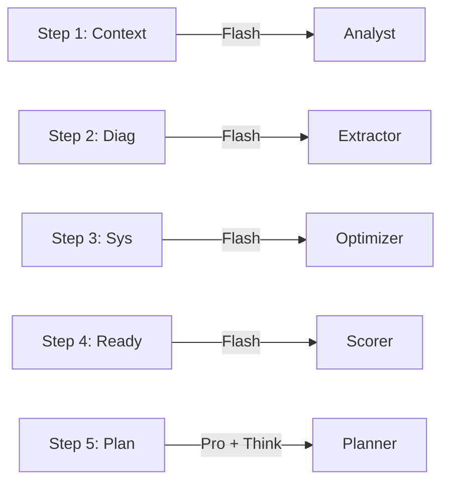
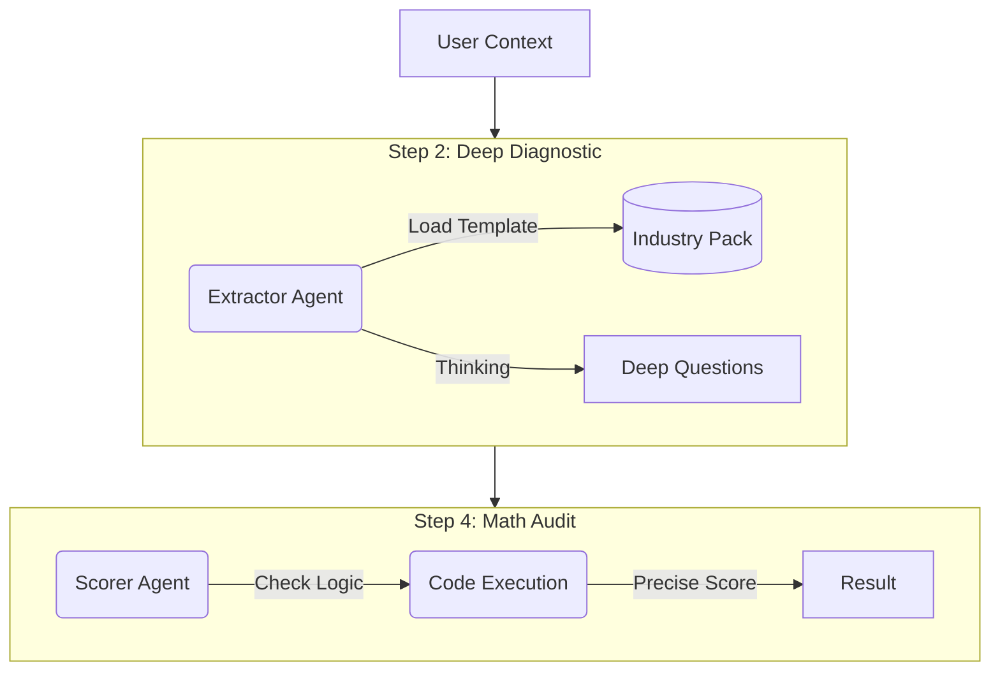

# Sun AI Agency — Wizard Implementation Audit

**Date:** Current
**Reference Doc:** `docs/plan/03-wizards.md`
**Auditor:** System
**Status:** 🟡 Functional MVP (Needs V2 Upgrades)

---

## 1. Executive Summary

The current application successfully implements the **User Interface** and **Basic Data Flow** for all 5 screens. The 3-panel layout is robust, and the agents are connected.

**Major Deviation:** The current implementation relies heavily on `gemini-3-flash` for speed and simplicity. The V2 Plan calls for `gemini-3-pro` with **Thinking Mode** for Steps 2, 3, and 4 to provide deep consultative reasoning. Additionally, the **Industry Pack** system is currently simulated via prompt engineering rather than structured data injection.

**Readiness:**
- **UI/UX:** 95% Complete
- **AI Logic:** 60% Complete (Needs Model Upgrades)
- **Data Depth:** 50% Complete (Missing detailed schema fields)

---

## 2. Screen-by-Screen Audit

### Screen 1: Business Context
**Goal:** Truth Baseline & Intelligence.

| Feature | Plan Requirement | Current Implementation | Status |
| :--- | :--- | :--- | :--- |
| **Model** | Flash | Flash | ✅ Pass |
| **Tools** | Google Search | Google Search | ✅ Pass |
| **Schema** | Industry, Maturity Score, Model | Industry, Confidence, Summary | ⚠️ Partial |
| **Logic** | Auto-detect Industry | Auto-detects Industry | ✅ Pass |
| **Gap** | Missing `maturity_score` (1-5) and specific `observations` array in JSON output. |

### Screen 2: Industry Diagnostics
**Goal:** Deep Dive Consultant.

| Feature | Plan Requirement | Current Implementation | Status |
| :--- | :--- | :--- | :--- |
| **Model** | **Pro + Thinking (4k)** | Flash | 🔴 Gap |
| **Content** | 4 Specific Questions (Sales, Content, Speed, Priority) | 3 Generated + 1 Hardcoded (Priority) | ⚠️ Partial |
| **Schema** | Options map to specific Systems | Options are generic strings | 🔴 Gap |
| **Context** | Industry Pack Injection | String Interpolation | ⚠️ Partial |
| **Gap** | The AI isn't strictly mapping "Problem A" -> "System B" internally yet. It just generates questions. |

### Screen 3: System Selection
**Goal:** The Prescription.

| Feature | Plan Requirement | Current Implementation | Status |
| :--- | :--- | :--- | :--- |
| **Model** | **Pro + Thinking (1k)** | Flash | 🔴 Gap |
| **Logic** | Re-rank based on Step 2 | Re-ranks based on Step 2 | ✅ Pass |
| **Output** | ROI Projections | Generic "Revenue Impact" text | ⚠️ Partial |
| **UI** | "Recommended" Badges | Implemented | ✅ Pass |
| **Gap** | ROI projections are currently text strings, not calculated numbers based on industry formulas. |

### Screen 4: Readiness Assessment
**Goal:** The Audit.

| Feature | Plan Requirement | Current Implementation | Status |
| :--- | :--- | :--- | :--- |
| **Model** | **Pro + Thinking (4k)** | Flash | 🔴 Gap |
| **Tool** | **Code Execution** (Math) | LLM Guessing | 🔴 Gap |
| **Schema** | Category Breakdown (Data/Infra/Culture) | Global Score Only | ⚠️ Partial |
| **Gap** | Scoring is currently "Vibes based" via LLM or simple checkbox counting. Plan requires Python execution for accurate weighted scoring. |

### Screen 5: Strategic Roadmap
**Goal:** The Product.

| Feature | Plan Requirement | Current Implementation | Status |
| :--- | :--- | :--- | :--- |
| **Model** | Pro + Thinking | Pro + Thinking (1024 tokens) | ✅ Pass |
| **Schema** | Phases, Deliverables, KPIs | Phases, Items (List) | ⚠️ Partial |
| **UI** | 30/60/90 Day Visuals | Vertical Timeline list | ⚠️ Partial |
| **Gap** | The schema is too simple (`items: string[]`). It needs to be richer (`deliverables: []`, `kpis: []`) to support the detailed Dashboard view later. |

---

## 3. Architecture Visualization

### Current Implementation (Linear/Simple)

### Targeted V2 Implementation (Agentic/Deep)

---

## 4. Immediate Action Checklist (To Reach V2)

To align the code with `docs/plan/03-wizards.md`, perform the following upgrades:

### Phase 1: Model Upgrades
- [ ] **Step 2 (Extractor):** Switch `gemini-3-flash` to `gemini-3-pro`. Add `thinkingConfig: { thinkingBudget: 2048 }`.
- [ ] **Step 3 (Optimizer):** Switch to `gemini-3-pro` for better logic in mapping problems to systems.
- [ ] **Step 4 (Scorer):** Switch to `gemini-3-pro`.

### Phase 2: Schema Enrichment
- [ ] **Analyst (Step 1):** Add `maturity_score` (1-5) to JSON schema.
- [ ] **Extractor (Step 2):** Update schema to strictly require 4 questions: `[Sales, Content, Speed, Priority]`.
- [ ] **Planner (Step 5):** Expand schema to include `kpis` and `deliverables` arrays for each phase.

### Phase 3: Logic Hardening
- [ ] **Industry Packs:** Create a hardcoded TS file `data/industryPacks.ts` containing the "Ground Truth" for each industry (specific system names, KPI formulas) to inject into the system prompts. Currently, the AI is hallucinating these details based on the industry string.

## 5. Progress Tracker

| Component | UI Status | AI Model Status | Schema Status |
| :--- | :---: | :---: | :---: |
| **Context** | 100% | 100% (Flash) | 80% |
| **Diagnostics** | 100% | 50% (Need Pro) | 60% |
| **Systems** | 100% | 50% (Need Pro) | 70% |
| **Readiness** | 100% | 50% (Need Pro) | 40% |
| **Plan** | 100% | 100% (Pro + Think) | 60% |

