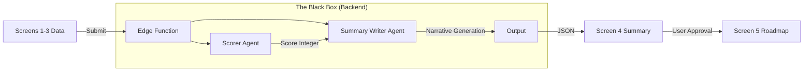

# Wizard Screen 4: The Executive Summary (Sales-Ready Redesign)

**Status:** Approved Specification
**Focus:** Conversion, Trust, and Strategic Alignment
**Goal:** Replace the technical "Readiness Checklist" with a persuasive "Strategic Summary" that validates the user's needs before presenting the Roadmap.

---

## 1. Purpose of Screen 4 (Plain English)

This screen is the **"The Pivot"**. Up to this point, the user has been doing the work (entering data, selecting options). Now, the application returns the favor by synthesizing everything into a cohesive strategy.

**Why it exists:**
1.  **To Validate:** Prove we listened. The AI reflects the user's specific pain points and industry context back to them.
2.  **To Educate:** Explain *why* the selected AI systems are the right cure for their specific business "symptoms."
3.  **To Sell:** Build enough confidence that when they click "View Plan," they are mentally ready to execute, not just browsing.

It is **not** a settings page or a form. It is a **Consultant's Executive Brief**.

---

## 2. Recommended Screen Structure

### A. The "Pulse" Header (Visual Anchor)
*   **AI Readiness Snapshot:** A single, large visual score (0–100) calculated in the background.
*   **Friendly Label:**
    *   Score > 80: "Ready to Scale" (Green)
    *   Score 50-79: "Strong Foundation" (Amber)
    *   Score < 50: "High Potential" (Blue)
*   **Design:** Clean, modern typography. No scary red warnings; only constructive framing.

### B. The Solution Stack (Left Column)
*   **Visual Stack:** Display the 2-3 systems selected in Step 3.
*   **Benefit Tag:** One distinct benefit per system (e.g., "Automates 40hrs/mo").
*   **Industry Context:** Uses the specific names from the Industry Pack (e.g., "Fit Intelligence" instead of "Data Tool").

### C. The Strategic Narrative (Right Column / Main Body)
*   **Generated by Gemini 3 Pro.**
*   **Format:** 2-3 concise paragraphs.
*   **Tone:** Senior Consultant—calm, confident, objective.
*   **Content:** Connects the dots between the Client's Context (Step 1), Pain Points (Step 2), and the Solution (Step 3).

### D. Business Outcomes (Bottom Row)
*   **Three Key Pillars:** Speed, Revenue, Efficiency.
*   **Format:** Simple icon + bold text (e.g., "Faster Speed to Lead", "Higher AOV").
*   **Avoid:** Fake math or specific dollar guarantees that reduce trust.

### E. The Call to Action (Fixed Footer)
*   **Primary Button:** "Reveal Execution Roadmap" or "Generate 30-Day Plan".
*   **Subtext:** "Based on your unique profile."

---

## 3. Gemini 3 Prompt for the Persuasive Summary

**Model:** `gemini-3-pro-preview`
**Config:** `thinkingBudget: 2048` (To ensure logical connection of points)

```text
You are a Senior Strategic Partner at Sun AI Agency. Your client is in the {industry} industry.

CONTEXT:
1. Business: {business_name} (Model: {business_model})
2. Core Pain Point: {pain_point} (Priority: {priority})
3. Selected Solution Stack: {selected_systems_list}
4. Readiness Score: {score}/100

TASK:
Write a persuasive, 3-paragraph Executive Summary for this client.

PARAGRAPH 1: THE DIAGNOSIS
- Acknowledge their specific situation and industry.
- Validate that their pain point ({pain_point}) is a common but solvable bottleneck in {industry}.

PARAGRAPH 2: THE STRATEGY
- Explain WHY the selected systems ({selected_systems_list}) are the correct prescription.
- Use reasoning, not feature listing. Example: "Because you struggle with response time, the WhatsApp Concierge is essential to stop lead leakage."

PARAGRAPH 3: THE OUTLOOK
- Briefly paint a picture of the future state.
- Mention the Readiness Score context (e.g., "With a score of {score}, you are well-positioned to...").

CONSTRAINTS:
- Tone: Professional, encouraging, expert. No hype.
- Length: Max 180 words.
- Language: Use {industry} specific terminology (e.g., "Guests" for Tourism, "Tenants" for Real Estate).
```

---

## 4. How to Use Gemini 3 Features Correctly

*   **Gemini 3 Pro:** Required for the **nuance** of the sales narrative. A smaller model (Flash) might sound robotic or generic. Pro captures the "Consultant Persona."
*   **Thinking Mode:** Used to reason about the connection between *Pain* and *Solution*.
    *   *Thought Process:* "User has high churn + selected CRM. I should emphasize retention in the summary."
*   **Structured Output:** We don't just want text; we want a JSON object containing `{ headline, narrative, key_benefits[], readiness_label }` to render the UI components safely.
*   **Agents Involved:**
    *   **Scorer Agent:** Runs silently in the background to compute the math (Score).
    *   **Analyst Agent:** Provides the industry context variables.

---

## 5. Core vs. Advanced Logic (Behind the Scenes)

| Feature | Internal Logic (Hidden) | User Experience (Visible) | Why? |
| :--- | :--- | :--- | :--- |
| **Readiness** | Complex Python script calculating weighted averages based on boolean checklist arrays. | **"Strong Foundation (78/100)"** | Users don't care about the math; they care about the verdict. |
| **System Fit** | Dependency graph checking if System A works with System B. | **"Cohesive Stack"** | Technical dependencies scare users; "synergy" sells them. |
| **Risk Audit** | Analysis of missing infrastructure (e.g., No API access). | **"Strategic Focus Area"** | Framing risks as "focus areas" keeps momentum high while remaining honest. |

---

## 6. Industry-Specific Real-World Examples

### A. Fashion E-commerce
*   **Pain Point:** High return rates reducing margins.
*   **Recommendation:** Fit & Sizing Intelligence Agent.
*   **Summary Snippet:** "In high-volume fashion retail, returns are the silent profit killer. By deploying Fit Intelligence, we move from reactive refunds to proactive sizing guidance, protecting your margins before the checkout happens."

### B. Real Estate Brokerage
*   **Pain Point:** Slow response times on weekends.
*   **Recommendation:** WhatsApp Lead Concierge.
*   **Summary Snippet:** "Real estate is won in the first 5 minutes. Your current manual process misses leads outside office hours. The WhatsApp Concierge ensures every Zillow inquiry gets an instant, qualified response, regardless of when your agents clock out."

### C. B2B SaaS
*   **Pain Point:** Churn during onboarding.
*   **Recommendation:** Customer Success Autopilot.
*   **Summary Snippet:** "Your acquisition is strong, but retention is leaking value. The CS Autopilot acts as an always-on safety net, identifying at-risk accounts based on usage data and intervening before they cancel."

---

## 7. Mermaid Diagram (High-Level Flow)



---

## 8. Wiring Plan (Frontend + Backend)

### A. Frontend (`Step4Summary.tsx`)
*   **Props:** Consumes `appState.data` (Industry, Services, Priorities) and `appState.aiState.recommendations`.
*   **Lifecycle:**
    *   **On Mount:** Calls `summary` service immediately.
    *   **Loading State:** Shows a "Synthesizing Strategy..." skeleton with a pulsing Gemini icon.
    *   **Success State:** Renders the 3-panel layout populated with the JSON response.
*   **Persistence:** Updates `appState.aiState.summary` on success.

### B. Backend (`supabase/functions/summary/index.ts`)
*   **Inputs:**
    *   `wizardState`: Full state object.
    *   `industry`: String.
*   **Logic:**
    1.  **Calculate Score:** Re-use `scorer` logic (or import shared module) to get the 0-100 int.
    2.  **Generate Narrative:** Call Gemini 3 Pro with the prompt defined in Section 3.
    3.  **Fallback:** If Gemini fails, return a generic template: "Based on your inputs, we have designed a strategy to address {pain_point}..."
*   **Outputs (JSON):**
    ```json
    {
      "score": 85,
      "label": "Ready to Scale",
      "headline": "A Strategy for Growth",
      "narrative": "Paragraph 1... Paragraph 2... Paragraph 3...",
      "outcomes": ["Increase Lead Velocity", "Reduce Admin Overhead"]
    }
    ```

### C. Gemini Service (`services/gemini/summary.ts`)
*   **Function:** `generateExecutiveSummary(state: AppState)`
*   **Model:** `gemini-3-pro-preview`
*   **Thinking Budget:** `2048` tokens (Balanced for quality vs speed).
*   **Retry Policy:** 1 retry on 500/503 errors.

### D. Data Contracts
*   **Request:**
    ```typescript
    {
      industry: "real_estate",
      businessName: "Acme Homes",
      priorities: { moneyFocus: "Lead Gen" },
      selectedSystems: ["whatsapp_bot", "crm_sync"]
    }
    ```
*   **Response:**
    ```typescript
    {
      score: number;       // 0-100
      label: string;       // "Strong Foundation"
      narrative: string;   // Markdown supported
      key_benefits: string[];
    }
    ```

### E. Acceptance Tests
1.  [ ] **Context Check:** If Industry is "Fashion", narrative must mention "Fashion" terms.
2.  [ ] **Pain Point Check:** If Pain Point is "Speed", narrative must mention "Efficiency" or "Time Savings".
3.  [ ] **Empty State:** If no systems selected (shouldn't happen, but possible), returns a polite error or generic advice.
4.  [ ] **Latency:** Screen renders loading state immediately and results appear within ~8 seconds.
