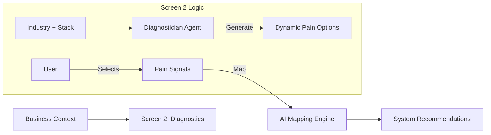

# Screen 2: Industry Diagnostics — Enhancement Plan (v2.0)

**Status:** Strategic Redesign (Approved)
**Goal:** Transform Screen 2 from a generic survey into a **business clarity & sales alignment engine**.
**Focus:** Surface real pain points, align them to revenue/time, and make Screen 3 recommendations feel inevitable.

---

## 1. Executive Summary

Screen 2 builds directly on the "Truth Baseline" established in Screen 1. Instead of technical configuration, it asks:
> *"What is blocking my business from saving time, making more money, and growing to the next level?"*

It uses **Gemini 3 Pro** (Reasoning) and **Search Grounding** to generate industry-specific options that feel "safe" and "honest" to the user, ensuring the transition to System Selection (Screen 3) is frictionless.

---

## 2. Context Inputs (From Screen 1)

The AI Agents utilize the following locked context:
*   **Identity:** Business Name, Website URL.
*   **Vertical:** Locked Industry (e.g., Fashion, SaaS).
*   **Model:** Detected Business Model (e.g., DTC, Agency).
*   **Tech Stack:** Selected Services (e.g., Shopify, WhatsApp).
*   **Maturity:** Digital Maturity Score (1-5).

---

## 3. Screen Structure & UX

The screen is divided into 5 distinct sections designed for speed (<90s completion).

### 1. Context Confirmation (Top, Read-Only)
*   **Visual:** Locked Industry Card + Detected Business Model.
*   **Microcopy:** "These questions are tailored to your business and the services you selected."

### 2. Primary Growth Focus (Single Select)
*   **Question:** "What matters most right now?"
*   **Options:**
    *   Increase sales & revenue
    *   Save time through automation
    *   Reduce manual work & inefficiency
    *   Scale without hiring
    *   Improve lead quality & conversion
*   **Microcopy:** "Choose the one causing the biggest pain today."

### 3. Revenue & Growth Pain Points (Multi-Select)
*   **Logic:** Dynamic options generated by **Extractor Agent** based on Industry.
*   **Phrasing:** Business language, not AI jargon.
*   **Example (Fashion):**
    *   "Too many visitors browse but don’t buy" (Maps to: *Conversion Booster*)
    *   "Sales depend too much on ads" (Maps to: *Content Engine*)
    *   "Customers abandon carts and never return" (Maps to: *CRM Autopilot*)
    *   "Past customers don't come back" (Maps to: *Retention System*)

### 4. Time & Automation Blockers (Multi-Select)
*   **Question:** "What’s eating up your time?"
*   **Options:**
    *   Manual follow-ups
    *   Repetitive customer questions
    *   Content creation bottlenecks
    *   Lead qualification
    *   Reporting & tracking performance

### 5. AI Readiness Confidence (Single Select)
*   **Question:** "How ready are you to automate parts of your business?"
*   **Options:** Ready now / Interested but unsure / Need guidance / Just exploring.
*   **Purpose:** Helps pace the roadmap intensity in Step 5.

---

## 4. Logic & System Mapping

Each answer in Screen 2 **must** map to a specific System Recommendation in Screen 3.

| User Selection (Pain) | System Mapped (Solution) |
| :--- | :--- |
| "Too many visitors browse but don't buy" | **Revenue Conversion Suite** |
| "Leads respond slowly" | **WhatsApp Lead Concierge** |
| "Content creation is slow" | **Strategic Content Engine** |
| "Leads go cold before closing" | **CRM Autopilot / Nurture** |
| "Manual follow-ups" | **Sales Automation Agent** |

**Ranking Logic:**
*   Systems mapped to the "Primary Growth Focus" get a **"Primary Fit"** badge.
*   Systems mapped to multiple selected pains get a **"High Impact"** badge.

---

## 5. AI Architecture & Agents

### Gemini 3 Features
*   **Gemini 3 Pro:** For deep reasoning to align "Pain" with "Solution" without hallucination.
*   **Search Grounding:** To understand the specific business context (e.g., if they sell high-ticket items, "Lead Quality" matters more than "Volume").
*   **Structured Outputs:** To ensure the UI receives strict JSON for rendering options.
*   **Thinking Mode:** To analyze the user's Tech Stack (Step 1) before generating options.

### Agent Roster
1.  **Analyst Agent (Background):** Continues to analyze website/description to refine the business model context.
2.  **Diagnostician Agent (Active):** Generates the dynamic questions and options for Screen 2.
3.  **Optimizer Agent (Forward):** Receives Screen 2 signals to rank Screen 3 systems.

---

## 6. Visual Flow

---

## 7. Real-World Scenario

**User:** Founder of a "Sustainable Activewear Brand" (Fashion/DTC).
1.  **Step 1:** Selects "Fashion", "Shopify", "Instagram".
2.  **Step 2 (Diagnostics):**
    *   *Focus:* "Increase Sales".
    *   *Pain:* "Visitors don't convert", "Content creation is slow".
    *   *Time Blocker:* "Repetitive customer questions".
3.  **Step 3 (Result):**
    *   **Recommendation 1:** **Revenue Conversion Suite** (Because: "Visitors don't convert").
    *   **Recommendation 2:** **Content Growth Engine** (Because: "Content is slow").
    *   **Recommendation 3:** **WhatsApp/Chat Concierge** (Because: "Repetitive questions").

---

## 8. Production Checklist

- [ ] **Industry Locking:** Ensure Screen 2 creates a specific "Fashion" or "Real Estate" instance based on Step 1.
- [ ] **Service Awareness:** If user selected "WhatsApp" in Step 1, inject a specific question about messaging volume.
- [ ] **Mobile Layout:** Ensure multi-select cards are easy to tap on mobile.
- [ ] **No Jargon:** Verify all generated options use plain business English.
- [ ] **Structured Output:** Ensure Edge Function returns strict JSON `id`s for mapping.
