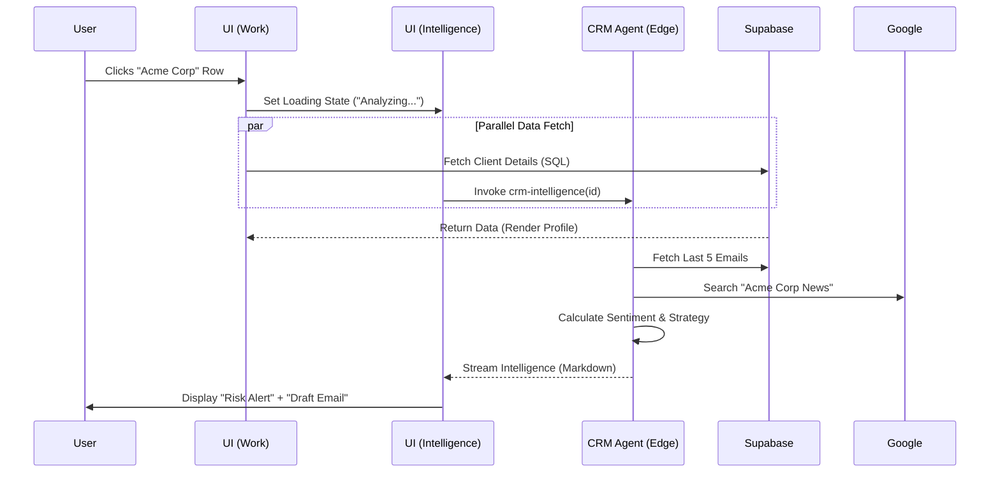

# Sun AI Agency — CRM System Plan

**Status:** Strategic Definition  
**Target:** Internal Agency Team (Account Managers, Sales)  
**Core Logic:** The "Active" CRM. It doesn't just store data; it proactively manages relationships using Gemini 3.

---

## 1. Executive Summary

The Sun AI CRM is built on our signature **3-Panel Architecture**. Unlike traditional CRMs (Salesforce/HubSpot) which are "Databases of Record," this is a "System of Intelligence."

**The Interaction Model:**
1.  **Left (Context):** High-level pipeline health and navigation.
2.  **Center (Work):** The interactive list or detailed profile.
3.  **Right (Intelligence):** When a user clicks a contact in the Center, the Right panel **instantly streams** AI analysis, sentiment checks, and drafted communications specific to that contact.

---

## 2. The 3-Panel CRM Architecture

| Panel | Width | Role | Content & Behavior |
| :--- | :--- | :--- | :--- |
| **Left** | 20% | **Context & Navigation** | • **Pipeline Pulse:** Mini-charts of Lead Volume vs. Conversion.<br>• **Smart Filters:** "Churn Risk", "Hot Leads", "Needs Reply".<br>• **Team View:** Toggle between "My Leads" and "All Leads". |
| **Center** | 50% | **Work Surface** | • **List View:** Sortable table (Name, Stage, Value, Last Touch).<br>• **Detail View:** Rich profile with Activity Timeline, Deal History, and Contact Info.<br>• **Interaction:** Clicking a row triggers the Right Panel. |
| **Right** | 30% | **Intelligence Stream** | • **The Agent:** *Account Manager Agent* (Gemini 3 Flash).<br>• **Content:** Live sentiment analysis, "Next Best Action", Drafted Emails, Competitor News (via Google Search). |

---

## 3. Gemini 3 Features & Tools Strategy

| Feature | Model | Usage in CRM |
| :--- | :--- | :--- |
| **Google Search Grounding** | `gemini-3-flash` | **Competitor Watch:** When viewing a client, auto-search news about their brand or competitors to populate conversation starters. |
| **Thinking Mode** | `gemini-3-pro` | **Deal Strategy:** "Why is this deal stuck in 'Proposal' for 3 weeks? Analyze the email thread and suggest a way to unblock it." |
| **Structured Outputs** | `gemini-3-flash` | **Data Enrichment:** Extract `Job Title`, `Company Size`, and `Tech Stack` from raw email signatures or LinkedIn bios pasted into notes. |
| **Function Calling** | `gemini-3-flash` | **Action Taking:** "Schedule a meeting for Tuesday" -> Calls Calendar API. "Move to 'Qualified'" -> Updates Supabase. |
| **Sentiment Analysis** | `gemini-3-flash` | **Health Score:** Analyze last 5 emails to calculate a 0-100 Relationship Health Score. |

---

## 4. AI Agent: The Account Manager

**Role:** Proactive Relationship Manager  
**Model:** `gemini-3-flash` (Default) / `gemini-3-pro` (Strategy)  
**Trigger:** Selecting a Client in the Center Panel.

**System Instruction:**
> "You are a Senior Account Manager. Your goal is to maximize LTV and minimize Churn. When the user selects a client, analyze recent interactions. If sentiment is dropping, flag it immediately. If a deal is stalling, suggest a specific unblocking tactic based on the client's industry."

---

## 5. Real-World Use Cases

### Scenario A: The Stalled Deal (Real Estate Agency Client)
*   **Context:** User clicks "Urban Properties" in Center Panel. Status: "Proposal Sent" (2 weeks ago).
*   **Center Panel:** Shows the profile and the last email sent.
*   **Right Panel (Intelligence):**
    *   **Alert:** "⚠️ Deal Stalled. Time in stage exceeds average (14 days > 5 days)."
    *   **Insight:** "Last email mentioned 'budget concerns' regarding the WhatsApp bot."
    *   **Action:** "I have drafted a follow-up email addressing the ROI of the WhatsApp bot specifically for their rental volume. **[Review Draft]**"

### Scenario B: The Churn Risk (Fashion Brand Client)
*   **Context:** User clicks "Luxe Threads". Status: "Active".
*   **Center Panel:** Shows billing history and project status.
*   **Right Panel (Intelligence):**
    *   **Alert:** "📉 Engagement Drop. Client hasn't logged into the dashboard in 10 days."
    *   **Grounding (Search):** "News: Luxe Threads competitor just launched a similar 'Fit Finder' tool."
    *   **Action:** "Suggest scheduling a Quarterly Business Review (QBR) to show them the new 'Returns Reduction' features. **[Draft Invitation]**"

---

## 6. Database Schema (Supabase)

New tables required to support the Intelligence layer.

```sql
-- Core CRM Entities
create table public.crm_contacts (
  id uuid primary key default gen_random_uuid(),
  org_id uuid references organizations(id),
  first_name text,
  last_name text,
  email text,
  linkedin_url text,
  role text,
  sentiment_score int, -- AI Calculated (0-100)
  last_contacted_at timestamptz
);

create table public.crm_deals (
  id uuid primary key default gen_random_uuid(),
  client_id uuid references clients(id),
  stage text check (stage in ('new', 'discovery', 'proposal', 'negotiation', 'closed_won', 'closed_lost')),
  value decimal,
  probability int, -- AI Calculated based on stage + sentiment
  expected_close_date date
);

-- Interaction Log (Vector Ready)
create table public.crm_interactions (
  id uuid primary key default gen_random_uuid(),
  client_id uuid references clients(id),
  type text check (type in ('email', 'call', 'meeting', 'note')),
  content text, -- The raw text
  embedding vector(768), -- For RAG/Semantic Search
  summary text, -- AI Generated Summary
  sentiment_label text, -- 'positive', 'neutral', 'negative'
  created_at timestamptz default now()
);
```

---

## 7. Edge Functions

### `crm-intelligence`
*   **Trigger:** UI Interaction (Clicking a row).
*   **Input:** `client_id`, `recent_interactions`.
*   **Logic:**
    1.  Fetch last 5 interactions.
    2.  Perform Sentiment Analysis.
    3.  If `Grounding` enabled, search Google for Company Name.
    4.  Generate "Next Best Action".
*   **Output:** Streamed Markdown for Right Panel.

### `crm-enrich`
*   **Trigger:** Adding a new contact (Paste LinkedIn URL or Email).
*   **Input:** `url` or `email_signature`.
*   **Logic:** Use Gemini to parse unstructured text into `first_name`, `role`, `company`.
*   **Output:** JSON Object to populate form fields.

---

## 8. Implementation Plan (Progress Tracker)

| Phase | Task | Description | Status |
| :--- | :--- | :--- | :--- |
| **1. Core** | **Schema Migration** | Create `crm_contacts`, `crm_deals`, `crm_interactions`. | 🔴 Pending |
| **1. Core** | **UI Skeleton** | Build 3-Panel Layout (`CRMLayout.tsx`). | 🔴 Pending |
| **1. Core** | **List View** | Interactive Table with Sorting/Filtering. | 🔴 Pending |
| **2. AI** | **Intelligence Edge Function** | Create `crm-intelligence` (Flash). | 🔴 Pending |
| **2. AI** | **Right Panel UI** | Streaming Markdown Renderer for insights. | 🔴 Pending |
| **3. Advanced** | **Grounding Integration** | Add Google Search tool to `crm-intelligence`. | 🔴 Pending |
| **3. Advanced** | **Action Buttons** | "Draft Email", "Schedule Call" (Function Calling). | 🔴 Pending |

---

## 9. Multistep Prompts

### Prompt 1: Schema Setup
```text
Create a Supabase migration `20250108_crm_schema.sql`.
Define tables: `crm_contacts`, `crm_deals`, `crm_interactions`.
Ensure `crm_interactions` supports `vector(768)` for future RAG.
Add RLS policies: Agency Owners/Consultants can view all; Clients cannot view CRM data.
```

### Prompt 2: The Intelligence Agent
```text
Create `supabase/functions/crm-intelligence/index.ts`.
- Model: `gemini-3-flash-preview`.
- Input: `clientId`, `recentHistory`.
- Tools: `googleSearch` (optional flag).
- Task: Analyze the relationship health.
- Output Structure:
  {
    health_score: number,
    summary: string,
    news_snippet: string,
    suggested_action: { title: string, draft_content: string }
  }
```

### Prompt 3: The UI Component
```text
Create `components/dashboard/CRM/CRMLayout.tsx`.
- Use the standard 3-panel grid.
- Center Panel: `ClientList.tsx` (Table).
- Right Panel: `ClientIntelligence.tsx`.
- State: `selectedClientId`.
- Effect: When `selectedClientId` changes, invoke `crm-intelligence` and stream result to Right Panel.
```

---

## 10. Mermaid Diagram: The "Click-to-Insight" Flow


