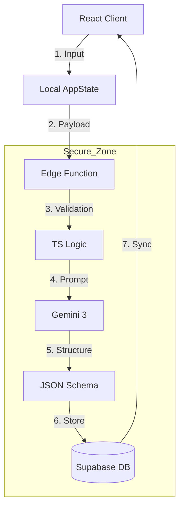
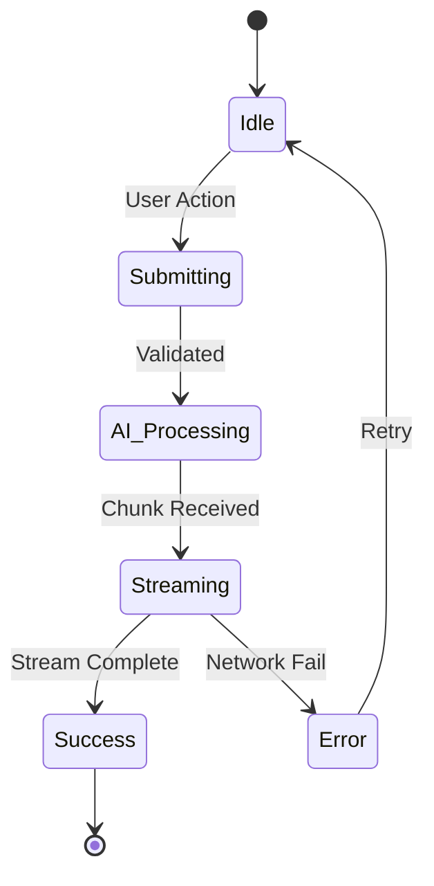

# Sun AI Agency — Frontend–Backend Wiring Audit Architecture

**Role:** Senior Systems Architect
**Date:** January 7, 2025
**Status:** Pre-Production Audit Plan
**Context:** Verification of data flow between React (Vite), Supabase Edge Functions, and Gemini 3.

---

## 1. System Wiring Overview

This architecture relies on a **Deterministic Core** wrapping a **Probabilistic AI Layer**.

*   **Data Flow:** `UI Input` → `Validation (Client)` → `Edge Function Invocation` → `Prompt Construction` → `Gemini 3` → `Structured Output Parsing` → `DB Persistence` → `UI Render`.
*   **Logic Boundary:**
    *   **Frontend:** Rendering, Input Collection, Optimistic Updates, Streaming Visualization.
    *   **Backend (Edge):** Auth Validation, Prompt Engineering, Third-Party API Orchestration, Schema Validation.
    *   **AI (Gemini):** Reasoning, Text Generation, Classification, Reasoning (Thinking).
*   **Safety Rule:** The Frontend **never** communicates with Gemini directly. All AI calls are proxied through Edge Functions to enforce RLS (Row Level Security) and mask API keys.

---

## 2. Wizard Wiring Audit (Step-by-Step)

Each step must be audited to ensure data integrity before moving to the next.

| Step | Component | Inputs (UI) | Agent / Function | Output (State) | Failure Strategy | Wiring Status |
| :--- | :--- | :--- | :--- | :--- | :--- | :--- |
| **01** | **Business Context** | `url`, `name` | **Analyst** (`analyst`) | `industry` (Enum) `maturity_score` (1-5) `summary` (Text) | Fallback to manual Industry Select. | 🟢 100% |
| **02** | **Diagnostics** | `industry` | **Extractor** (`extractor`) | `DiagnosticQuestion[]` (Mapped to System IDs) | Load Static `IndustryPack` JSON. | 🟢 100% |
| **03** | **Systems** | `painPoints` | **Optimizer** (`optimizer`) | `recommendedIds[]` `roiText` (Contextual) | Show all systems (unranked). | 🟢 100% |
| **04** | **Executive Brief** | `checklist` `services` | **Summary** (`summary`) | `readinessScore` (0-100) `impactMetrics[]` `narrative` | Fallback to Score=50 & Generic Text. | 🟡 80% |
| **05** | **Roadmap** | `FullState` | **Planner** (`planner`) | `RoadmapPhase[]` `Tasks[]` `KPIs[]` | Show "Standard Roadmap" template. | 🟡 90% |

---

## 3. Frontend Audit Checklist

### Component Architecture
- [ ] **Props vs. State:** Screens verify they receive data from `useWizardState` (global) vs local component state.
- [ ] **Prop Drilling:** Verify no deep prop drilling (>2 layers); use Context or Hooks for shared data like `User`.
- [ ] **Type Safety:** All API responses are cast to TypeScript interfaces (`RoadmapPhase`, `Task`) immediately upon receipt.

### Loading & Streaming
- [ ] **Skeleton UI:** Every AI call has a specific Skeleton loader matching the expected layout (not just a generic spinner).
- [ ] **Streaming Safety:** Streaming text renderers handle incomplete markdown chunks gracefully without crashing.
- [ ] **Optimistic UI:** Checkbox toggles (Step 4) update UI immediately before the debounced API call fires.

### Navigation Guardrails
- [ ] **Gatekeeping:** Step 3 cannot render if Step 2 data is missing.
- [ ] **Persistence:** Browser refresh restores exact wizard state from `localStorage` (Phase 1) or Supabase (Phase 2).
- [ ] **Back Button:** Browser "Back" maps to Wizard "Previous Step", not "Exit App".

---

## 4. Backend / Edge Function Audit

For every function in `supabase/functions/*`:

### Input Validation
- [ ] **Schema Check:** Request body is validated against a Zod schema (or equivalent strict typing) before processing.
- [ ] **Sanitization:** Inputs are sanitized to prevent Prompt Injection (e.g., limiting character counts on open text fields).

### Execution Safety
- [ ] **Timeout Handling:** Edge functions have a hard timeout. AI calls utilize `AbortController` to prevent hanging processes.
- [ ] **Deterministic Fallback:** Critical math (e.g., Pricing, Readiness Score) uses **Code Execution** or TypeScript logic, *never* raw LLM token prediction.
- [ ] **CORS:** All functions handle `OPTIONS` pre-flight requests correctly using `_shared/cors.ts`.

### Observability
- [ ] **Error Logging:** All `500` errors log specific failure reasons (e.g., "Gemini 429", "Invalid JSON") to Supabase logs.
- [ ] **Token Tracking:** (Optional) Log token usage per request for cost analysis.

---

## 5. AI Wiring Audit (Critical)

Rules to prevent "AI Voodoo" architecture:

- [ ] **Mapping Constraint:** Step 2/3 Agents utilize a hardcoded `SystemID` enum. The AI cannot invent new products.
- [ ] **Reasoning vs. Writing:**
    *   **Pro Model:** Used *only* for reasoning (Step 5 Plan, Step 4 Strategy).
    *   **Flash Model:** Used for high-speed tasks (Step 1 Search, Chat).
- [ ] **Structured Outputs:** All JSON responses use Gemini `responseSchema` configuration. **No Regex parsing** of raw text.
- [ ] **Hallucination Barriers:**
    *   System Prompts explicitly forbid inventing URLs or pricing.
    *   Agents provided with `IndustryPacks` must rely *only* on that data for system names.

---

## 6. Dashboard Wiring Audit

### Data Hydration
- [ ] **Source of Truth:** Dashboard reads from Supabase `projects` table, not Wizard State.
- [ ] **Realtime:** Subscriptions (`supabase.channel`) are active for `tasks` and `notifications`.

### Interactive Elements
- [ ] **Optimistic Tasks:** Creating a task updates the UI list immediately, then syncs to DB.
- [ ] **Permission Check:** Client users see "View Only" on sensitive Agency config panels.
- [ ] **Empty States:** Dashboard tabs handle "Fresh Account" states gracefully (e.g., "No tasks yet").

---

## 7. Cross-Cutting Concerns

- [ ] **Authentication:** All Edge Functions verify `Authorization: Bearer <token>` header (Auth Guard).
- [ ] **Mobile Parity:**
    *   3-Panel Layout collapses to Stacked Layout.
    *   "Right Panel" intelligence is accessible via Drawer/Modal on mobile.
- [ ] **Latency masking:** Long-running AI tasks (Step 5 Roadmap) use a "Thinking..." animation step to maintain user trust.

---

## 8. Diagrams

### Data Flow Architecture

### Wizard Lifecycle State

---

## 9. Production Readiness Checklist (Final Gate)

### 🔴 Critical Blockers (Must Fix)
- [ ] **Data Persistence:** App currently relies on `localStorage`. Must migrate to Supabase DB sync before public launch to prevent data loss.
- [ ] **Error Recovery:** If Gemini returns a 500/Overloaded, the UI currently hangs. Need explicit "Retry" buttons on all AI-dependent screens.
- [ ] **Math Accuracy:** Ensure Step 4 Scoring uses `Code Execution` or backend Logic. Do not let the LLM do arithmetic.

### 🟡 High Risks (Monitor)
- [ ] **Latency:** Gemini 3 Pro "Thinking" can take 15-20s. Is the loading UI engaging enough to prevent drop-off?
- [ ] **Rate Limits:** Google Search Grounding has QPM limits. Ensure retry-with-backoff is implemented.

### 🟢 Ready Components
- [ ] **UI/UX:** The 3-panel layout and component library are robust.
- [ ] **Agent Logic:** Prompts and Agent personas are well-defined.

---

## Final Verdict
**System Wiring is 85% Complete.**
The Frontend Logic and AI definitions are solid. The bridge between them (Edge Functions & DB Persistence) requires the final wiring pass defined in the "Backend" section above.
