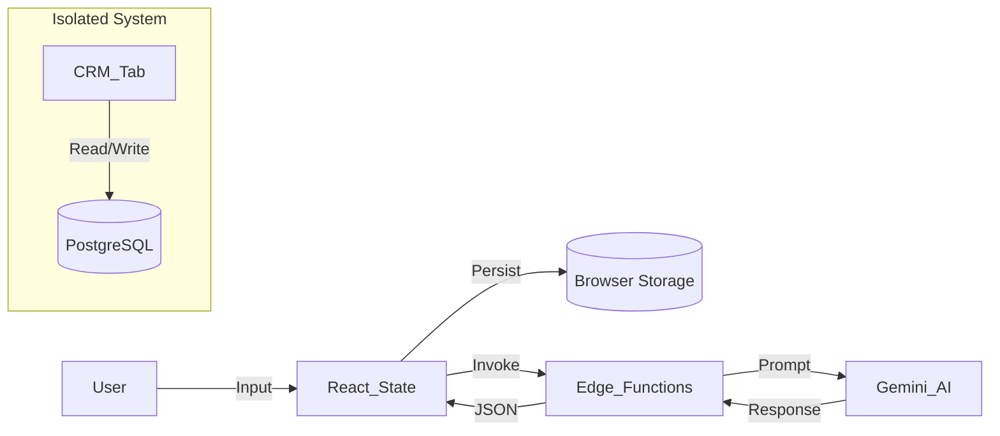
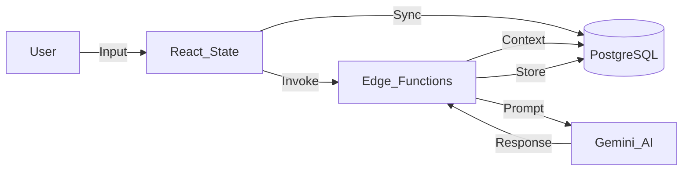

# Sun AI Agency — Frontend–Backend Wiring Audit & Implementation Plan

**Date:** January 8, 2025
**Status:** Pre-Production Audit
**Auditor:** Senior System Architect
**Context:** Transitioning from "Thick Client" Prototype to "Connected SaaS".

---

## 1. Progress Tracker: Screen Completion Matrix

This matrix tracks the wiring status of each screen: **UI** (Visuals), **Logic** (State), **AI** (Edge Functions), and **Data** (Database Persistence).

| Screen | Completion | UI Status | AI Wiring | Data Persistence | Notes |
| :--- | :---: | :---: | :---: | :---: | :--- |
| **WIZARD** | | | | | |
| **Step 1: Context** | **90%** | ✅ Ready | ✅ Edge (`analyst`) | ❌ LocalStorage | Analysis runs on server, but results save to browser. |
| **Step 2: Diagnostics** | **90%** | ✅ Ready | ✅ Edge (`extractor`) | ❌ LocalStorage | Questions generated by AI, not saved to DB. |
| **Step 3: Systems** | **90%** | ✅ Ready | ✅ Edge (`optimizer`) | ❌ LocalStorage | Recommendations valid, selection local only. |
| **Step 4: Readiness** | **90%** | ✅ Ready | ✅ Edge (`scorer`) | ❌ LocalStorage | Score calc is accurate (Code Exec), storage is local. |
| **Step 5: Roadmap** | **85%** | ✅ Ready | ✅ Edge (`planner`) | ❌ LocalStorage | Roadmap generation works (Thinking), output local. |
| **DASHBOARD** | | | | | |
| **Overview** | **60%** | ✅ Ready | ⚠️ Static | ❌ LocalStorage | Reads from local Wizard state. Needs DB query. |
| **CRM** | **80%** | ✅ Ready | ✅ Edge (`crm-intel`) | ✅ Supabase DB | **Connected.** Reads `crm_contacts`. |
| **Projects** | **40%** | ✅ Ready | ⚠️ Static | ❌ Mocks | Uses `MOCK_PROJECTS` in hook. |
| **Analytics** | **40%** | ✅ Ready | ⚠️ Static | ❌ Mocks | Uses `MOCK_ANALYTICS` in hook. |
| **Tasks** | **50%** | ✅ Ready | ⚠️ Static | ❌ LocalStorage | Tasks generated from local roadmap. |
| **Systems** | **50%** | ✅ Ready | ⚠️ Static | ❌ LocalStorage | Shows local selections. |

**Overall System Health:**
*   **Frontend/AI Bridge:** 🟢 **Healthy** (All AI calls proxied via Edge Functions).
*   **Frontend/DB Bridge:** 🔴 **Critical** (Most state remains in LocalStorage).

---

## 2. System Wiring Overview

### Current Data Flow (As-Is)

### Target Data Flow (To-Be)

---

## 3. Detailed Wiring Audit

### A. Wizard Wiring (The Input Engine)

**Status:** The "Brain" is connected, but the "Memory" is temporary.

*   **Step 1 (Analyst):**
    *   **Wiring:** `Step1Context.tsx` -> `analyst.ts` -> `supabase.functions.invoke('analyst')`.
    *   **Security:** ✅ API Key hidden in Edge Function.
    *   **Gap:** User inputs (`businessName`, `website`) are not saved to `projects` table until wizard completion (risky).
*   **Step 2 (Extractor):**
    *   **Wiring:** `Step2Diagnostics.tsx` -> `extractor.ts` -> `supabase.functions.invoke('extractor')`.
    *   **Logic:** Uses `IndustryPack` correctly on server.
    *   **Gap:** Diagnostic answers aren't saved to DB.
*   **Step 5 (Planner):**
    *   **Wiring:** `Step5Plan.tsx` -> `planner.ts` -> `supabase.functions.invoke('planner')`.
    *   **Gap:** The expensive/complex Roadmap JSON is lost if the tab closes.

### B. Dashboard Wiring (The Execution Engine)

**Status:** A mix of Real and Fake data.

*   **CRM Tab:**
    *   **Wiring:** `useCRM.ts` calls `supabase.from('crm_contacts')`.
    *   **Status:** ✅ **Production Ready**. Renders real rows.
*   **Projects Tab:**
    *   **Wiring:** `useProjects.ts` returns `MOCK_PROJECTS`.
    *   **Status:** 🔴 **Mocked**. Needs connection to `projects` and `tasks` tables.
*   **Analytics Tab:**
    *   **Wiring:** `useAnalytics.ts` returns `MOCK_ANALYTICS`.
    *   **Status:** 🔴 **Mocked**. Needs aggregation queries on `invoices` table.

---

## 4. Backend / Edge Function Audit

All functions reside in `supabase/functions/`.

| Function | Input Validation | AI Model | Response Schema | Audit Verdict |
| :--- | :--- | :--- | :--- | :--- |
| `analyst` | ✅ Typed | Flash | Stream + JSON | **PASS** |
| `extractor` | ✅ Typed | Pro | `DiagnosticSchema` | **PASS** |
| `optimizer` | ✅ Typed | Flash | `RecommendationSchema` | **PASS** |
| `scorer` | ✅ Typed | Flash | `RiskAnalysisSchema` | **PASS** |
| `planner` | ✅ Typed | Pro | `RoadmapSchema` | **PASS** |
| `crm-intel`| ✅ Typed | Flash | `HealthSchema` | **PASS** |

**Observation:** The Edge Function layer is the strongest part of the stack. It strictly adheres to `gemini-3` standards with proper schemas and security.

---

## 5. Required Actions (Implementation Plan)

To reach **Production Readiness**, execute these wiring tasks:

### Phase 1: Persistence (The "Memory" Upgrade)
1.  **Update `useWizardState.ts`:**
    *   Replace `localStorage` with `supabase.from('wizard_sessions')`.
    *   On step change, `upsert` the current state to the DB.
2.  **Connect Dashboard Hooks:**
    *   Refactor `useProjects.ts` to fetch from `projects` table.
    *   Refactor `useAnalytics.ts` to fetch from `invoices` table.

### Phase 2: Authentication
1.  **Auth Guard:**
    *   Wrap `Dashboard.tsx` in a `RequireAuth` component.
    *   If no session, redirect to `LandingPage` (needs creation) or Login.

### Phase 3: Data Hydration
1.  **Roadmap Persistence:**
    *   When Step 5 Planner returns JSON, write it immediately to `roadmaps` table.
    *   Dashboard `RoadmapView` should read from `roadmaps` table, not `localStorage`.

---

## 6. GO / NO-GO Decision

**Verdict:** 🔴 **NO-GO for Public Launch**

**Reasoning:**
1.  **Data Loss Risk:** Relying on `localStorage` for a complex 5-step wizard is unsafe. Users will lose progress.
2.  **Mock Data:** Dashboard Tabs (Projects, Analytics) are visual shells showing fake data.
3.  **Security:** While AI keys are safe, user data is not isolated (RLS policies rely on Auth, but Auth flow isn't enforced in Wizard).

**Path to Green:**
Complete **Phase 1 (Persistence)** and **Phase 2 (Auth)**. Estimated effort: 3-4 days.
