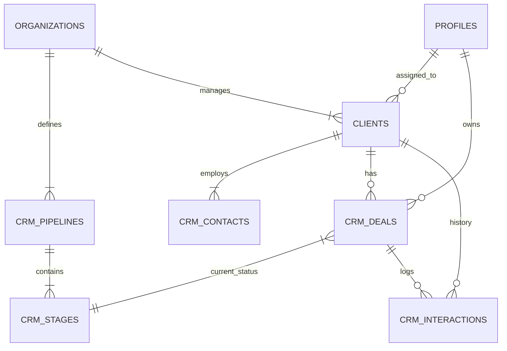

# Supabase CRM Schema Architecture

**Version:** 1.0
**Context:** Advanced CRM Module for Sun AI Agency
**Features:** Multi-pipeline support, Vector-ready interactions, Automated health scoring, RLS security.

---

## 1. Executive Summary

This schema transforms the application from a simple wizard into a robust "System of Intelligence". It goes beyond standard CRUD by integrating:
1.  **Vector Embeddings:** For RAG-powered client retrieval and context aware drafting.
2.  **Activity Aggregation:** Triggers that roll up last contact dates to the parent entity.
3.  **Flexible Pipelines:** Support for multiple deal flows (e.g., "Sales" vs "Renewal").

---

## 2. Entity Relationship Diagram (Conceptual)



---

## 3. SQL Migration Script

### A. Extensions & Enums

```sql
-- Enable Vector extension for AI features
create extension if not exists vector;

-- Standardize CRM Types
create type crm_interaction_type as enum ('email', 'call', 'meeting', 'note', 'linkedin', 'system');
create type crm_sentiment as enum ('positive', 'neutral', 'negative', 'churn_risk');
```

### B. Core Definitions (Pipelines & Stages)

Allows the agency to have different workflows (e.g., "New Sales" vs "Partnership").

```sql
create table public.crm_pipelines (
  id uuid primary key default gen_random_uuid(),
  org_id uuid references public.organizations(id) not null,
  name text not null,
  is_default boolean default false,
  created_at timestamptz default now()
);

create table public.crm_stages (
  id uuid primary key default gen_random_uuid(),
  pipeline_id uuid references public.crm_pipelines(id) on delete cascade not null,
  name text not null,
  probability int default 0, -- Win probability %
  display_order int default 0,
  created_at timestamptz default now()
);
```

### C. People & Companies (Contacts)

Enhancing the existing `clients` table and adding `crm_contacts`.

```sql
-- Ensure Clients table has CRM fields (Idempotent update)
alter table public.clients 
add column if not exists lifecycle_stage text default 'lead', -- lead, marketing_qualified, sales_qualified, customer, evangelist
add column if not exists health_score int default 50, -- 0-100 AI calculated
add column if not exists last_interaction_at timestamptz,
add column if not exists next_action_date timestamptz,
add column if not exists assigned_to uuid references public.profiles(id);

-- Contacts: The humans inside the client companies
create table public.crm_contacts (
  id uuid primary key default gen_random_uuid(),
  org_id uuid references public.organizations(id) not null,
  client_id uuid references public.clients(id) on delete set null,
  
  first_name text not null,
  last_name text,
  email text,
  phone text,
  linkedin_url text,
  job_title text,
  
  is_primary boolean default false,
  tags text[], -- e.g., ['decision_maker', 'champion']
  
  created_at timestamptz default now(),
  updated_at timestamptz default now()
);
```

### D. The Deal Flow (Opportunities)

```sql
create table public.crm_deals (
  id uuid primary key default gen_random_uuid(),
  org_id uuid references public.organizations(id) not null,
  client_id uuid references public.clients(id) not null,
  stage_id uuid references public.crm_stages(id),
  
  title text not null,
  amount decimal(12,2) default 0,
  currency text default 'USD',
  
  expected_close_date date,
  owner_id uuid references public.profiles(id),
  
  win_probability int, -- Override or inherited from stage
  status text default 'open', -- open, won, lost, archived
  
  created_at timestamptz default now(),
  updated_at timestamptz default now()
);
```

### E. The History Layer (Interactions & Vectors)

This is the most critical table for the AI Agents. It stores every touchpoint.

```sql
create table public.crm_interactions (
  id uuid primary key default gen_random_uuid(),
  org_id uuid references public.organizations(id) not null,
  
  -- Links (Polymorphic-ish logic via nullable FKs)
  client_id uuid references public.clients(id) on delete cascade,
  deal_id uuid references public.crm_deals(id) on delete set null,
  contact_id uuid references public.crm_contacts(id) on delete set null,
  
  type crm_interaction_type not null,
  direction text check (direction in ('inbound', 'outbound')),
  
  -- Content
  subject text,
  content text, -- The raw body
  summary text, -- AI generated summary
  
  -- AI Metadata
  embedding vector(1536), -- For RAG (Gemini/OpenAI compatible dim)
  sentiment crm_sentiment default 'neutral',
  
  created_by uuid references public.profiles(id),
  created_at timestamptz default now()
);
```

### F. Performance Indexes

```sql
-- Lookup Indexes
create index idx_crm_contacts_client on public.crm_contacts(client_id);
create index idx_crm_contacts_email on public.crm_contacts(email);
create index idx_crm_deals_stage on public.crm_deals(stage_id);
create index idx_crm_deals_client on public.crm_deals(client_id);
create index idx_crm_interactions_client on public.crm_interactions(client_id);
create index idx_crm_interactions_created_at on public.crm_interactions(created_at desc);

-- Vector Index (IVFFlat for speed vs recall balance)
-- Note: Requires sufficient data rows to function optimally, created here for schema completeness
create index idx_crm_interactions_embedding 
on public.crm_interactions 
using ivfflat (embedding vector_cosine_ops)
with (lists = 100);
```

### G. Row Level Security (RLS)

Strict multi-tenant isolation.

```sql
-- Enable RLS
alter table public.crm_pipelines enable row level security;
alter table public.crm_stages enable row level security;
alter table public.crm_contacts enable row level security;
alter table public.crm_deals enable row level security;
alter table public.crm_interactions enable row level security;

-- Policies (Standard Org Isolation)
create policy "Org Isolation: Pipelines" on public.crm_pipelines
  for all using (org_id in (select org_id from public.team_members where user_id = auth.uid()));

create policy "Org Isolation: Stages" on public.crm_stages
  using (pipeline_id in (select id from public.crm_pipelines));

create policy "Org Isolation: Contacts" on public.crm_contacts
  for all using (org_id in (select org_id from public.team_members where user_id = auth.uid()));

create policy "Org Isolation: Deals" on public.crm_deals
  for all using (org_id in (select org_id from public.team_members where user_id = auth.uid()));

create policy "Org Isolation: Interactions" on public.crm_interactions
  for all using (org_id in (select org_id from public.team_members where user_id = auth.uid()));
```

### H. Automation Triggers

**1. Last Contact Rollup**
Automatically updates the `clients` table when a new interaction is logged.

```sql
create or replace function public.handle_new_interaction() 
returns trigger as $$
begin
  update public.clients
  set last_interaction_at = new.created_at
  where id = new.client_id;
  return new;
end;
$$ language plpgsql security definer;

create trigger on_crm_interaction_insert
  after insert on public.crm_interactions
  for each row execute procedure public.handle_new_interaction();
```

**2. Updated At Timestamp**
Reuse existing trigger function if available, or define new.

```sql
create trigger handle_updated_at before update on public.crm_contacts
  for each row execute procedure moddatetime (updated_at);

create trigger handle_updated_at before update on public.crm_deals
  for each row execute procedure moddatetime (updated_at);
```

---

## 4. AI Edge Function Integration Points

| Function | Trigger Event | Data Access | Goal |
| :--- | :--- | :--- | :--- |
| `crm-intelligence` | **SELECT** (Client View) | Reads `crm_interactions` (Last 5) | Generate Health Score & Next Actions. |
| `crm-ingest` | **INSERT** (Webhook) | Writes to `crm_interactions` | Log inbound emails/calls automatically. |
| `crm-embed` | **INSERT** (DB Trigger) | Reads `content` -> Writes `embedding` | Generate vector for search (Async). |

---

## 5. Deployment Checklist

1.  **Run Migration:** Execute SQL in Supabase SQL Editor.
2.  **Seed Data:** Create default pipeline ("Sales") and stages ("New", "Qualification", "Proposal", "Closed Won", "Closed Lost").
3.  **Verify RLS:** Test with a user profile to ensure they can't see other org's deals.
4.  **Connect UI:** Update `useCRM` hook to fetch from these new tables instead of mocks.
