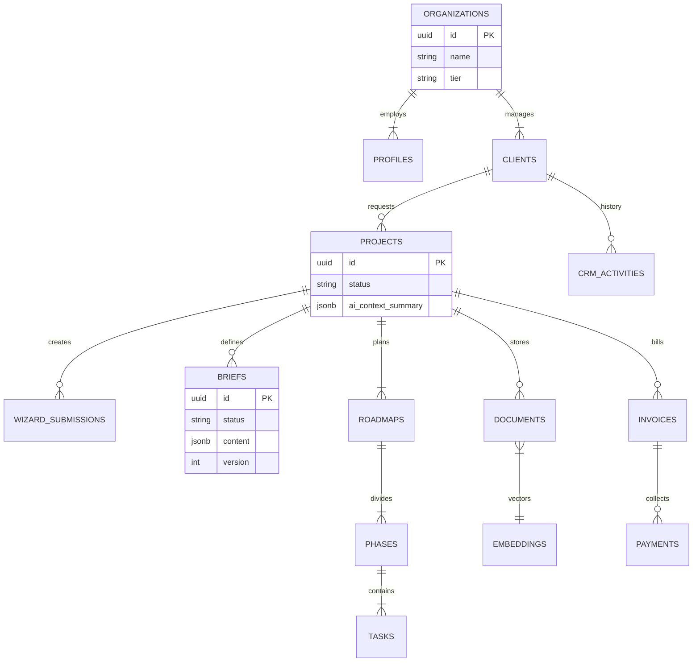

# Sun AI Agency — Supabase Schema Architecture V2 (Optimized)

**Date:** January 7, 2025
**Status:** Approved Architecture
**Context:** Full-Stack AI Consultancy Platform (Wizard + Client Portal + Agency CRM)

---

## 1. Executive Summary

This V2 schema optimizes the original plan by introducing **Vector Search** for RAG, **Version Control** for briefs, and a strict **Financial Ledger** for billing. It is designed to support the specific data needs of the Gemini 3 Agents (Analyst, Planner, Scorer).

**Core Design Principles:**
1.  **Multi-Tenancy at Root:** Every row belongs to an `organization_id`.
2.  **JSONB for Flexibility:** Wizard steps store data in JSONB to allow rapid iteration of question logic without schema migrations.
3.  **Strict Relations for Execution:** Tasks, Invoices, and CRM data use strict relational columns for performant querying and aggregations.
4.  **Vector-Ready:** Built-in support for `pgvector` to enable the Assistant Agent to "read" uploaded documents.

---

## 2. Entity Relationship Diagram (ERD)



---

## 3. Detailed Schema Specification

### Module A: Core Identity & Access

| Table | Column | Type | Notes |
| :--- | :--- | :--- | :--- |
| `organizations` | `id` | uuid | Primary Tenant. |
| | `type` | text | 'agency' or 'client_account'. |
| `profiles` | `id` | uuid | Linked to `auth.users`. |
| | `org_id` | uuid | FK to Organizations. |
| | `role` | text | 'owner', 'consultant', 'client'. |

### Module B: The Wizard & Intelligence Layer

Stores the raw inputs from the 5-step wizard and the AI's synthesized context.

| Table | Column | Type | Notes |
| :--- | :--- | :--- | :--- |
| `wizard_submissions` | `id` | uuid | One row per completed wizard run. |
| | `project_id` | uuid | FK. |
| | `step_data` | jsonb | Full state dump (Steps 1-4). |
| | `ai_analysis` | jsonb | The Gemini output (Score, Risks). |
| `ai_cache` | `hash` | text | Hash of prompt inputs. |
| | `response` | jsonb | Cached AI response to save tokens. |

### Module C: Client Dashboard (The Portal)

The view for external clients. Includes RAG support.

| Table | Column | Type | Notes |
| :--- | :--- | :--- | :--- |
| `briefs` | `content` | jsonb | Rich text content of the strategy. |
| | `status` | text | 'draft', 'approved'. |
| `brief_versions` | `diff` | jsonb | Delta of changes for version history. |
| `documents` | `file_path` | text | Storage bucket path. |
| | `embedding` | vector(768)| **Gemini Embedding** for RAG search. |
| | `summary` | text | AI-generated summary of the doc. |

### Module D: Agency CRM & Execution

The internal view for the Agency team.

| Table | Column | Type | Notes |
| :--- | :--- | :--- | :--- |
| `clients` | `pipeline_stage`| text | 'Lead', 'Proposal', 'Active', 'Churned'. |
| | `health_score` | int | 0-100 (Calculated by AI). |
| `crm_activities` | `type` | text | 'call', 'email', 'meeting', 'note'. |
| | `sentiment` | text | AI-analyzed sentiment of the interaction. |
| `tasks` | `status` | text | 'todo', 'in_progress', 'review', 'done'. |
| | `ai_generated` | boolean | True if created by Orchestrator Agent. |

### Module E: Financials

Strict ledger for the Analytics Agent to analyze.

| Table | Column | Type | Notes |
| :--- | :--- | :--- | :--- |
| `invoices` | `amount_cents` | int | Avoid floating point errors. |
| | `due_date` | date | |
| | `status` | text | 'paid', 'open', 'overdue'. |
| `payments` | `stripe_id` | text | External reference. |

---

## 4. Row Level Security (RLS) Strategy

This is critical for preventing Clients from seeing Agency internal data.

1.  **Agency Scope:** Users with `role = 'consultant'` or `owner` can read/write ALL rows where `org_id` matches their own.
2.  **Client Scope:** Users with `role = 'client'` can ONLY read rows in `projects` (and children like `tasks`, `briefs`) where `projects.client_id` matches their profile ID.
3.  **Strict Isolation:** `crm_activities` and internal `notes` on Clients are **never** exposed to the 'client' role via policy.

---

## 5. Migration Plan (Phase 2 Execution)

Since we are building on the MVP, we will run these migrations to upgrade the schema.

### Step 1: Enable Extensions
```sql
create extension if not exists vector;
```

### Step 2: Create Documents Table (RAG Ready)
```sql
create table public.documents (
  id uuid primary key default gen_random_uuid(),
  org_id uuid references organizations(id),
  project_id uuid references projects(id),
  name text not null,
  storage_path text not null,
  content_text text, -- Extracted text for indexing
  embedding vector(768), -- For Gemini semantic search
  summary text, -- AI generated one-liner
  created_at timestamptz default now()
);
```

### Step 3: Create Financial Tables
```sql
create table public.invoices (
  id uuid primary key default gen_random_uuid(),
  project_id uuid references projects(id),
  amount_cents integer not null,
  status text check (status in ('draft', 'sent', 'paid', 'overdue')),
  due_date date,
  pdf_url text
);
```

### Step 4: Upgrade Tasks for Orchestrator
```sql
alter table public.tasks 
add column priority text check (priority in ('high','medium','low')),
add column estimated_hours float,
add column ai_suggestion text; -- For "Do It" button context
```

---

## 6. Implementation Checklist

- [ ] **Run Migrations:** Execute SQL in Supabase Dashboard.
- [ ] **Generate Types:** Run `supabase gen types typescript --local > types/supabase.ts`.
- [ ] **Update AI Service:** Update `assistant.ts` to insert embeddings into `documents` table upon upload.
- [ ] **Update Hooks:** Update `useWizardState` to pull/push from `wizard_submissions` table instead of local storage.
