# Sun AI Agency — Product Requirements Document (v2.0)

**Version:** 2.0 (The Agentic Era)
**Status:** Approved for Engineering
**Focus:** Full-Stack AI Consultancy Platform with Gemini 3 Integration

---

## 1. Executive Summary

Sun AI Agency is an industry-first **AI Consultancy Platform**. It automates the work of a high-end strategy consultant, using a multi-agent architecture to research, diagnose, plan, and execute AI transformations for businesses.

Unlike generic chatbots, Sun AI uses a **"Context-First" architecture**. It leverages **Gemini 3 Pro** (Reasoning) and **Gemini 3 Flash** (Speed) alongside advanced tools like **Google Search Grounding**, **Deep Research**, and **Code Execution** to deliver verified, mathematically accurate, and strategically sound roadmaps.

**Core Value Prop:** "The wisdom of a senior consultant, the speed of software."

---

## 2. Phased Rollout Strategy

### Phase 1: The Intelligent Wizard (MVP)
*   **Goal:** User Acquisition & Strategy Generation.
*   **Scope:** Screens 1-5 (Frontend Only).
*   **Key Tech:** Gemini 3 Flash (Search/URL Context), Gemini 3 Pro (Thinking), Structured Outputs.
*   **Persistence:** LocalStorage.

### Phase 2: The Execution Dashboard (Beta)
*   **Goal:** Implementation & Retention.
*   **Scope:** Dashboard, Auth, Database.
*   **Key Tech:** Supabase (Auth/DB), Orchestrator Agent, Function Calling, Google Maps Grounding.
*   **Persistence:** Supabase PostgreSQL.

### Phase 3: The Autonomous Firm (Scale)
*   **Goal:** High-Value Automation.
*   **Scope:** RAG (Docs), Voice Mode, Visualizations.
*   **Key Tech:** Interactions API (Low-latency), Nano Banana (Image Gen), Deep Research, Code Execution.

---

## 3. AI Architecture: The "Sun Agentic System"

The platform is driven by 10 specialized agents. Each agent utilizes specific Gemini 3 capabilities.

| Agent | Role | Model | Primary Tools |
| :--- | :--- | :--- | :--- |
| **🕵️ Analyst** | Research & Discovery | `gemini-3-flash` | **Google Search**, **URL Context**, **Deep Research** |
| **🔬 Extractor** | Data Structuring | `gemini-3-flash` | **Structured Outputs** (JSON Schema) |
| **⚖️ Optimizer** | Solution Mapping | `gemini-3-flash` | **Text Gen**, System Prompting |
| **💯 Scorer** | Risk Audit | `gemini-3-flash` | **Code Execution** (Math), Structured Outputs |
| **📅 Planner** | Strategy & Timeline | `gemini-3-pro` | **Gemini Thinking**, **Structured Outputs** |
| **🎼 Orchestrator**| Task Management | `gemini-3-flash` | **Function Calling** |
| **💬 Assistant** | Live Support | `gemini-3-flash` | **Interactions API** (Voice/Chat) |
| **🎨 Visualizer** | Future State Demo | `gemini-3-pro` | **Image Generation** (Nano Banana) |
| **📚 Retriever** | Knowledge Base | `gemini-3-flash` | **RAG** (Vector Search) |
| **🛡️ Controller** | Safety & QA | `gemini-3-flash` | Content Safety Settings |

---

## 4. User Journeys & Screen Specifications

### 4.1 Phase 1: The Core Wizard

#### Screen 1: Business Context (The Truth Baseline)
*   **User Action:** Enters URL and Company Name.
*   **Agent:** **Analyst**.
*   **AI Logic:**
    1.  **URL Context Tool**: Crawls the landing page to extract H1, Meta Description, and Offer.
    2.  **Google Search Grounding**: Verifies the business exists and finds recent news.
    3.  **Classification**: Auto-detects Industry.
*   **UI/UX:** 3-Panel Layout. Right panel streams "Reading website... Verifying market position..."

#### Screen 2: Industry Diagnostics (The Deep Dive)
*   **User Action:** Views Industry context, answers dynamic questions.
*   **Agent:** **Extractor**.
*   **AI Logic:**
    1.  **Structured Output**: Generates a JSON form strictly matching the detected Industry.
    2.  **Google Maps Grounding** (If Real Estate/Tourism): "I see you are based in [City]. Local competition is high."
*   **UI/UX:** Dynamic Form generation.

#### Screen 3: System Selection (The Prescription)
*   **User Action:** Selects AI Systems (Lead Gen, CRM, etc.).
*   **Agent:** **Optimizer** + **Visualizer**.
*   **AI Logic:**
    1.  **Re-Ranking**: Sorts systems based on Step 2 pain points.
    2.  **Nano Banana (Image Gen)**: Generates a *preview* of what the dashboard will look like for *this specific client* (e.g., "Generate a CRM dashboard for a Fashion Brand").
*   **UI/UX:** System Cards + Generated Image Preview in Right Panel.

#### Screen 4: Readiness Assessment (The Audit)
*   **User Action:** Completes checklist (Data, Team, Budget).
*   **Agent:** **Scorer**.
*   **AI Logic:**
    1.  **Code Execution**: Uses Python to calculate a weighted score based on complex heuristics (not just LLM guessing). ensures mathematical accuracy.
    2.  **Risk Analysis**: Identifies critical gaps.
*   **UI/UX:** Circular Score Visualization + Risk/Win List.

#### Screen 5: The Master Plan (The Strategy)
*   **User Action:** Watches the plan generation.
*   **Agent:** **Planner**.
*   **AI Logic:**
    1.  **Gemini Thinking**: "Thinking Budget" set to 2048 tokens. Analyzes dependencies (e.g., "Cannot start Ads before CRM is ready").
    2.  **Structured Output**: Returns a strict JSON Gantt structure.
*   **UI/UX:** Streaming "Thinking" visualization (Right Panel) -> Vertical Timeline (Center).

---

### 4.2 Phase 2: The Dashboard

#### Screen 6: Overview (Command Center)
*   **Agent:** **Analyst**.
*   **Feature:** **Deep Research**.
*   **Logic:** Periodically performs deep searches on the client's competitors and updates a "Market Pulse" widget.

#### Screen 7: Interactive Roadmap
*   **Agent:** **Planner**.
*   **Feature:** **Function Calling**.
*   **Logic:** When user drags a task, UI calls `update_timeline()`. The Planner re-thinks dependencies and returns a valid new schedule.

#### Screen 8: Task Orchestration
*   **Agent:** **Orchestrator**.
*   **Feature:** **Function Calling** + **Text Gen**.
*   **Logic:** "Do It For Me" buttons.
    *   *Task:* "Draft Email." -> Agent generates text.
    *   *Task:* "Calculate ROI." -> Agent uses Code Execution.

---

### 4.3 Phase 3: Advanced Features

#### Feature: "Sun Voice" (Dashboard Assistant)
*   **Location:** Global Floating Action Button.
*   **Tech:** **Interactions API**.
*   **Logic:** Low-latency, multimodal voice interaction. User can talk to their project: "How are we doing on the Lead Gen setup?"

#### Feature: "The Vault" (RAG Knowledge Base)
*   **Location:** New "Documents" Tab.
*   **Tech:** **Retriever Agent** (Embeddings).
*   **Logic:** User uploads PDFs (SOPs, Brand Guidelines). Agents cite these docs when generating content.

---

## 5. Workflows & Automations (Mermaid)

### 5.1 The "Deep Research" Loop (Screen 1 & Dashboard)

```mermaid
graph TD
    User[User Input] --> Analyst[🕵️ Analyst Agent]
    Analyst -->|Step 1| URL[URL Context Tool]
    Analyst -->|Step 2| Search[Google Search]
    Search -->|Results| Deep{Deep Research?}
    Deep -- Yes --> Loop[Iterative Query Loop]
    Loop --> Synthesis[Synthesize Report]
    Deep -- No --> Quick[Quick Summary]
    Synthesis --> UI[Right Panel Stream]
```

### 5.2 The "Thinking" Planner (Screen 5)

```mermaid
sequenceDiagram
    participant User
    participant UI
    participant Planner as 📅 Planner (Gemini 3 Pro)
    
    User->>UI: Request Plan
    UI->>Planner: Context + Thinking Budget
    loop Thinking Process
        Planner->>Planner: Analyze Dependencies
        Planner->>Planner: Sequence Phases
        Planner->>Planner: Allocate Resources
    end
    Planner-->>UI: Structured JSON (Roadmap)
    UI->>User: Render Gantt Chart
```

### 5.3 The "Orchestrator" Action Loop (Dashboard)

```mermaid
graph LR
    Task[Task: Draft Outreach] --> Click[User Clicks 'Auto-Draft']
    Click --> Orch[🎼 Orchestrator]
    Orch -->|Decide| Tool{Select Tool}
    Tool -->|Simple| Gen[Text Generation]
    Tool -->|Complex| Func[Function Call: Email API]
    Gen --> Review[User Review]
    Func --> Review
```

---

## 6. Technical Stack Requirements

### Frontend
*   **Framework:** React 19 (Vite)
*   **Language:** TypeScript
*   **State:** React Context + Supabase Realtime
*   **Styling:** Tailwind CSS

### Backend & AI Infrastructure
*   **Database:** Supabase (PostgreSQL)
*   **Auth:** Supabase Auth
*   **Edge Functions:** Deno (hosting the Agents)
*   **AI Client:** `@google/genai` SDK
*   **Vector Store:** `pgvector` (for RAG)

### Data Schema (Key Entities)
*   `Profiles`: Users
*   `Projects`: The implementation container
*   `Roadmaps`: JSON structure of Screen 5
*   `Tasks`: Individual work items
*   `Context`: Vector embeddings of business info

---

## 7. Success Metrics & Validation

| Feature | Success Metric | Verification Method |
| :--- | :--- | :--- |
| **Business Verification** | >95% Accuracy | Compare Analyst output vs Manual Search. |
| **Roadmap Logic** | 0 Logical Conflicts | Planner output checked for date overlaps. |
| **Readiness Score** | mathematically verifiable | Code Execution output matches Excel formula. |
| **Latency** | < 2s for Flash, < 15s for Thinking | Performance monitoring. |

---

## 8. Launch Checklist (Short)

1.  ✅ **Core Wizard:** Screens 1-5 implemented.
2.  ⬜ **AI Migration:** Move Client-side API calls to Edge Functions (Security).
3.  ⬜ **Thinking Integration:** Enable `thinking_config` for Planner.
4.  ⬜ **Visualizer:** Add Nano Banana image gen to Screen 3.
5.  ⬜ **Auth:** Enable Supabase Login.
6.  ⬜ **Dashboard:** Connect Task Board to Orchestrator.

