# Sun AI Agency — Enhanced Implementation Master Plan (v2.1)

**Status:** Ready for Execution  
**Focus:** Migration to Server-Side Architecture, Industry Packs, and Advanced Gemini Features.

---

## 1. Executive Summary (Simplified)

We are moving the "Brain" of the application from the user's browser to a secure server. 

**Why?**
1.  **Security:** Currently, API keys are exposed. We will move them to Supabase Edge Functions.
2.  **Intelligence:** We are upgrading from "Fast" models (Flash) to "Smart" models (Pro with Thinking) for deep strategy.
3.  **Specialization:** We are creating "Industry Packs" (data files) so the AI knows the difference between *Fashion* (Visuals/Returns) and *Real Estate* (Location/Leads) without guessing.

---

## 2. Feature & Agent Matrix

| Feature | AI Agent | Purpose | Success Criteria |
| :--- | :--- | :--- | :--- |
| **Industry Packs** | All Agents | Inject static, vertical-specific knowledge (KPIs, System Names) into prompts. | Prompts load dynamic data based on `IndustryType`. |
| **Business Search** | **Analyst** | Verify business existence and stream "Truth Baseline". | Returns verified industry & summary via Google Search. |
| **Deep Diagnostics** | **Extractor** | Generate questions using specific industry jargon. | 4 Questions generated; options map to valid System IDs. |
| **System Ranking** | **Optimizer** | Recommend systems based on Pain Points + Selected Services. | Recommends top 3 systems; customized ROI text. |
| **Math Scoring** | **Scorer** | Calculate readiness score using Code Execution (Python). | Returns accurate 0-100 score; identifies specific gaps. |
| **Strategic Plan** | **Planner** | Create 3-phase roadmap with dependencies. | Returns Phases, KPIs, Deliverables via Thinking Mode. |
| **Task Breakdown** | **Orchestrator** | Convert Roadmap into atomic To-Do items. | Breaks 1 roadmap item into 3-5 sub-tasks with tags. |
| **Document RAG** | **Assistant** | Analyze uploaded briefs/PDFs for context. | Extracts key constraints from uploaded files. |
| **Financial BI** | **Analytics** | Calculate budget burn and revenue predictions. | Accurately flags budget overruns via Code Execution. |

---

## 3. Sequential Prompt List (Prioritized)

This list defines the order of operations. **Score (0-100)** indicates critical importance.

| Seq | Prompt Name | Description | Score |
| :--- | :--- | :--- | :--- |
| 01 | **Supabase Core** | Setup Database Tables (Projects, Clients) & RLS. | **100** |
| 02 | **Industry Data** | Create `industryPacks.ts` with static definitions. | **95** |
| 03 | **Edge Scaffold** | Create `_shared` utilities (Gemini Client, CORS). | **95** |
| 04 | **Analyst Migration** | Move Step 1 Logic to Edge (Flash + Search). | **90** |
| 05 | **Context Upgrade** | Update Step 1 to use `Selected Services` in analysis. | **85** |
| 06 | **Extractor Upgrade** | Move Step 2 to Edge (Pro + Thinking + Pack). | **90** |
| 07 | **Optimizer Upgrade** | Move Step 3 to Edge (Ranking Logic + Services). | **85** |
| 08 | **Scorer Upgrade** | Move Step 4 to Edge (Code Exec for Math). | **80** |
| 09 | **Planner Upgrade** | Move Step 5 to Edge (Pro + Thinking 4k). | **90** |
| 10 | **Dashboard Data** | Implement Realtime Subscriptions in React. | **75** |
| 11 | **Orchestrator** | Create Dashboard Task Agent (Function Calling). | **70** |
| 12 | **Analytics** | Create Dashboard BI Agent (Code Exec). | **65** |

---

## 4. Architecture Diagram

```mermaid
flowchart TD
    User[Client Frontend]
    
    subgraph Edge_Runtime [Supabase Edge Functions]
        Gateway[Shared Gemini Client]
        
        Analyst[🕵️ Analyst<br>Flash + Search]
        Extractor[🔬 Extractor<br>Pro + Thinking]
        Planner[📅 Planner<br>Pro + Thinking]
    end
    
    subgraph Data_Layer [Supabase DB & Storage]
        Packs[(Industry Packs<br>TypeScript/JSON)]
        DB[(PostgreSQL)]
        Vault[API Keys]
    end

    User -->|Invoke| Analyst
    User -->|Invoke| Extractor
    User -->|Invoke| Planner
    
    Analyst --> Gateway
    Extractor --> Gateway
    Planner --> Gateway
    
    Gateway --> Vault
    Gateway --> Packs
    Gateway --> DB
```



---

## 5. Implementation Strategy (Multi-Step Prompts)

Copy and paste these prompts sequentially to the AI Developer to execute the plan.

### Phase 1: Foundation (Data & Backend)

**Prompt 1: Industry Packs & Types**
```text
Create a new file `data/industryPacks.ts`. 
Define a TypeScript structure for `IndustryPack` containing:
1. `systemNames`: Map of generic IDs to industry-specific titles (e.g., 'lead_gen' -> 'Fashion Drop Waitlist').
2. `roiFormulas`: String templates for ROI calculation.
3. `diagnosticTemplates`: 4 static question frames.
4. `kpis`: Array of strings (e.g., "AOV", "Churn").

Populate this file with data for 'Fashion', 'Real Estate', 'Tourism', and 'Events'.
Update `types.ts` to export this interface.
```

**Prompt 2: Supabase Setup**
```text
We are migrating to Supabase.
1. Create a migration file `supabase/migrations/20250107_init.sql`.
2. Define tables: `organizations`, `projects`, `tasks`, `clients`, `briefs`, `invoices` based on `docs/plan/supabase.md`.
3. Enable RLS on all tables.
4. Create a `services/supabase.ts` in the frontend to initialize the client using `VITE_SUPABASE_URL`.
```

### Phase 2: Edge Function Migration (The Wizard)

**Prompt 3: Shared Edge Utilities**
```text
Create the directory structure `supabase/functions/_shared/`.
1. Create `cors.ts`: Export standard CORS headers.
2. Create `gemini.ts`: Export a helper `createGeminiClient()` that:
   - Reads `GEMINI_API_KEY` from `Deno.env`.
   - Throws a clear error if missing.
   - Instantiates `GoogleGenAI`.
3. Create `types.ts`: Copy relevant shared types from the frontend.
```

**Prompt 4: Analyst Agent (Step 1)**
```text
Create `supabase/functions/analyst/index.ts`.
- Model: `gemini-3-flash-preview`.
- Tool: `googleSearch`.
- Inputs: `businessName`, `website`, `selectedServices`.
- Logic:
  1. Verify business existence.
  2. Use `selectedServices` to refine `maturity_score` (1-5).
  3. Return JSON schema: `{ industry, maturity_score, observations[] }`.
- Output: Stream text observations, then return final JSON.
```

**Prompt 5: Extractor Agent (Step 2)**
```text
Create `supabase/functions/extractor/index.ts`.
- Model: `gemini-3-pro-preview`.
- Config: `thinkingConfig: { thinkingBudget: 2048 }`.
- Inputs: `industry`, `selectedServices`.
- Logic:
  1. Import `IndustryPack` for the specific industry.
  2. Generate 4 questions (Sales, Content, Speed, Priority).
  3. Map options to valid System IDs.
- Schema: Strict `DiagnosticResponse`.
```

**Prompt 6: Optimizer Agent (Step 3)**
```text
Create `supabase/functions/optimizer/index.ts`.
- Model: `gemini-3-flash-preview`.
- Inputs: `industry`, `painPoints`, `selectedServices`.
- Logic:
  1. If `selectedServices` includes 'Chatbots', prioritize conversational systems.
  2. Calculate ROI using `IndustryPack.roiFormulas`.
  3. Increase thinking budget to 2048 tokens.
- Output: Ranked System IDs + Custom ROI text.
```

**Prompt 7: Scorer Agent (Step 4)**
```text
Create `supabase/functions/scorer/index.ts`.
- Model: `gemini-3-flash-preview`.
- Tool: `codeExecution`.
- Inputs: `checklist`, `selectedServices`.
- Logic:
  1. If `selectedServices` contains 'AI Agents', verify Infrastructure API readiness.
  2. Use Python to calculate weighted score (0-100).
- Output: Score, Risks, Quick Wins.
```

**Prompt 8: Planner Agent (Step 5)**
```text
Create `supabase/functions/planner/index.ts`.
- Model: `gemini-3-pro-preview`.
- Config: `thinkingConfig: { thinkingBudget: 4096 }`.
- Inputs: Full Wizard State + Industry Pack.
- Logic:
  1. Analyze dependencies between Systems and Readiness Gaps.
  2. Generate 3-Phase Roadmap.
- Schema Update: Add `deliverables: string[]` and `kpis: string[]` to each phase.
```

### Phase 3: Dashboard & Advanced Features

**Prompt 9: Orchestrator & Analytics**
```text
1. Create `supabase/functions/orchestrator/index.ts` (Flash).
   - Input: Roadmap JSON.
   - Capability: `functionDeclarations` for `send_email_reminder`.
   - Task: Break roadmap into sub-tasks.

2. Create `supabase/functions/analytics/index.ts` (Pro).
   - Tool: `codeExecution` for Budget Calculations.
   - Prompt: Analyze financial data and flag budget overruns.
```

**Prompt 10: RAG Assistant**
```text
Create `supabase/functions/assistant/index.ts`.
- Feature: RAG (Retrieval Augmented Generation).
- Logic: 
  1. Receive document ID.
  2. Query `match_documents` RPC in Supabase.
  3. Synthesize answer using retrieved context.
```

**Prompt 11: Frontend Integration**
```text
1. Update `services/api.ts` in React to replace local AI calls with `supabase.functions.invoke('agent-name')`.
2. Implement `useSubscription` in Dashboard components to listen for DB changes (Realtime).
3. Add "Missing API Key" error handling in the UI if Edge Functions return 500.
```
