# Wizard Screen 2: Industry Diagnostics — Implementation Prompt

**Progress Tracker:** Step 2 of 5 | Status: Specification Ready | Priority: P0 Critical  
**Estimated Implementation:** 3-4 days | Dependencies: Step 1 Context (Services + Docs), Extractor Agent  
**AI Model:** `gemini-3-pro-preview` | **Tools:** Thinking Mode, Structured Outputs

---

## 1. Executive Summary

Screen 2 is the "Consultant" phase. It transforms the verified business identity from Step 1 into a specific problem set. Instead of generic questions ("What is your problem?"), it uses the **Extractor Agent** to generate highly relevant, industry-specific diagnostic scenarios.

**The "Context-First" Upgrade:**
This screen now consumes the **Selected Services** (e.g., WhatsApp, Shopify) and **Document Insights** (e.g., PDF content) from Step 1.
*   *If user has Shopify:* We ask about "Cart Abandonment" and "AOV", not "Do you need a website?".
*   *If user uploaded a manifesto about "Slow Support":* We generate a question specifically about "Response Time Automation".

**Core Value:** The user feels deeply understood because the questions reflect their specific tech stack and stated goals from the uploaded documents.

---

## 2. Three-Panel Layout Architecture

### Left Panel (20%) — Verified Context
*   **Role:** Continuity & Trust.
*   **Content:**
    *   **Industry Badge:** e.g., "Fashion E-commerce" (Locked).
    *   **Tech Stack Detected:** Icons/List of services selected in Step 1 (e.g., "Shopify", "Instagram").
    *   **Context Signal:** "Analysis based on your website & uploaded docs."
*   **Behavior:** Sticky sidebar.

### Center Panel (50%) — The Diagnostic Form
*   **Role:** Data Collection.
*   **Content:**
    *   **Dynamic Title:** e.g., "Let's diagnose your Growth Bottlenecks."
    *   **4 Diagnostic Cards:** Single-select questions generated by AI.
    *   **"Analyze" Button:** Triggers Step 3.
*   **UX Pattern:** Progressive disclosure or a clean vertical stack of cards.

### Right Panel (30%) — Consultant's Logic
*   **Role:** Transparency (The "Why").
*   **Content:**
    *   **Contextual Reasoning:** As the user hovers a question, explain *why* we are asking it based on their Step 1 inputs.
    *   *Example:* "Since you use **WhatsApp** (from Step 1), we need to measure your lead response velocity to see if automation can recover lost revenue."

---

## 3. AI Agent: The Extractor

### Agent Profile
*   **Name:** Extractor Agent
*   **Model:** `gemini-3-pro-preview`
*   **Capabilities:** **Gemini Thinking** (Budget: 2048 tokens), **Structured Outputs**.
*   **Role:** To act as a Senior Industry Consultant who tailors the discovery phase.

### Logic Flow (The "Thinking" Process)
1.  **Ingest Context:** Read `Industry`, `Business Model`, `Services[]`, and `DocumentSummary`.
2.  **Gap Analysis:**
    *   *Check Services:* If they have "Lead Gen" but not "CRM", flag "Lead Leakage" as a potential topic.
    *   *Check Docs:* If docs mention "scaling issues", focus questions on "Operational Efficiency".
3.  **Draft Questions:** Generate 4 distinct questions (Sales, Marketing, Ops, Strategy) using industry jargon.
4.  **Map Answers:** Ensure every answer option maps to a specific **AI System ID** (from our catalog) to be recommended in Step 3.

### Workflow Diagram

```mermaid
sequenceDiagram
    participant User
    participant UI
    participant Extractor as 🔬 Extractor Agent (Gemini 3 Pro)
    participant Database

    User->>UI: Completes Step 1
    UI->>Extractor: Send Context { Industry, Services, DocInsights }
    
    rect rgb(240, 248, 255)
        note right of Extractor: Thinking Mode (2k tokens)
        Extractor->>Extractor: Analyze Tech Stack (Services)
        Extractor->>Extractor: Correlate with Doc Insights
        Extractor->>Extractor: Generate 4 Questions
        Extractor->>Extractor: Map Options -> System IDs
    end
    
    Extractor-->>UI: Return JSON Schema
    UI->>User: Render Dynamic Form
    User->>UI: Selects Answers
    UI->>Database: Save Diagnostic State
```



---

## 4. Real-World Examples

### Scenario A: The Fashion Brand
*   **Step 1 Inputs:**
    *   Industry: `Fashion E-commerce`
    *   Services: `[Shopify, Instagram, Klaviyo]`
    *   Docs: "We struggle with high return rates on our summer line."
*   **Generated Question 1 (Ops):**
    *   *Title:* "Your return rates are impacting margins. What is the primary driver?"
    *   *Option A:* "Sizing inconsistency" -> Maps to **Fit Intelligence Agent**.
    *   *Option B:* "Product quality mismatch" -> Maps to **Review Analysis Engine**.
*   **Generated Question 2 (Marketing):**
    *   *Title:* "How are you leveraging your Instagram traffic?" (Context: Service `Instagram`)
    *   *Option A:* "Manual DM replies" -> Maps to **Social Commerce Bot**.

### Scenario B: The Real Estate Broker
*   **Step 1 Inputs:**
    *   Industry: `Real Estate`
    *   Services: `[WhatsApp, Webflow]`
    *   Docs: None.
*   **Generated Question 1 (Sales):**
    *   *Title:* "You use WhatsApp for client comms. What is your average response time?"
    *   *Option A:* "> 1 hour" -> Maps to **WhatsApp Concierge**.
    *   *Option B:* "Instant but manual" -> Maps to **CRM Autopilot**.

---

## 5. Technical Specification

### Gemini 3 Configuration
We use `gemini-3-pro-preview` because `Flash` often hallucinates the mapping between *Answer Option* and *System ID*. `Pro` with Thinking Mode ensures logical consistency.

```typescript
const config = {
  model: "gemini-3-pro-preview",
  thinkingConfig: { thinkingBudget: 2048 }, // Critical for logic mapping
  responseMimeType: "application/json",
  responseSchema: DIAGNOSTIC_SCHEMA
};
```

### JSON Schema (Strict)

```typescript
interface DiagnosticResponse {
  questions: {
    id: string; // e.g. "q_sales"
    category: "sales" | "marketing" | "speed" | "priority";
    title: string; // The question title
    context_reasoning: string; // "Why we ask this" (for Right Panel)
    options: {
      id: string;
      label: string; // The user-facing answer
      mapped_system_id: string; // CRITICAL: The System ID this answer suggests (e.g. 'lead_gen')
      pain_point_tag: string; // For dashboard (e.g. "Slow Response")
    }[];
  }[];
}
```

### Edge Function Logic (`generate-diagnostics`)
1.  **Input:** `{ industry, businessName, services: string[], docInsights: string }`
2.  **Prompt:**
    ```text
    You are a Senior Consultant for {industry}. 
    The client uses these tools: {services}. 
    Their internal docs say: {docInsights}.
    
    Task: Generate 4 diagnostic questions.
    Constraint 1: If they use a tool (e.g. Shopify), ask how they optimize it, do not ask IF they use it.
    Constraint 2: Map every answer to one of our AI Systems: [lead_gen, content_studio, ...].
    Constraint 3: Use the provided JSON schema including 'pain_point_tag'.
    ```

---

## 6. Success Criteria

| Category | Metric | Goal | Verification |
| :--- | :--- | :--- | :--- |
| **Relevance** | Service Awareness | 100% | If user selected "WhatsApp", at least 1 question MUST mention WhatsApp. |
| **Logic** | System Mapping | 100% | Every answer option must map to a valid `mapped_system_id` defined in `types.ts`. |
| **UX** | Latency | < 10s | Pro model with Thinking takes time; ensure Skeleton UI is engaging. |
| **Content** | Tone | Expert | Questions use industry jargon (e.g. "AOV", "Churn", "Showings"). |

---

## 7. Production Readiness Checklist

- [ ] **Schema Validation:** Ensure the `mapped_system_id` returned by AI actually exists in the `SYSTEMS` constant in `types.ts`. Fallback to a default if it hallucinates.
- [ ] **Empty State Handling:** If Step 1 `services` array is empty, fall back to generic industry questions.
- [ ] **Loading State:** Create a specific "Consultant is analyzing your tech stack..." loading screen to cover the 5-8s generation time.
- [ ] **Error Handling:** If Gemini fails (500), load a static "Emergency Fallback" set of questions based strictly on Industry to prevent blocking the user.
