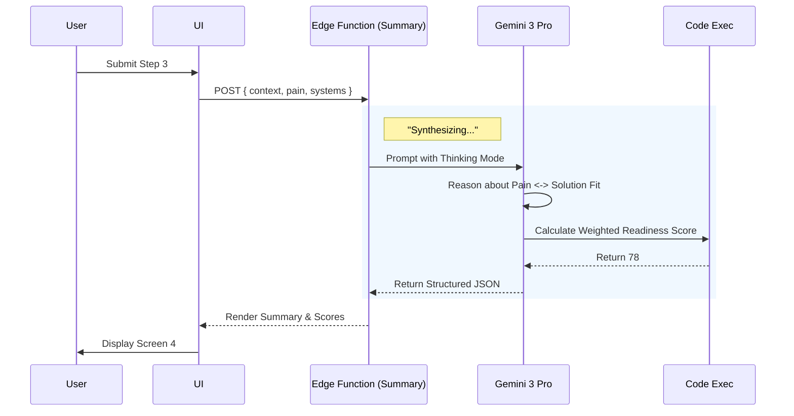

# Wizard Screen 4: Executive Strategy Brief — Implementation Prompt

**Progress Tracker:** Step 4 of 5 | Status: Specification Ready | Priority: P0 Critical
**Estimated Implementation:** 5-7 days | Dependencies: Steps 1-3 Data, Summary Agent
**AI Model:** `gemini-3-pro-preview` | **Tools:** Thinking Mode, Structured Output, Code Execution

---

## 1. Progress Tracker & Status

| Milestone | Component | Status | Model | Notes |
| :--- | :--- | :---: | :---: | :--- |
| **UI/UX** | 3-Panel Layout | 🟡 Planned | - | Left: Brief, Center: Strategy, Right: Logic |
| **Logic** | Readiness Scoring | 🟡 Planned | Flash | Calculations moved to background/implicit |
| **AI** | Narrative Generation | 🔴 Pending | **Pro** | Needs "Consultant Persona" prompt |
| **AI** | Impact Calculators | 🔴 Pending | Flash | Python execution for % gains |
| **Data** | Edge Function | 🔴 Pending | - | `summary` endpoint creation |

---

## 2. Executive Summary

Screen 4 is the **"Pivot Point"**. Previously a manual checklist, it is now an **Executive Strategy Brief**. It synthesizes the data from Steps 1 (Context), 2 (Diagnostics), and 3 (Systems) into a cohesive, persuasive narrative.

**Core Value:** Instead of asking the user for *more* input (work), we deliver *value* (strategy). We reflect their business context back to them with expert analysis, building the trust required to "Unlock" the Roadmap in Step 5.

**The "Impact Scorecard" Upgrade:**
Beyond just text, this screen uses the **Analytics Agent** to project specific KPIs (Efficiency, Speed, Revenue) based on the selected AI systems and industry benchmarks.

---

## 3. Three-Panel Layout Architecture

### Left Panel (20%) — The Client Brief (Context Anchor)
*   **Purpose:** Grounding. Reminds the user *who* we are analyzing to ensure the strategy feels bespoke.
*   **Content:**
    *   **Profile Card:** Business Name + Industry Badge (e.g., "Fashion E-commerce").
    *   **Model:** Detected Business Model (e.g., "DTC Luxury").
    *   **Mission:** Primary Goal from Step 2 (e.g., "Reduce Returns").
    *   **Stack:** Selected Systems icons from Step 3.
*   **Behavior:** Sticky. Interactive "Edit" links if context is wrong.

### Center Panel (50%) — The Strategic Analysis (Work Area)
*   **Purpose:** The core deliverable. A visual and textual argument for the proposed AI solution.
*   **Content:**
    1.  **Readiness Pulse:** Large animated radial score (0-100) with a verdict (e.g., "Ready to Scale").
    2.  **Strategic Narrative:** 2-3 paragraphs generated by Gemini 3 Pro connecting Pain (Step 2) to Solution (Step 3).
    3.  **Projected Impact Scorecard:** 3 horizontal bar charts showing "Before vs After" metrics (Efficiency, Velocity, Revenue).
    4.  **CTA:** "Reveal Execution Roadmap" (Transitions to Step 5).

### Right Panel (30%) — The Consultant (Intelligence)
*   **Purpose:** Transparency and Education. Explains *why* the score is what it is.
*   **Content:**
    *   **Live Logic Stream:** "Analyzing infrastructure gaps..."
    *   **Score Reasoning:** "Why 78/100? Your data foundation is strong (Shopify), but lack of CRM lowers the automation ceiling."
    *   **Contextual Hover:** Hovering over "Efficiency Score" in the center panel reveals the math/logic in the right panel.

---

## 4. Purpose & Strategic Intent

**Primary Purpose:** Validate the user's problem and sell the solution before showing the timeline.

**Strategic Intent:**
*   **Validation:** Prove we listened. "You told us X, so we designed Y."
*   **Authority:** Use industry-specific jargon and benchmarks.
*   **Urgency:** Show what they are losing (Impact Scores) by waiting.
*   **Confidence:** The "Readiness Score" acts as a stamp of approval.

---

## 5. User Journey Flow

1.  **Arrival:** User clicks "Analyze" on Step 3.
2.  **Loading (The Magic):** Screen shows "Synthesizing Strategy..." with streaming text logs in the Right Panel (e.g., "Calculating ROI models...", "Benchmarking against Fashion standards...").
3.  **The Reveal:** Center panel fades in. Score animates 0 -> 78. Narrative types out.
4.  **Review:** User reads the "Strategy Narrative" and checks the "Impact Scorecard".
5.  **Validation:** User sees their specific business context in the Left Panel, confirming this isn't a template.
6.  **Action:** User clicks "Reveal Roadmap".

---

## 6. Real-World Examples

### Scenario A: Fashion Brand (DTC)
*   **Context:** High returns, manual content creation.
*   **Generated Narrative:** "In the high-stakes world of DTC fashion, returns are the silent profit killer. By deploying **Fit Intelligence**, we move from reactive refunds to proactive sizing guidance. Combined with the **Content Studio**, you will 10x creative output without hiring."
*   **Impact Scores:**
    *   Efficiency: +40% (Auto-drafting).
    *   Margins: +15% (Reduced returns).

### Scenario B: Real Estate Brokerage
*   **Context:** Slow weekend response times.
*   **Generated Narrative:** "Real estate is won in the first 5 minutes. Your current manual process misses leads outside office hours. The **WhatsApp Concierge** ensures every Zillow inquiry gets an instant, qualified response, 24/7."
*   **Impact Scores:**
    *   Lead Velocity: 3x (Instant reply).
    *   Response Time: < 2 mins (Prev: 4 hours).

---

## 7. Gemini 3 Features & Tools

| Feature | Usage on Screen 4 | Implementation |
| :--- | :--- | :--- |
| **Gemini 3 Pro** | **Strategic Narrative** | Requires nuance and "Consultant Persona" tone. Flash is too robotic. |
| **Thinking Mode** | **Logic Connection** | Used to reason: "If Pain=Returns AND System=Fit_AI, THEN Narrative must focus on 'Profit Protection'." |
| **Code Execution** | **Score Calculation** | Python script to calculate the Readiness Score and Impact % based on boolean inputs and industry benchmarks. |
| **Structured Output** | **UI Rendering** | Returns strict JSON for the Impact Charts `{ label: string, before: number, after: number }`. |

---

## 8. AI Agent: The Summary Agent

### Agent Profile
*   **Role:** Senior Strategic Partner.
*   **Model:** `gemini-3-pro-preview`.
*   **Tools:** `codeExecution` (for scores), `thinkingConfig` (for narrative).

### Input Data (The Context)
*   `industry`: String (e.g., "Fashion").
*   `businessModel`: String (e.g., "DTC").
*   `painPoints`: Array (from Step 2).
*   `selectedSystems`: Array (from Step 3).
*   `services`: Array (Step 1 Tech Stack).

### Output Schema (JSON)
```typescript
{
  readiness: {
    score: number; // 0-100
    label: string; // "Ready to Scale"
    reasoning: string; // For Right Panel
  },
  strategy: {
    headline: string; // "Turning Returns into Retention"
    body: string; // 2 paragraphs markdown
  },
  impact_card: [
    { label: "Efficiency", before: 40, after: 90, unit: "%" },
    { label: "Velocity", before: 2, after: 10, unit: "x" }
  ]
}
```

---

## 9. Mermaid Diagrams

### Data & Logic Flow


---

## 10. Production Ready Checklist

### Frontend Implementation
- [ ] **Component:** Create `Step4Summary.tsx`.
- [ ] **State:** Ensure it consumes `appState.data` and `appState.aiState.recommendations`.
- [ ] **Visuals:** Implement the Radial Progress bar (Recharts or SVG).
- [ ] **Visuals:** Implement the Horizontal Bar Charts for "Impact Scorecard".
- [ ] **Mobile:** Ensure panels stack: Context (Top Summary) -> Strategy (Main) -> Logic (Bottom/Hidden).

### Backend (Edge Functions)
- [ ] **Function:** Create `supabase/functions/summary/index.ts`.
- [ ] **Prompting:** Write the "Consultant Persona" system instruction for Gemini 3 Pro.
- [ ] **Math:** Implement the Python scoring logic within the agent prompt (or helper function).
- [ ] **Fallback:** If Gemini fails, return a generic "Strong Foundation" template to avoid blocking.

### Testing
- [ ] **Latency:** Ensure the "Loading" skeleton state is engaging for the ~5-8s generation time.
- [ ] **Relevance:** Verify the "Narrative" mentions the specific Industry and Selected Systems.
- [ ] **Math:** Verify the "Impact Scores" make sense (After > Before).

---

## 11. Multistep Implementation Prompts

### Prompt 1: The Summary Agent (Edge Function)
```text
Create `supabase/functions/summary/index.ts`.
- Model: `gemini-3-pro-preview`.
- Config: `thinkingBudget: 2048`.
- Inputs: Full Wizard State.
- Logic:
  1. Calculate Readiness Score (0-100) based on Step 1 Services completeness.
  2. Generate a 2-paragraph Strategic Narrative connecting Pain Points to Selected Systems.
  3. Generate 3 Impact Metrics (Efficiency, Revenue, Speed) with Before/After values.
- Output: Strict JSON Schema.
```

### Prompt 2: Frontend UI (Step4Summary)
```text
Create `components/wizard/Step4Summary.tsx`.
- Layout: 3-Panel (Left: Client Context, Center: Strategy, Right: Consultant).
- Components:
  - `ReadinessDial`: SVG circular progress.
  - `ImpactChart`: Simple bar comparison.
  - `StrategyCard`: Text container for the narrative.
- Behavior: Fetch data from `summary` edge function on mount. Show skeleton while loading.
```

### Prompt 3: Wiring & State
```text
Update `WizardFlow.tsx`.
- Replace the old `Step4Readiness` component with `Step4Summary`.
- Pass necessary props (Data, Setters).
- Ensure the "Next" button routes to Step 5 (Roadmap).
```
