# System Diagrams & Visual Documentation

This document contains the visual architecture for the Sun AI Agency platform.

---

## 1. System Architecture (C4 Model)

### Context Diagram (Level 1)
Shows the system in relation to external entities.


### Container Diagram (Level 2)
Shows the high-level technology choices.


---

## 2. Agent Orchestration (Block Diagram)

Visualizes how the specific AI Agents interact with models and tools.

```mermaid
block-beta
    columns 3
    
    block:frontend
        UI["React Frontend"]
    end

    block:gateway
        API["Edge Function Gateway"]
    end

    block:agents
        Analyst["🕵️ Analyst<br>(Flash)"]
        Extractor["🔬 Extractor<br>(Flash)"]
        Optimizer["⚖️ Optimizer<br>(Flash)"]
        Scorer["💯 Scorer<br>(Flash)"]
        Planner["📅 Planner<br>(Pro + Thinking)"]
        Orchestrator["🎼 Orchestrator<br>(Flash)"]
    end

    block:tools
        Search(("Google Search"))
        Code(("Code Exec"))
        Schema(("JSON Schema"))
    end

    UI --> API
    API --> Analyst
    API --> Extractor
    API --> Optimizer
    API --> Scorer
    API --> Planner
    API --> Orchestrator

    Analyst --> Search
    Scorer --> Code
    Planner --> Schema
    Extractor --> Schema
```



---

## 3. Wizard Logic Flow (State Diagram)

Tracks the user's progression through the onboarding wizard.


---

## 4. Roadmap Generation (Sequence Diagram)

Detailed view of the most complex interaction: Step 5 "The Planner".


---

## 5. Database Schema (Entity Relationship Diagram)

Represents the Supabase PostgreSQL structure.


---

## 6. Frontend Components (Class Diagram)

Conceptual structure of the React codebase and state management.


---

## 7. Requirement Diagram

Mapping functional requirements to the implementing Agents.

```mermaid
requirementDiagram

    requirement Verify_Business {
        id: 1
        text: "The system must verify the business URL exists and detect industry."
        type: Functional
        risk: Medium
        verifymethod: Test
    }

    element Analyst_Agent {
        type: Agent
    }

    requirement Generate_Strategy {
        id: 2
        text: "The system must create a 3-phase roadmap based on user constraints."
        type: Functional
        risk: High
        verifymethod: Inspection
    }

    element Planner_Agent {
        type: Agent
    }

    requirement Score_Readiness {
        id: 3
        text: "The system must mathematically calculate a readiness score."
        type: Functional
        risk: Low
        verifymethod: Analysis
    }

    element Scorer_Agent {
        type: Agent
    }

    Analyst_Agent - satisfies -> Verify_Business
    Planner_Agent - satisfies -> Generate_Strategy
    Scorer_Agent - satisfies -> Score_Readiness
```

---

## 8. User Journey Map

The emotional and functional path of the user.


---

## 9. ZenUML (Analyst Logic)

Simplified logic flow for the first step of the application.

```zenuml
// Step 1: Analyst Agent Logic
User->App: Enter URL
if (URL is valid) {
    App->Analyst: analyze(url)
    Analyst->GoogleSearch: query(brand)
    GoogleSearch->Analyst: results
    Analyst->App: stream(intelligence)
    Analyst->App: return(industry_enum)
    App->User: update_ui(industry)
} else {
    App->User: show_error
}
```

---

## 10. Deployment Architecture

Cloud infrastructure view.

```mermaid
graph TD
    subgraph "Client Side"
        Browser[User Browser]
    end

    subgraph "Vercel (Frontend)"
        Static[Static Assets]
        Vite[Vite/React App]
    end

    subgraph "Supabase (Backend)"
        Auth[GoTrue Auth]
        DB[(PostgreSQL)]
        Edge[Edge Functions (Deno)]
    end

    subgraph "Google Cloud"
        Gemini[Gemini 1.5/3.0 API]
        Search[Google Search API]
    end

    Browser -->|HTTPS| Vite
    Browser -->|Auth| Auth
    Browser -->|Data/RPC| Edge
    
    Edge -->|Query| DB
    Edge -->|Prompt| Gemini
    Edge -->|Grounding| Search
```
