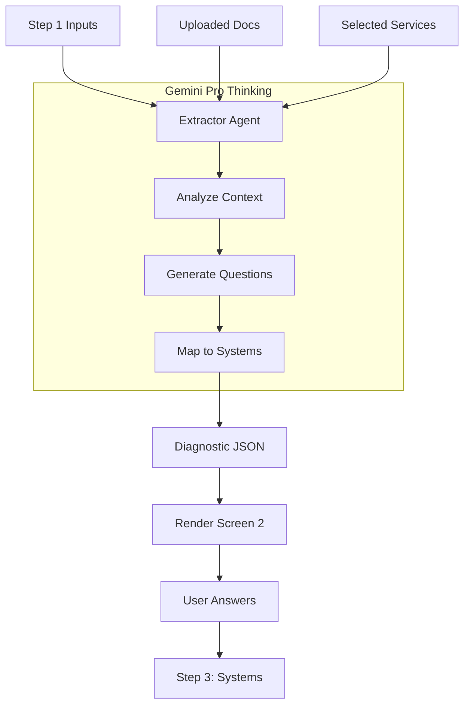

# Wizard Screen 2: Industry Diagnostics — Implementation Plan

**Progress Tracker:** Step 2 of 5 | Status: Ready for Dev | Priority: P0 Critical
**Estimated Implementation:** 3-5 days
**Dependencies:** Step 1 (Context) Data, Extractor Agent, Industry Packs
**AI Model:** `gemini-3-pro-preview` (Reasoning for Context-Aware Questions)

---

## 1. Executive Summary

Screen 2 is the **"Consultant" Phase**. It transforms the verified business identity from Step 1 into a specific, actionable problem set.

**The Upgrade:**
Instead of a static form, this screen uses the **Extractor Agent** to dynamically generate questions based on:
1.  **Industry** (e.g., Fashion)
2.  **Tech Stack** (e.g., Shopify, WhatsApp - selected in Step 1)
3.  **Document Context** (e.g., "Manual spreadsheets" mentioned in uploaded PDF)

**Core Value:** The user feels deeply understood. "They know I use Shopify, so they're asking about Cart Abandonment, not generic website questions."

---

## 2. Three-Panel Layout Architecture

### Left Panel (20%) — Verified Context
*   **Purpose:** Trust Anchor. Proof we are using their data.
*   **Content:**
    *   **Industry Badge:** Locked (e.g., "Real Estate").
    *   **Tech Stack:** Visual list of services from Step 1.
    *   **Maturity Score:** The calculated score from Step 1.
*   **Behavior:** Sticky.

### Center Panel (50%) — The Diagnostic Form
*   **Purpose:** Data Collection via Progressive Disclosure.
*   **Sections:**
    1.  **Primary Focus:** Single select (Growth vs Time).
    2.  **Revenue Pains:** Multi-select (Dynamic options based on Industry).
    3.  **Operational Blockers:** Multi-select (Dynamic based on Services).
    4.  **Growth Ceiling:** Single select (Strategy check).
    5.  **AI Readiness:** Single select (Psychological check).
*   **UX:** Clean cards with hover states.

### Right Panel (30%) — Consultant Logic
*   **Purpose:** Education ("The Why").
*   **Content:**
    *   **Contextual Reasoning:** When a user hovers over a question, explain *why* it matters.
    *   *Example:* "Since you uploaded a PDF mentioning 'support volume', we need to quantify your response time lag."

---

## 3. AI Agent: The Extractor

### Agent Profile
*   **Role:** Senior Industry Consultant.
*   **Model:** `gemini-3-pro-preview`.
*   **Tools:** `thinkingConfig` (2048 tokens), `structuredOutput`.

### Logic Flow (The "Thinking" Process)
1.  **Ingest Context:** Read `Industry`, `Services[]`, and `DocumentSummary`.
2.  **Gap Analysis:**
    *   *IF* Service='WhatsApp' -> Generate Question about "Response Time".
    *   *IF* Doc='Inventory Issues' -> Generate Question about "Stockouts".
3.  **Map Answers:** Ensure every generated option maps to a specific **System ID**.

### JSON Schema (Output)
```typescript
interface DiagnosticSchema {
  sections: {
    id: string; // 'revenue', 'operations', 'readiness'
    title: string;
    description: string;
    questions: {
      id: string;
      text: string;
      ai_hint: string; // For Right Panel
      type: 'single' | 'multi';
      options: {
        label: string;
        mapped_system_id: string; // CRITICAL: Links to Step 3
        pain_point_tag: string;
      }[];
    }[];
  }[];
}
```

---

## 4. Logic Mapping Table (Deterministic)

The Agent must adhere to these mapping rules when generating options:

| User Selection (Pain) | Mapped System (Solution) |
| :--- | :--- |
| Visitors browse but don't buy | **Revenue Conversion Suite** |
| High return rates | **Fit & Sizing Intelligence** |
| Slow lead response time | **WhatsApp Lead Concierge** |
| Manual content creation | **Strategic Content Engine** |
| Lead data is disorganized | **CRM Autopilot** |
| Unqualified meetings | **Lead Qualification Bot** |

---

## 5. Implementation Prompts (Sequential)

### Prompt 1: The Extractor Agent (Edge Function)
```text
Update `supabase/functions/extractor/index.ts`.
- **Model:** `gemini-3-pro-preview` with `thinkingConfig: { thinkingBudget: 2048 }`.
- **Inputs:** `industry`, `selectedServices`, `docInsights` (string summary).
- **Task:** Generate a dynamic diagnostic form.
- **Logic Constraints:**
  1. If `docInsights` contains specific pain points, generate a custom question addressing them.
  2. If `selectedServices` contains specific tools (e.g. WhatsApp), ask about optimization of that tool.
  3. Include a 'readiness_check' section asking about their implementation timeline (Ready Now vs Exploring).
  4. Ensure EVERY option maps to a valid `mapped_system_id` from `industryPacks.ts`.
- **Output:** Strict JSON matching `DiagnosticSchema`.
```

### Prompt 2: Frontend UI (Step2Diagnostics)
```text
Update `components/wizard/Step2Diagnostics.tsx`.
- **Layout:** 3-Panel structure.
- **Left Panel:** Render `ContextSidebar` showing Industry + Service Icons.
- **Center Panel:** 
  - Render the form sections dynamically from the Agent JSON.
  - Use `RadioGroup` for Single Select and `CheckboxGrid` for Multi-select.
  - Add a "Continue" button that requires at least 1 selection per section.
- **Right Panel:**
  - Render `IntelligenceCard`.
  - When user focuses/hovers a question, display the `ai_hint` from the JSON.
- **State:** Save answers to `appState.data.diagnosticAnswers`.
```

### Prompt 3: Wiring & Data Flow
```text
Update `WizardFlow.tsx`.
- Pass `docInsights` (from Step 1 Analysis) to `Step2Diagnostics`.
- Ensure `extractor` is called on mount of Step 2.
- Show a "Consultant is analyzing your documents..." loading state.
```

---

## 6. Real-World Scenario

**User:** Founder of "LuxeThreads" (Fashion).
*   **Step 1:** Selected "Shopify", Uploaded "Returns_Report.pdf".
*   **Step 2 Generation:**
    *   **Question:** "Your documents mention high return rates. What is the primary cause?"
    *   **Option A:** "Sizing confusion" -> Maps to *Fit Intelligence*.
    *   **Option B:** "Product quality" -> Maps to *Review Analyzer*.
    *   **Right Panel Hint:** "Addressing sizing confusion pre-purchase typically reduces returns by 30%."

---

## 7. Mermaid Diagram: Logic Flow



---

## 8. Success Checklist

- [ ] **Context:** Does the form mention the user's specific services?
- [ ] **Mapping:** Do selected pains result in the correct System Recommendation in Step 3?
- [ ] **Readiness:** Is the "Ready Now/Later" question included?
- [ ] **Speed:** Does the screen load within 5 seconds (using Skeleton UI)?
- [ ] **Mobile:** Do the panels stack correctly on small screens?
