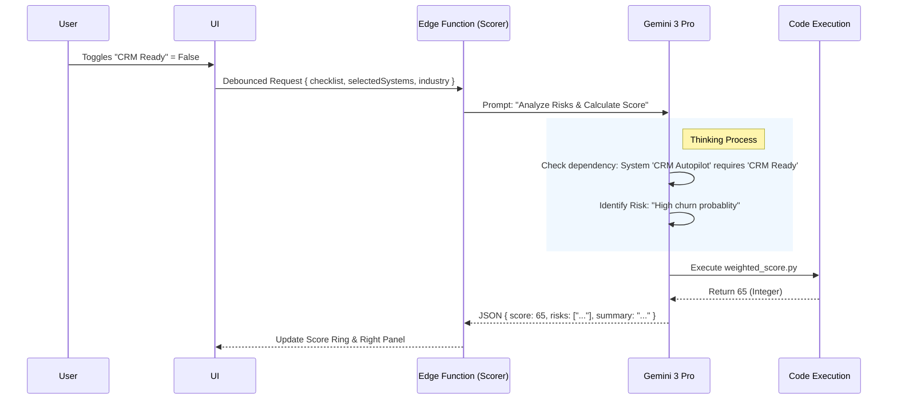

# Wizard Optimization & Readiness Strategy (Screen 4 Focus)

**Date:** Current
**Status:** Optimization & Review Plan
**Context:** Converting "Inputs" (Screens 1-3) into "Analysis" (Screen 4).

---

## 1. Executive Summary & Flow Review

The "Readiness Assessment" (Screen 4) is the pivot point of the Onboarding Wizard. It transitions the user from **Aspiration** (What I want: Systems) to **Reality** (What I have: Infrastructure).

To make Screen 4 impactful, it must dynamically consume the context gathered in Screens 1, 2, and 3. It cannot be a static checklist.

### Data Flow Optimization
| Screen | Input Gathered | Impact on Screen 4 (Readiness) |
| :--- | :--- | :--- |
| **1. Context** | **Industry:** `Fashion`<br>**Services:** `[Shopify, WhatsApp]`<br>**Docs:** `Brand_Guidelines.pdf` | **Dynamic Checklist:**<br>- Check for "Shopify API Access"<br>- Check for "WhatsApp Business Account"<br>- **Docs Analysis:** If docs mention "Manual Excel", flag "Data Centralization" as critical. |
| **2. Diagnostics** | **Pain Points:** "High Return Rate"<br>**Priority:** "Speed" | **Risk Weighting:**<br>- If Priority is "Speed", prioritize "Team Availability" items.<br>- If Pain is "Returns", prioritize "Product Data Quality". |
| **3. Systems** | **Selection:** `[Fit Intelligence, Returns Bot]` | **Gap Analysis:**<br>- "Fit Intelligence" requires historical purchase data.<br>- If "Data Ready" is unchecked, flag as **CRITICAL BLOCKER**. |

---

## 2. Gemini 3 Features & Agent Strategy

We use a multi-model approach to balance speed (UI) and depth (Analysis).

### Core Features (Required)
1.  **Code Execution (Python Sandbox):**
    *   **Why?** LLMs are bad at math. We need to calculate a precise weighted score (0-100) based on boolean inputs.
    *   **Implementation:** The **Scorer Agent** writes and executes a Python script to sum weighted values.
2.  **Thinking Mode (Gemini 3 Pro):**
    *   **Why?** To deduce *Risk*. "If they have System A but lack Infra B, what is the specific consequence?"
    *   **Implementation:** `thinkingBudget: 4096` tokens allows the model to "reason" through dependency chains before answering.
3.  **Structured Outputs:**
    *   **Why?** The UI needs strict arrays for `risks`, `wins`, and `gaps` to render cards.

### Agent Roster
| Agent | Role | Model | Tooling |
| :--- | :--- | :--- | :--- |
| **Scorer Agent** | The Auditor | `gemini-3-pro` | Code Execution, Thinking |
| **Analyst Agent** | The Context Holder | `gemini-3-flash` | Context Caching (Virtual) |

---

## 3. Real-World Execution Scenarios

The Scorer Agent must adapt the checklist and analysis based on the Industry context.

### Scenario A: The Fashion Brand
*   **Context:** `Industry: Fashion`, `Service: Shopify`.
*   **Systems Selected:** `Fit Intelligence Agent` (Needs data).
*   **The Check:**
    *   *User toggles "Data Ready" to FALSE.*
*   **The AI Analysis (Right Panel):**
    *   **Logic:** Fit Intelligence requires historical sizing data. Without it, the model cannot run.
    *   **Risk:** "Critical Blocker: The 'Fit Intelligence' system requires at least 1,000 past orders to train. Without centralized data, this system will fail to launch."
    *   **Score Impact:** Heavy penalty (-30 points).

### Scenario B: The Real Estate Brokerage
*   **Context:** `Industry: Real Estate`, `Service: WhatsApp`.
*   **Systems Selected:** `WhatsApp Lead Concierge`.
*   **The Check:**
    *   *User toggles "Tools Ready (API Access)" to FALSE.*
*   **The AI Analysis (Right Panel):**
    *   **Logic:** Automation on WhatsApp requires the Meta Business API, not just the phone app.
    *   **Risk:** "Implementation Block: You cannot run the 'Concierge' on a standard personal WhatsApp account. You must verify a Business Manager account first."
    *   **Quick Win:** "Verify Meta Business Account (1 hour)."

---

## 4. Screen 4: Content & Layout Specification

### 3-Panel Architecture

**Left Panel (20%) — The Context**
*   **Content:**
    *   **Selected Systems Stack:** Visual list of the 3 systems from Step 3.
    *   **Industry Badge:** Locked context.
*   **Goal:** Remind the user *why* we are grilling them on their infrastructure.

**Center Panel (50%) — The Audit (Interactive)**
*   **Content:**
    *   **Dynamic Checklist:** 3 Categories (Data, Tech, Team). Items are *injected* based on Step 1 Services.
    *   **The Score Ring:** Large, animated SVG circle (0-100). Updates in real-time (debounced).
    *   **Gap Cards:** Red/Yellow alerts appearing dynamically as items are unchecked.
    *   **"Analyze" Button:** Proceeds to Step 5.

**Right Panel (30%) — The Consultant (Live)**
*   **Content:**
    *   **Streaming Intelligence:** Real-time reaction to clicks.
    *   *User unchecks "API Access":* -> **Stream:** "Warning: Without API access, the 'Lead Gen Engine' cannot sync with your CRM. This increases manual work by 4 hours/week."
    *   **Quick Wins:** "Green" cards showing easy fixes (e.g., "Export CSV").

---

## 5. Architecture Diagrams (Mermaid)

### Logic Flow: The Scoring Engine


---

## 6. Success Criteria & Metrics

### Functional
*   **Score Accuracy:** The Readiness Score is calculated via Code Execution, ensuring 100% mathematical consistency (no "vibes" scoring).
*   **Dependency Detection:** If a user selects "WhatsApp System" (Step 3) but unchecks "WhatsApp API" (Step 4), a specific "Blocking Risk" MUST appear.
*   **Latency:** Analysis completes in < 5 seconds (Flash) or < 15 seconds (Pro with Thinking).

### UX/UI
*   **Transparency:** The Right Panel explains *why* the score dropped.
*   **Hope:** Even low scores (e.g., 30/100) are presented with "Quick Wins" to prevent user churn.

---

## 7. Multistep Implementation Prompts

Use these prompts sequentially to build the optimized Screen 4.

### Prompt 1: The Scorer Agent (Backend)
```text
Update `supabase/functions/scorer/index.ts`.
- Model: `gemini-3-pro-preview`.
- Tools: Enable `codeExecution`.
- Inputs: `checklist` (Boolean Map), `selectedSystems` (Array), `selectedServices` (Array), `industry`.
- Logic:
  1. Define weights dynamically: 
     - If `industry` is 'SaaS', 'Data' category is weighted 50%.
     - If `selectedServices` contains 'AI Agents', 'Tools Ready' is weighted 40%.
  2. Use Code Execution to calculate the weighted sum (0-100).
  3. Use Thinking Mode to compare `selectedSystems` requirements vs `checklist` gaps.
     - E.g. If system='WhatsApp' AND checklist.toolsReady=false -> Risk="Blocked API".
  4. Generate a `risk_analysis` string and `quick_wins` array.
- Output Schema:
  {
    score: number,
    risks: [{ title: string, severity: 'high'|'medium'|'low' }],
    wins: string[],
    summary: string
  }
```

### Prompt 2: Dynamic Checklist UI (Frontend)
```text
Update `components/wizard/Step4Readiness.tsx`.
- Props: Add `selectedServices` (from Step 1).
- Logic: 
  - If `selectedServices` includes 'WhatsApp', add a checklist item: "WhatsApp Business API Verified".
  - If `selectedServices` includes 'Shopify', add: "Product Catalog Clean".
- State: Ensure these dynamic keys are tracked in `readiness` state object.
- Effect: Call `scorer` edge function via `useDebounce` when items change.
```

### Prompt 3: Right Panel Intelligence (Frontend)
```text
Update `components/wizard/Step4Readiness.tsx`.
- Connect the `analysis.summary` and `analysis.risks` from the Edge Function to the Right Panel.
- Display "Thinking..." animation while the `scorer` function is running (debounced).
- Render `risks` as red alert cards in the Right Panel.
```
