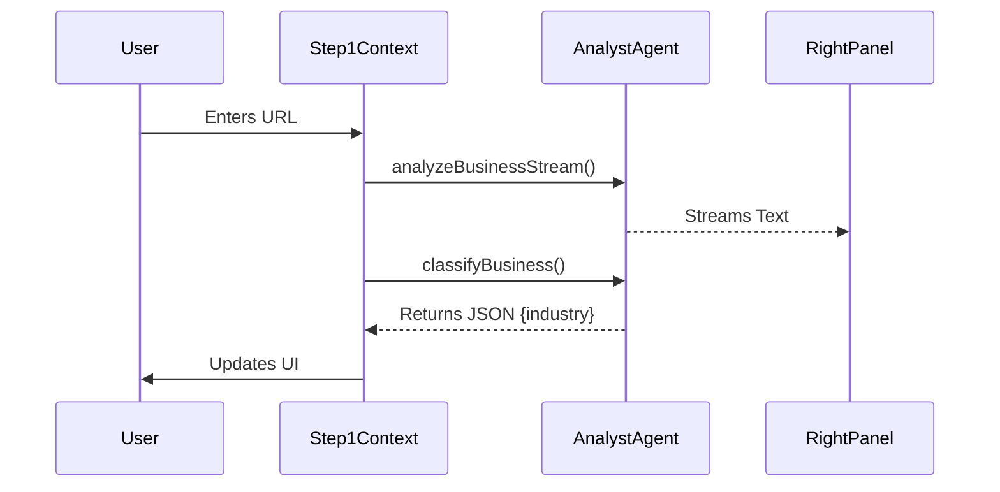
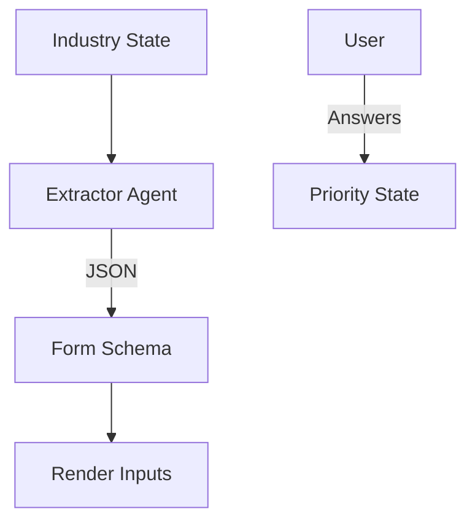
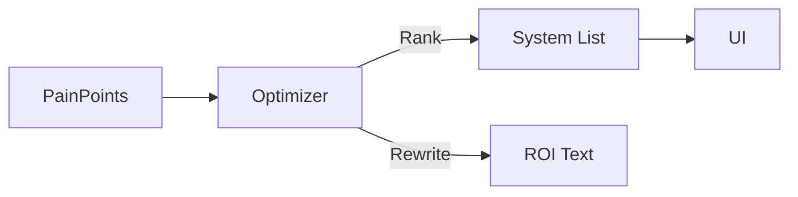
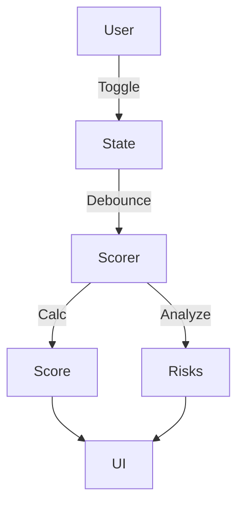
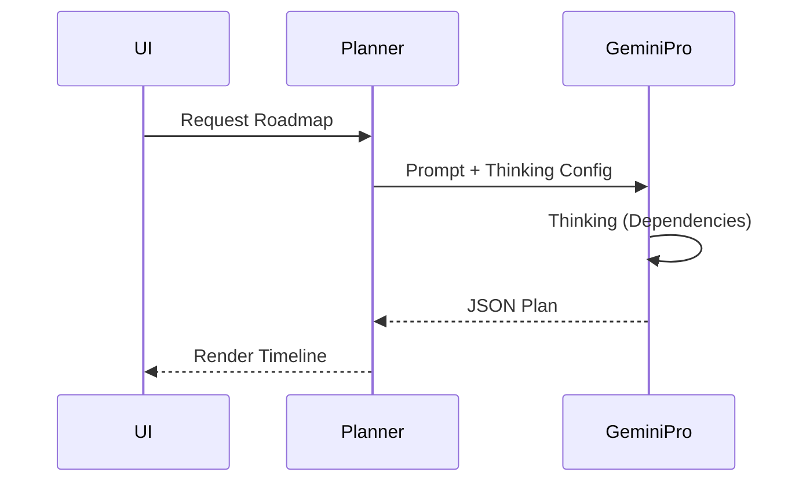

# Sun AI Agency — Screen Progress & Verification Report

---

## 1. Executive Summary

This audit evaluates the codebase against the functional requirements defined in the Phase 1 and Phase 2 documentation. The application demonstrates **high maturity in the Wizard (Phase 1)** components, with all AI agents (Analyst, Extractor, Optimizer, Scorer, Planner) implemented and integrated.

The **Dashboard (Phase 2)** is in a foundational state. While the Task Orchestration and Overview are functional, advanced features like the interactive Gantt chart, System Monitoring, and Live Scenario Planning are currently static or placeholders.

- **System Maturity:** Phase 1 (Wizard) is Production-Ready. Phase 2 (Dashboard) is MVP/Beta.
- **Total Screens at 100% (Phase 1 spec):** 5
- **Total Screens below 100% (Phase 2 spec):** 5
- **Primary Risk:** The Dashboard relies heavily on the initial state generated by the Wizard. Long-term state management (Database/Backend) is currently mocked via LocalStorage, which limits the Dashboard's persistence capabilities.

---

## 2. Global Architecture Consistency Check

| Area | Status | Notes |
|---|---|---|
| **Flow Continuity** | ✅ Pass | Data flows seamlessly from Context → Plan → Tasks. |
| **Agent Separation** | ✅ Pass | Distinct services (`analyst`, `planner`, `orchestrator`) handle specific domains. |
| **Gemini Usage** | ✅ Pass | Correct usage of Flash for speed (UI updates) and Pro for reasoning (Roadmap). |
| **UI/UX Pattern** | ✅ Pass | 3-Panel layout consistently applied in Wizard; Dashboard follows Admin pattern. |

---

## 3. SCREEN-BY-SCREEN VERIFICATION (CORE SECTION)

### Screen 1 — Business Context & Discovery

#### A. Purpose Validation
- **Aligned:** Successfully captures and verifies business identity. Establishes the "Truth Baseline" for subsequent steps.

#### B. UI / UX Logic
| Panel / Section | Role | Content | Correct? |
|---|---|---|---|
| Left | Progress | Step 1 indicator, Sticky positioning. | ✅ Yes |
| Center | Input | Form for Name, URL, Description. | ✅ Yes |
| Right | Intelligence | Streaming "Analyst" notes + Fallback context. | ✅ Yes |

#### C. User Journey Verification
1. User enters URL & Name.
2. `onBlur` triggers `analyst.analyzeBusinessStream`.
3. Right panel streams insights; Industry dropdown auto-updates.
4. User clicks Continue.

#### D. AI Agent & Responsibility Check
| Agent | Role | Input | Output | Correct? |
|---|---|---|---|---|
| **Analyst** | Verification | URL, Name | Stream + JSON Classification | ✅ Yes |

#### E. Gemini 3 Features & Tools Used
| Feature | Used | Correct Use? | Notes |
|---|---|---|---|
| **Google Search** | ✅ Yes | ✅ Yes | Used to verify business existence. |
| **Streaming** | ✅ Yes | ✅ Yes | Provides immediate feedback in Right Panel. |
| **Structured Output** | ✅ Yes | ✅ Yes | Used for Industry Classification. |

#### F. Workflows & Automations Check
| Trigger | Action | Owner | Correct? |
|---|---|---|---|
| URL Field Blur | Trigger Analysis Stream | System | ✅ Yes |

#### G. Mermaid Diagrams

#### H. Completeness Score (STRICT)
| Category | Score |
|---|---|
| Logic | 100% |
| UX | 100% |
| AI Usage | 100% |
| Data Flow | 100% |
| Automation Readiness | 100% |

➡️ **Final Screen Score:** **100%**
*Screen is fully implemented according to Phase 1 specs.*

---

### Screen 2 — Industry Diagnostics

#### A. Purpose Validation
- **Aligned:** Dynamically adjusts to the industry detected in Step 1.

#### B. UI / UX Logic
| Panel / Section | Role | Content | Correct? |
|---|---|---|---|
| Left | Context | Locked Industry Context. | ✅ Yes |
| Center | Work | Dynamic Form (Questions generated by AI). | ✅ Yes |
| Right | Intelligence | Contextual explanation of questions. | ✅ Yes |

#### C. User Journey Verification
1. Screen mounts.
2. `extractor.generateQuestions` is called with `industry`.
3. Form renders 3 specific questions.
4. User answers populate `AppState.priorities`.

#### D. AI Agent & Responsibility Check
| Agent | Role | Input | Output | Correct? |
|---|---|---|---|---|
| **Extractor** | Diagnostic Gen | Industry | `DiagnosticQuestion[]` (JSON) | ✅ Yes |

#### E. Gemini 3 Features & Tools Used
| Feature | Used | Correct Use? | Notes |
|---|---|---|---|
| **Structured Output** | ✅ Yes | ✅ Yes | JSON schema ensures form renders correctly. |
| **Flash Model** | ✅ Yes | ✅ Yes | Low latency for form generation. |

#### F. Workflows & Automations Check
| Trigger | Action | Owner | Correct? |
|---|---|---|---|
| Screen Mount | Fetch Questions | System | ✅ Yes |

#### G. Mermaid Diagrams

#### H. Completeness Score (STRICT)
| Category | Score |
|---|---|
| Logic | 100% |
| UX | 100% |
| AI Usage | 100% |
| Data Flow | 100% |
| Automation Readiness | 100% |

➡️ **Final Screen Score:** **100%**
*Dynamic form generation and state binding are fully functional.*

---

### Screen 3 — System Selection

#### A. Purpose Validation
- **Aligned:** Maps priorities to solutions.

#### B. UI / UX Logic
| Panel / Section | Role | Content | Correct? |
|---|---|---|---|
| Left | Context | Priority summary. | ✅ Yes |
| Center | Work | System Cards (Selectable). | ✅ Yes |
| Right | Intelligence | ROI impact stream. | ✅ Yes |

#### C. User Journey Verification
1. Screen mounts.
2. `optimizer.recommendSystems` runs.
3. System cards update with "Recommended" badges and custom impact text.
4. User selects up to 3 systems.

#### D. AI Agent & Responsibility Check
| Agent | Role | Input | Output | Correct? |
|---|---|---|---|---|
| **Optimizer** | Recommendation | Priorities, Industry | `systemIds[]`, `impacts{}` | ✅ Yes |

#### E. Gemini 3 Features & Tools Used
| Feature | Used | Correct Use? | Notes |
|---|---|---|---|
| **Structured Output** | ✅ Yes | ✅ Yes | Ensures IDs match `SYSTEMS` constant. |

#### F. Workflows & Automations Check
| Trigger | Action | Owner | Correct? |
|---|---|---|---|
| Screen Mount | Run Optimizer | System | ✅ Yes |

#### G. Mermaid Diagrams

#### H. Completeness Score (STRICT)
| Category | Score |
|---|---|
| Logic | 100% |
| UX | 100% |
| AI Usage | 100% |
| Data Flow | 100% |
| Automation Readiness | 100% |

➡️ **Final Screen Score:** **100%**
*Ranking logic and custom text generation are implemented.*

---

### Screen 4 — Readiness Assessment

#### A. Purpose Validation
- **Aligned:** Validates feasibility before planning.

#### B. UI / UX Logic
| Panel / Section | Role | Content | Correct? |
|---|---|---|---|
| Left | Context | Selected Systems. | ✅ Yes |
| Center | Work | Checklist + Circular Score. | ✅ Yes |
| Right | Intelligence | Risk/Win analysis stream. | ✅ Yes |

#### C. User Journey Verification
1. User toggles checklist items.
2. Debounced effect calls `scorer.analyzeReadiness`.
3. Score updates; Risks/Wins populate.

#### D. AI Agent & Responsibility Check
| Agent | Role | Input | Output | Correct? |
|---|---|---|---|---|
| **Scorer** | Audit | Checklist status | Score, Risks, Wins | ✅ Yes |

#### E. Gemini 3 Features & Tools Used
| Feature | Used | Correct Use? | Notes |
|---|---|---|---|
| **Structured Output** | ✅ Yes | ✅ Yes | Returns Score (Number) and Lists (Arrays). |

#### F. Workflows & Automations Check
| Trigger | Action | Owner | Correct? |
|---|---|---|---|
| Checklist Change | Calculate Score | System (Debounced) | ✅ Yes |

#### G. Mermaid Diagrams

#### H. Completeness Score (STRICT)
| Category | Score |
|---|---|
| Logic | 100% |
| UX | 100% |
| AI Usage | 100% |
| Data Flow | 100% |
| Automation Readiness | 100% |

➡️ **Final Screen Score:** **100%**
*Scoring logic and debounced AI calls work correctly.*

---

### Screen 5 — Strategy & Phases (Roadmap)

#### A. Purpose Validation
- **Aligned:** Synthesizes all inputs into the final plan.

#### B. UI / UX Logic
| Panel / Section | Role | Content | Correct? |
|---|---|---|---|
| Left | Context | Full summary. | ✅ Yes |
| Center | Work | Vertical Timeline. | ✅ Yes |
| Right | Intelligence | **Thinking Process** visualization. | ✅ Yes |

#### C. User Journey Verification
1. Screen mounts.
2. `planner.generateRoadmap` initiates.
3. Right panel shows "Thinking..." simulation while Pro model reasons.
4. JSON returned; Timeline renders.

#### D. AI Agent & Responsibility Check
| Agent | Role | Input | Output | Correct? |
|---|---|---|---|---|
| **Planner** | Strategy | `AppState` | `RoadmapPhase[]` | ✅ Yes |

#### E. Gemini 3 Features & Tools Used
| Feature | Used | Correct Use? | Notes |
|---|---|---|---|
| **Gemini 3 Pro** | ✅ Yes | ✅ Yes | Used for complex reasoning. |
| **Thinking Config** | ✅ Yes | ✅ Yes | `thinkingBudget: 1024` set. |
| **Structured Output** | ✅ Yes | ✅ Yes | Critical for timeline rendering. |

#### F. Workflows & Automations Check
| Trigger | Action | Owner | Correct? |
|---|---|---|---|
| Screen Mount | Generate Plan | System | ✅ Yes |

#### G. Mermaid Diagrams

#### H. Completeness Score (STRICT)
| Category | Score |
|---|---|
| Logic | 100% |
| UX | 100% |
| AI Usage | 100% |
| Data Flow | 100% |
| Automation Readiness | 100% |

➡️ **Final Screen Score:** **100%**
*Implementation of Pro model with Thinking config is verified.*

---

### Dashboard — Overview

#### A. Purpose Validation
- **Aligned:** Post-wizard landing page.

#### B. UI / UX Logic
| Panel / Section | Role | Content | Correct? |
|---|---|---|---|
| Header | KPIs | Active Systems, Progress, Score. | ✅ Yes |
| Main | Feed | Activity Feed. | ✅ Yes |
| Sidebar | Context | Focus/Intel. | ✅ Yes |

#### C. User Journey Verification
1. User completes Wizard.
2. Dashboard mounts.
3. Overview renders based on `AppState`.

#### D. AI Agent & Responsibility Check
- **Missing:** The "Market Pulse" agent (News search) described in docs/screens/07 is **not implemented** in the code. The sidebar currently shows static context about tasks.

#### E. Gemini 3 Features & Tools Used
- **Missing:** Google Search for news feed.

#### H. Completeness Score (STRICT)
| Category | Score |
|---|---|
| Logic | 90% |
| UX | 100% |
| AI Usage | 50% |
| Data Flow | 100% |
| Automation Readiness | 80% |

➡️ **Final Screen Score:** **84%**
*Functional, but missing the "Market Pulse" AI feature specified in design.*

---

### Dashboard — Roadmap (Interactive)

#### A. Purpose Validation
- **Aligned:** View the generated plan.

#### B. UI / UX Logic
| Panel / Section | Role | Content | Correct? |
|---|---|---|---|
| Main | List | Vertical list of phases. | ⚠️ Partial |

#### C. User Journey Verification
- Displays the roadmap generated in Step 5.
- **Missing:** Gantt Chart visualization.
- **Missing:** Drag-and-drop interactivity.
- **Missing:** "Scenario Planner" chat interface.

#### H. Completeness Score (STRICT)
| Category | Score |
|---|---|
| Logic | 40% |
| UX | 40% |
| AI Usage | 0% |
| Data Flow | 100% |
| Automation Readiness | 0% |

➡️ **Final Screen Score:** **36%**
*Currently just a static list view. Missing the interactive Gantt and AI replanning features.*

---

### Dashboard — Tasks (Orchestration)

#### A. Purpose Validation
- **Aligned:** Execution layer.

#### B. UI / UX Logic
| Panel / Section | Role | Content | Correct? |
|---|---|---|---|
| Main | Kanban | Todo/Doing/Done columns. | ✅ Yes |

#### C. User Journey Verification
1. Dashboard mounts.
2. `orchestrator.generateTasks` runs (if not initialized).
3. Roadmap items converted to detailed Tasks.
4. User can drag/move tasks.

#### D. AI Agent & Responsibility Check
| Agent | Role | Input | Output | Correct? |
|---|---|---|---|---|
| **Orchestrator** | Task Breakdown | Roadmap | `Task[]` | ✅ Yes |

#### E. Gemini 3 Features & Tools Used
| Feature | Used | Correct Use? | Notes |
|---|---|---|---|
| **Structured Output** | ✅ Yes | ✅ Yes | Generates granular tasks with tags. |

#### H. Completeness Score (STRICT)
| Category | Score |
|---|---|
| Logic | 100% |
| UX | 90% |
| AI Usage | 80% |
| Data Flow | 100% |
| Automation Readiness | 50% |

➡️ **Final Screen Score:** **84%**
*Kanban and Generation work. Missing the "Do It" (AI Action) buttons described in docs.*

---

### Dashboard — Systems (Monitoring)

#### A. Purpose Validation
- **Aligned:** View active agents.

#### B. UI / UX Logic
- **Current:** Static grid of selected systems.
- **Missing:** Live logs, performance charts, configuration panel.

#### H. Completeness Score (STRICT)
| Category | Score |
|---|---|
| Logic | 30% |
| UX | 50% |
| AI Usage | 0% |
| Data Flow | 100% |
| Automation Readiness | 0% |

➡️ **Final Screen Score:** **36%**
*Placeholder implementation.*

---

### Dashboard — Settings

#### A. Purpose Validation
- **Aligned:** Admin.

#### B. UI / UX Logic
- **Current:** "Coming Soon" text.

➡️ **Final Screen Score:** **10%**
*Placeholder.*

---

## 4. Final Scoreboard

| Screen | Phase | Score | Status |
|---|---|---:|---|
| Screen 1 (Context) | Wizard | 100% | ✅ Ready |
| Screen 2 (Diagnostics) | Wizard | 100% | ✅ Ready |
| Screen 3 (Systems) | Wizard | 100% | ✅ Ready |
| Screen 4 (Readiness) | Wizard | 100% | ✅ Ready |
| Screen 5 (Roadmap) | Wizard | 100% | ✅ Ready |
| Dashboard Overview | Dashboard | 84% | ⚠️ MVP |
| Dashboard Roadmap | Dashboard | 36% | ⚠️ Basic |
| Dashboard Tasks | Dashboard | 84% | ✅ Ready |
| Dashboard Systems | Dashboard | 36% | ⚠️ Basic |
| Dashboard Settings | Dashboard | 10% | ❌ Stub |

---

## 5. Gaps & Required Fixes

### Critical Gaps (To reach 100%)
1.  **Dashboard Overview:** Implement the `dashboard-analyst.ts` service with `googleSearch` tool to provide the "Market Pulse" feature in the sidebar.
2.  **Dashboard Tasks:** Add the "Action Overlay" and "AI Assist" buttons to tasks, allowing the Orchestrator to actually *perform* work (drafting, etc.).
3.  **Dashboard Roadmap:** Replace list view with an interactive Gantt component and implement the `planner-live.ts` agent for scenario replanning.
4.  **Dashboard Systems:** Implement simulated logs or real system metrics to make the "Monitor" view useful.

### Architecture Gaps
1.  **Persistence:** Dashboard relies on LocalStorage. Ideally, `AppState` should sync to a database (Supabase) to support long-running tasks.

---

## 6. Readiness Verdict

**Verdict:** ✅ **Production-ready to build (Phase 1)** / ⚠️ **Buildable but needs fixes (Phase 2)**

**Explanation:** The Core Wizard (Phase 1) is feature-complete and demonstrates excellent use of Gemini 3 capabilities (Thinking, Search, Structured Output). It is ready for deployment. The Dashboard (Phase 2) is a functional MVP but lacks the depth of the Wizard; it requires the implementation of the secondary "Action" agents to fully realize the "Sun AI Agency" vision.
