# Screen 1: Business Context & Discovery

**Phase:** Phase 1 (Core Wizard)
**Status:** 🟡 In Progress
**AI Model:** `gemini-3-flash-preview`
**Agent Role:** 🕵️ **The Analyst**

---

## 1. Description & Purpose
The entry point of the application. Its primary goal is **Verification**. Unlike standard forms that just accept data, this screen actively researches the user's business in real-time to establish a "Truth Baseline."

**Key Goals:**
1.  Capture core business identity (Name, URL, Description).
2.  **Verify** existence via Google Search Grounding.
3.  **Classify** the industry vertical (SaaS, Retail, etc.) automatically.
4.  Build trust by streaming "Intelligence Notes" in the right panel.

---

## 2. 3-Panel Layout Logic

| Panel | Content | Behavior |
| :--- | :--- | :--- |
| **Left (Context)** | Progress Bar (10%)<br>Step Title | Sticky. Updates to show "Verified" badge once AI confirms URL. |
| **Center (Work)** | Input Form (Name, URL, Industry, Desc)<br>"Continue" Button | Simple, clean inputs. "Industry" dropdown auto-selects based on AI analysis. |
| **Right (Intelligence)** | **Streaming Agent Output**<br> - Market observations<br> - Competitor awareness | **Active State**: Pulses when AI is researching.<br>**Idle State**: Shows "Waiting for input..." |

---

## 3. AI Agent: The Analyst

**System Instruction:**
"You are an expert Business Analyst. Your goal is to verify a company's digital footprint and summarize their business model in 3 bullet points."

**Gemini 3 Features:**
-   **Grounding with Google Search**: Essential to confirm the URL and business name are real.
-   **Streaming**: Text must appear token-by-token in the Right Panel to show "work is happening."

### Workflow Diagram

```mermaid
sequenceDiagram
    participant User
    participant App
    participant Gemini as 🕵️ Analyst (Flash)
    participant Search as Google Search

    User->>App: Enters "Acme Inc" + URL
    App->>Gemini: Stream Request + Tool: [googleSearch]
    Gemini->>Search: "Acme Inc business model"
    Search-->>Gemini: Search Results
    Gemini-->>App: Stream "Intelligence Notes" (Right Panel)
    Gemini-->>App: JSON { industry: "SaaS", verified: true }
    App->>User: Auto-fill Industry Dropdown
```


---

## 4. Implementation Prompts

Use these prompts in your coding workflow to build this screen.

### Step 1: UI Skeleton
```text
Create a React component `components/wizard/Step1Context.tsx`.
- Use the 3-panel layout structure.
- Left Panel: "Step 1 of 5", Progress 10%.
- Center Panel: Form with Business Name, URL (optional), Industry (Select), Description (Textarea).
- Right Panel: A placeholder div for "Sun Intelligence".
- Use Tailwind colors `sun-bg`, `sun-primary`, etc.
```

### Step 2: AI Integration (The Analyst)
```text
Implement the Analyst Agent in `services/gemini/analyst.ts`.
- Use `gemini-3-flash-preview`.
- Config: `tools: [{ googleSearch: {} }]`.
- Function `analyzeBusiness(name, url)` should return a stream.
- The prompt should ask for a 3-bullet summary of the business.
- Connect the stream to the Right Panel in `Step1Context.tsx`.
```

### Step 3: Auto-Classification
```text
Enhance the Analyst Agent to return JSON alongside the stream.
- Use `responseMimeType: 'application/json'` for a second non-streaming call.
- Extract `industry` (Enum: saas, fashion, real_estate, tourism, other).
- Auto-update the Industry Select dropdown when the API returns.
```
