# Screen 2: Industry Diagnostics

**Phase:** Phase 1 (Core Wizard)
**Status:** 🟡 In Progress
**AI Model:** `gemini-3-flash-preview`
**Agent Role:** 🔬 **The Extractor**

---

## 1. Description & Purpose
This screen moves from general context to specific pain points. It demonstrates **Expertise** by asking the *right* questions for the user's specific industry, rather than generic "What is your problem?" queries.

**Key Goals:**
1.  Generate/Display 3-4 deep-dive questions specific to the Industry detected in Step 1.
2.  Capture high-value data points (CAC, LTV, Churn, Lead Velocity).
3.  Map user answers to potential AI solutions (hidden logic).

---

## 2. 3-Panel Layout Logic

| Panel | Content | Behavior |
| :--- | :--- | :--- |
| **Left (Context)** | Locked Step 1 Data (Industry)<br>Progress (30%) | Shows "Context: Retail" (or relevant industry). |
| **Center (Work)** | **Dynamic Form Generator**<br>Renders questions based on JSON schema. | Questions change completely based on Industry. |
| **Right (Intelligence)** | **Contextual Explainer**<br>"Why we ask this..." | Explains why a specific metric (e.g., "Return Rate") matters for AI automation. |

---

## 3. AI Agent: The Extractor

**System Instruction:**
"You are a Senior Consultant. Based on the industry provided, generate 4 diagnostic questions that reveal operational inefficiencies suitable for AI automation."

**Gemini 3 Features:**
-   **Structured Outputs (`responseSchema`)**: CRITICAL. The UI needs a strict JSON format to render the form.

### JSON Schema Structure
```typescript
interface DiagnosticSchema {
  questions: {
    id: string;
    label: string; // e.g., "What is your current Return Rate?"
    type: "select" | "number" | "text";
    options?: string[]; // For select inputs
    aiContext: string; // Text for the Right Panel explaining this question
  }[];
}
```

### Workflow Diagram

```mermaid
sequenceDiagram
    participant App
    participant Gemini as 🔬 Extractor (Flash)

    App->>Gemini: Request Questions (Industry: "Fashion")
    Gemini->>Gemini: Generate Schema
    Gemini-->>App: Return JSON
    App->>App: Render <DynamicForm />
    User->>App: Selects "High Return Rate"
    App->>RightPanel: Show "AI Context: High returns usually indicate sizing mismatch..."
```


---

## 4. Implementation Prompts

### Step 1: Dynamic Form Component
```text
Create `components/wizard/DynamicForm.tsx`.
- Props: `schema: DiagnosticSchema`.
- It should map through the questions array and render Input or Select components.
- When a field is focused, update a state `activeQuestionId`.
```

### Step 2: The Extractor Agent
```text
Create `services/gemini/extractor.ts`.
- Model: `gemini-3-flash-preview`.
- Define a `responseSchema` matching the `DiagnosticSchema` interface.
- Prompt: "Generate 4 diagnostic questions for a ${industry} business focusing on revenue bottlenecks."
- Ensure one field `aiContext` provides a short explanation for the Right Panel.
```

### Step 3: Integration
```text
In `Step2Diagnostics.tsx`:
- On mount, call `extractor.getQuestions(state.data.industry)`.
- Render the `DynamicForm`.
- Pass the `aiContext` of the focused field to the Right Panel.
```
