# Screen 3: System Selection

**Phase:** Phase 1 (Core Wizard)
**Status:** 🟡 In Progress
**AI Model:** `gemini-3-flash-preview`
**Agent Role:** ⚖️ **The Optimizer**

---

## 1. Description & Purpose
Here we map the "Pain" (Step 2) to the "Cure" (AI Systems). The user selects up to 3 systems. This screen frames AI not as "chatbots" but as **Revenue Engines**.

**Key Goals:**
1.  Present 5-6 standardized AI Systems (Lead Gen, Content, etc.).
2.  **Highlight/Rank** systems based on Step 2 answers.
3.  Show projected "Revenue Impact" for each card.

---

## 2. 3-Panel Layout Logic

| Panel | Content | Behavior |
| :--- | :--- | :--- |
| **Left (Context)** | "Priorities Identified"<br>List of pain points from Step 2. | Reminds user *why* they are choosing these systems. |
| **Center (Work)** | **System Grid** (Cards)<br>Selectable (Max 3). | "Recommended" badge appears on cards matching Step 2 priorities. |
| **Right (Intelligence)** | **ROI Calculator**<br>"If you fix X, you gain Y." | Dynamic text relating the selected system to the user's specific business. |

---

## 3. AI Agent: The Optimizer

**System Instruction:**
"You are a Solution Architect. Given the user's pain points, identify the top 3 recommended systems and generate a specific 'Revenue Impact' statement for each."

**Gemini 3 Features:**
-   **Text Generation**: To rewrite the "Revenue Impact" description dynamically.
-   **Reasoning**: To map "High Churn" -> "CRM Autopilot".

### Workflow Diagram

```mermaid
graph LR
    Step2[Step 2 Answers] --> Optimizer[⚖️ Optimizer Agent]
    StaticSystems[System Library] --> Optimizer
    Optimizer -->|Re-Rank| RankedList[Ordered Systems]
    Optimizer -->|Rewrite| ImpactText[Custom Revenue Impact]
    RankedList --> UI[Center Panel]
```


---

## 4. Implementation Prompts

### Step 1: System Card UI
```text
Update `components/wizard/Step3Systems.tsx`.
- Iterate through the `SYSTEMS` constant.
- Add a "Recommended" badge logic (boolean prop).
- Allow max 3 selections.
```

### Step 2: The Optimizer Agent
```text
Create `services/gemini/optimizer.ts`.
- Input: `industry`, `painPoints[]`.
- Output: JSON `{ recommendations: string[], customImpacts: { [systemId]: string } }`.
- Prompt: "Analyze these pain points. Which of our 5 systems solve them best? Rewrite the revenue impact description to be specific to ${industry}."
```

### Step 3: UI Binding
```text
In Step 3:
- Call Optimizer on mount.
- Apply "Recommended" badges to the returned IDs.
- Override the default `revenueImpact` text with the AI-generated one.
```
