# Screen 4: Readiness Assessment

**Phase:** Phase 1 (Core Wizard)
**Status:** 🟡 In Progress
**AI Model:** `gemini-3-flash-preview`
**Agent Role:** 💯 **The Scorer**

---

## 1. Description & Purpose
A reality check. We assess if the client is actually ready for AI. This builds immense trust because we (the AI agent) might say "You aren't ready yet," which proves we aren't just selling.

**Key Goals:**
1.  Checklist for Data, Team, Tools, Budget.
2.  Calculate a **Readiness Score** (0-100).
3.  Identify **Critical Risks** (Red Flags) and **Quick Wins** (Green Flags).

---

## 2. 3-Panel Layout Logic

| Panel | Content | Behavior |
| :--- | :--- | :--- |
| **Left (Context)** | Selected Systems (Step 3). | Shows what we are trying to implement. |
| **Center (Work)** | **Readiness Checklist**<br>Yes/No toggles. | Dynamic score updates as user clicks. |
| **Right (Intelligence)** | **Risk Analyst**<br>Streaming analysis of gaps. | Warns user: "Without a Project Lead, implementation usually stalls." |

---

## 3. AI Agent: The Scorer

**System Instruction:**
"You are an Implementation Manager. Analyze the checklist. If 'Data Ready' is false, flag it as Critical. Calculate a confidence score."

**Gemini 3 Features:**
-   **Structured Outputs**: Return `{ score: number, risks: string[], wins: string[] }`.

### Workflow Diagram

```mermaid
graph TD
    User -->|Toggles| Checklist
    Checklist --> Scorer[💯 Scorer Agent]
    Scorer -->|Analyze| Risks[Risk Assessment]
    Risks --> RightPanel[Right Panel Alert]
    Scorer -->|Calculate| VisualScore[Center Panel Circular Progress]
```


---

## 4. Implementation Prompts

### Step 1: Checklist UI
```text
Update `components/wizard/Step4Readiness.tsx`.
- Create a visual Circular Progress bar for the score (0-100).
- Add the 4 checklist items (Data, Team, Tools, Budget).
```

### Step 2: The Scorer Agent
```text
Create `services/gemini/scorer.ts`.
- Function `calculateRisk(checklistState)`.
- Output: JSON `{ analysis: string, critical_gap: string | null }`.
- Prompt: "The user lacks Data Readiness. Explain why this is a risk for a Lead Gen System implementation."
```
