# Screen 7: Dashboard Overview

**Phase:** Phase 2 (Dashboard & Backend)
**Status:** ⚪ Planned
**AI Model:** `gemini-3-flash-preview`
**Agent Role:** 🕵️ **The Analyst** (Returning)

---

## 1. Description & Purpose
The command center. This screen provides a high-level pulse check of the implementation. It is **Active**, not static. The AI constantly monitors progress against the baseline readiness score and industry benchmarks.

**Key Goals:**
1.  **KPI Visualization**: Real-time view of completion %, days remaining, and system health.
2.  **Contextual Alerts**: "You are 2 days behind schedule on Data Cleanup."
3.  **Market Pulse**: AI injects relevant industry news (e.g., "New Regulations in SaaS") that might affect the strategy.

---

## 2. Layout Logic (Dashboard Grid)

| Section | Content | Behavior |
| :--- | :--- | :--- |
| **Header (KPIs)** | 4 Cards: Overall Progress, Readiness Score, Active Systems, Critical Risks. | Animated circular progress bars. Red/Amber/Green status indicators. |
| **Main (Feed)** | **Strategic Activity Feed**. Not just "Task Done", but "Milestone Achieved: Data Core". | AI summarizes grouped tasks into meaningful milestones. |
| **Sidebar (Intel)** | **Live Market Pulse**. | Uses `googleSearch` to find news relevant to the user's industry and strategy. |

---

## 3. AI Agent: The Analyst (Dashboard Mode)

**System Instruction:**
"You are a Strategic Advisor. specific to the user's industry. Monitor the project progress. If readiness drops or tasks stall, issue a strategic alert. Periodically scan for industry news that validates the current strategy."

**Gemini 3 Features:**
-   **Grounding with Google Search**: To fetch "Market Pulse" news.
-   **Reasoning**: To correlate "Task Delay" with "Readiness Score Impact".

### Workflow Diagram

```mermaid
graph TD
    Data[Project State DB] --> Analyst[🕵️ Analyst Agent]
    News[Google Search] --> Analyst
    Analyst -->|Analyze| Health[Project Health Check]
    Analyst -->|Summarize| Feed[Smart Activity Feed]
    Analyst -->|Alert| UI[Dashboard UI]
```


---

## 4. Implementation Prompts

### Step 1: KPI Component
```text
Create `components/dashboard/Overview/KPIGrid.tsx`.
- Accept `projectState` prop.
- Render 4 cards.
- Use `recharts` for a mini sparkline in the "Readiness" card showing score trend over time.
```

### Step 2: Smart Feed
```text
Create `services/gemini/dashboard-analyst.ts`.
- Function `generateFeed(tasks[])`.
- Prompt: "Group these recent completed tasks into a narrative summary. E.g., instead of 'Task A, B, C done', say 'Phase 1 Data Foundation completed'."
```

### Step 3: Market Pulse
```text
Enhance `dashboard-analyst.ts` with `getMarketPulse(industry)`.
- Use `tools: [{ googleSearch: {} }]`.
- Prompt: "Find 1 recent trend in ${industry} that validates the need for AI automation."
- Render in the Right Sidebar of the Dashboard.
```
