# Screen 8: Interactive Roadmap

**Phase:** Phase 2 (Dashboard & Backend)
**Status:** ⚪ Planned
**AI Model:** `gemini-3-pro-preview`
**Agent Role:** 📅 **The Planner** (Returning)

---

## 1. Description & Purpose
The interactive version of Step 5. This is a living Gantt chart. If a user drags a task to a new date, the AI re-calculates the entire critical path and dependency chain.

**Key Goals:**
1.  **Visual Timeline**: Interactive Gantt view of the 3 Phases.
2.  **Dependency Management**: If "Data Clean" moves, "CRM Setup" must move.
3.  **Dynamic Re-planning**: Ask the AI "What if we accelerate Phase 2?"

---

## 2. Layout Logic

| Section | Content | Behavior |
| :--- | :--- | :--- |
| **Main View** | **Gantt Chart**. Bars for Phases, diamonds for Milestones. | Drag-and-drop enabled. Clicking a bar opens the Task Detail slide-over. |
| **Right Panel** | **Scenario Planner**. Chat interface to adjust the plan. | User types: "We have an extra budget, can we speed up?" |

---

## 3. AI Agent: The Planner (Live Mode)

**System Instruction:**
"You are a Project Manager. The user is modifying the schedule. Analyze dependencies. If a rigid dependency is broken, warn the user. If asked, re-optimize the schedule."

**Gemini 3 Features:**
-   **Gemini Thinking**: Essential for re-calculating the critical path when dates change.
-   **Function Calling**: `updateTaskDates(id, newDate)`, `flagRisk(taskId)`.

### Workflow Diagram

```mermaid
sequenceDiagram
    participant User
    participant UI as Gantt Chart
    participant Planner as 📅 Planner Agent

    User->>UI: Drags "CRM Setup" +1 week
    UI->>Planner: Event: TaskMoved(id, +1w)
    Planner->>Planner: Thinking (Check Dependencies)
    Planner-->>UI: Warning: "This delays Phase 3 launch"
    Planner-->>UI: Suggestion: "Add resources to Task B to compensate?"
```


---

## 4. Implementation Prompts

### Step 1: Gantt Component
```text
Create `components/dashboard/Roadmap/GanttView.tsx`.
- Use a library like `dhtmlx-gantt` or build a custom SVG timeline using `framer-motion`.
- Map the `AppState.roadmap` JSON to the timeline bars.
```

### Step 2: Dependency Logic
```text
Create `services/gemini/planner-live.ts`.
- Function `validateMove(taskId, newDate, currentPlan)`.
- Use Gemini to check logical inconsistencies (e.g., "Cannot optimize ads before ads are running").
```

### Step 3: Scenario Mode
```text
Implement a Chat Interface in the Right Panel of the Roadmap tab.
- Allow natural language queries: "Regenerate plan for a 6-week timeline instead of 8."
- The Agent returns a new JSON structure to replace the current roadmap state.
```
