# Screen 9: Task Orchestration

**Phase:** Phase 2 (Dashboard & Backend)
**Status:** ⚪ Planned
**AI Model:** `gemini-3-flash-preview`
**Agent Role:** 🎼 **The Orchestrator**

---

## 1. Description & Purpose
The execution layer. Where strategy turns into "To-Do". This isn't just a passive list; the **Orchestrator Agent** actively helps complete tasks (e.g., drafting emails, generating code snippets, configuring settings).

**Key Goals:**
1.  **Smart List**: Kanban or List view of deliverables.
2.  **Agent Assistance**: A "Do it for me" button on relevant tasks.
3.  **Verification**: AI checks if a task is actually done (e.g., by checking a URL or API).

---

## 2. Layout Logic

| Section | Content | Behavior |
| :--- | :--- | :--- |
| **Main View** | **Kanban Board** (Todo, In Progress, Review, Done). | Cards display owner, due date, and "AI Assist" badge if available. |
| **Task Detail** | **Action Overlay**. Description, sub-tasks, and AI Actions. | If task is "Draft Email", an AI text editor appears here. |

---

## 3. AI Agent: The Orchestrator

**System Instruction:**
"You are an Executive Assistant. Your job is to help the user complete tasks. You have tools to generate content, analyze data, and write code."

**Gemini 3 Features:**
-   **Function Calling**: `generateDraft(type, context)`, `auditUrl(url)`.
-   **Code Execution**: For tasks requiring calculation or data parsing.

### Workflow Diagram

```mermaid
graph LR
    Task[Task: Set up Email Seq] --> UserClick[User clicks 'Assist']
    UserClick --> Orch[🎼 Orchestrator]
    Orch -->|Gen Content| Draft[Email Draft]
    Draft --> UserEdit[User Edits]
    UserEdit --> Save[Task Complete]
```


---

## 4. Implementation Prompts

### Step 1: Kanban Board
```text
Create `components/dashboard/Tasks/KanbanBoard.tsx`.
- Columns: Todo, In Progress, Done.
- Drag and drop functionality.
- Task Cards show a "Magic Wand" icon if the Orchestrator can help.
```

### Step 2: The "Do It" Button
```text
Create `services/gemini/orchestrator-actions.ts`.
- Map specific Task Types to AI Prompts.
- e.g., type: 'content_creation' -> Prompt: "Draft a 3-part email sequence for..."
- e.g., type: 'technical_setup' -> Prompt: "Generate a checklist for API integration..."
```

### Step 3: Verification
```text
Implement an "Auto-Verify" feature.
- For tasks like "Update Website", use the Analyst Agent (Screen 1 logic) to browse the user's URL and confirm the changes were made.
```
