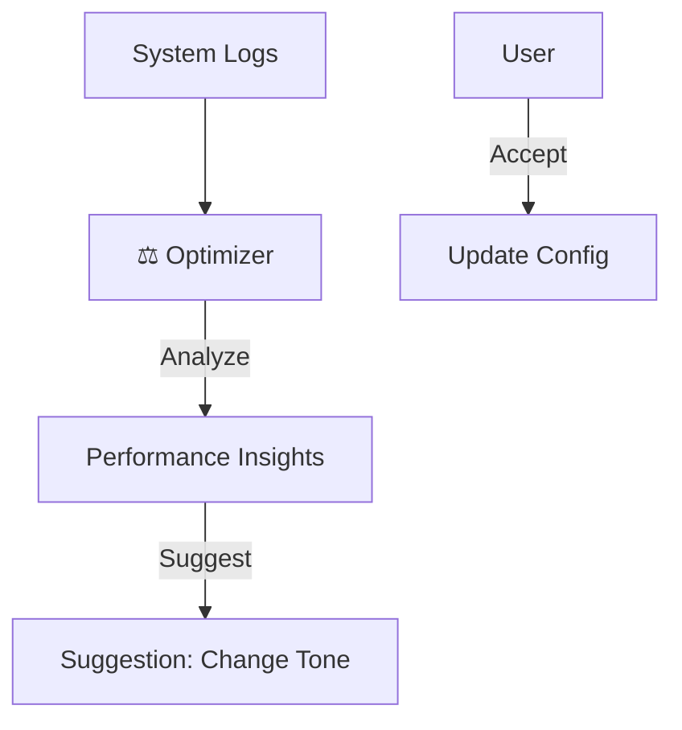

# Screen 10: System Monitor

**Phase:** Phase 2 (Dashboard & Backend)
**Status:** ⚪ Planned
**AI Model:** `gemini-3-flash-preview`
**Agent Role:** ⚖️ **The Optimizer** (Returning)

---

## 1. Description & Purpose
Manages the active AI agents/systems selected in Step 3. It shows their status, ROI metrics, and allows for fine-tuning.

**Key Goals:**
1.  **System Health**: Are the agents running? (Simulated or Real).
2.  **ROI Tracking**: "Lead Gen Engine generated 40 leads this week."
3.  **Tuning**: Adjust agent parameters (e.g., "Make tone more professional").

---

## 2. Layout Logic

| Section | Content | Behavior |
| :--- | :--- | :--- |
| **Main Grid** | **System Cards**. Detailed view of the selected systems. | Shows uptime, recent logs, and performance graphs. |
| **Config Panel** | **Settings Form**. Tone, Frequency, Budget. | Changes update the system prompt immediately. |

---

## 3. AI Agent: The Optimizer (Monitor Mode)

**System Instruction:**
"You are a Systems Engineer. Monitor the performance of the active agents. Suggest optimizations if performance dips."

**Gemini 3 Features:**
-   **Reasoning**: To suggest config changes based on data (e.g., "Open rate low -> Suggest changing Subject Line").

### Workflow Diagram


---

## 4. Implementation Prompts

### Step 1: System Detail View
```text
Create `components/dashboard/Systems/SystemDetail.tsx`.
- Charts for specific metrics (Leads, Content Pieces, etc.).
- A "Terminal" window showing fake/real logs of what the agent is doing.
```

### Step 2: Optimization Engine
```text
Create `services/gemini/system-optimizer.ts`.
- Function `auditPerformance(metrics)`.
- Returns a list of suggestions.
- e.g., "Increase daily limit to 50 to match demand."
```
