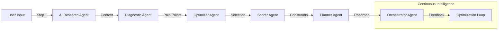
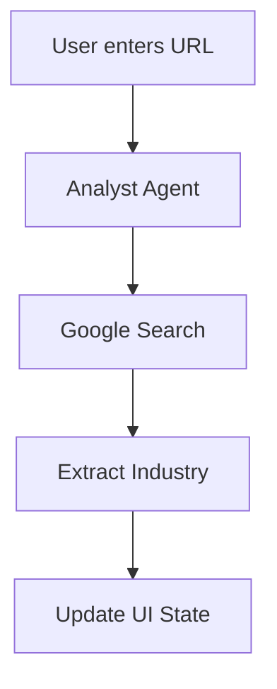
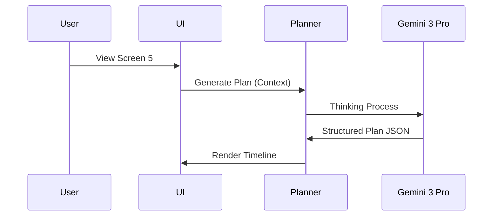

# 11 — Gemini Master Plan (Sun AI Agency)

## 1. Executive Summary

Sun AI Agency is a premium, AI-powered consultancy platform designed to transform businesses from manual operations into automated growth engines. Unlike generic SaaS tools, Sun AI acts as a strategic partner, using advanced AI to diagnose specific industry pain points and architect bespoke automation systems.

**Gemini is central to this vision.** It is not just a chatbot; it is the intelligence layer that powers research, diagnostics, strategy generation, and execution. By leveraging Gemini 3's advanced reasoning (Thinking), grounding (Search/Maps), and structured output capabilities, Sun AI builds trust through transparency and delivers actionable, high-value roadmaps.

The intelligence flows linearly: **Verify (Context) → Diagnose (Problem) → Prescribe (Solution) → Assess (Risk) → Plan (Strategy) → Execute (Dashboard).**

---

## 2. Global Architecture Overview

### 2.1 Intelligence Flow
The system operates on a "Context-First" architecture. Every step builds upon the verified truths of the previous step, preventing hallucination and ensuring relevance.

---

## 3. Gemini Models & Capabilities Matrix

| Capability | Gemini 3 Pro | Gemini 3 Flash | Used Where | Purpose |
| :--- | :---: | :---: | :--- | :--- |
| **Text Generation** | ✅ | ✅ | All Screens | Narrative generation, streaming insights, UI copy. |
| **Gemini Thinking** | ✅ | ❌ | Screen 5, Screen 8 | Deep reasoning for roadmap dependencies and scheduling. |
| **Function Calling** | ✅ | ✅ | Screen 9, 10 | Triggering external tools (email, CRM) and verifying tasks. |
| **Structured Outputs** | ✅ | ✅ | Screens 2, 4, 5 | Enforcing JSON schemas for UI rendering (forms, charts). |
| **URL Context Tool** | ✅ | ✅ | Screen 1 | Reading user website to extract brand voice and offers. |
| **Google Search** | ✅ | ✅ | Screen 1, 7 | Verifying business existence, market trends, and news. |
| **Google Maps** | ✅ | ✅ | Screen 2 (Local) | Location-based insights for Real Estate/Tourism. |
| **Deep Research** | ✅ | ❌ | Screen 1 (Adv) | Comprehensive market analysis (Advanced Phase). |
| **RAG** | ✅ | ❌ | Screen 10 | Retrieving answers from uploaded internal docs. |
| **Code Execution** | ✅ | ✅ | Screen 9 | Calculating complex ROI metrics or data parsing. |
| **Interactions API** | ❌ | ✅ | Dashboard | Low-latency voice/chat interactions (Future). |
| **Image Gen** | ✅ | ✅ | Screen 3 (Adv) | Generating mockups of content assets (Nano Banana). |

---

## 4. AI Agent System (Global)

### 4.1 Agent Types
*   **Orchestrator**: The "Project Manager." Routes requests, manages state, and triggers other agents.
*   **Planner**: The "Strategist." Uses deep reasoning to build and adjust timelines.
*   **Analyst**: The "Researcher." Finds patterns, identifies risks, and verifies data.
*   **Content / Communications**: The "Creative." Drafts copy, emails, and marketing assets.
*   **Retriever**: The "Librarian." Fetches knowledge from RAG or documents.
*   **Extractor**: The "Data Scientist." Pulls structured data from unstructured text/URLs.
*   **Optimizer**: The "Engineer." Matches problems to system solutions and tunes performance.
*   **Scorer**: The "Auditor." Calculates readiness scores and identifies gaps.
*   **Controller**: The "Gatekeeper." Ensures safety, compliance, and human-in-the-loop approval.

### 4.2 Agent Responsibility Matrix

| Agent | Role | Inputs | Outputs | Used In Screens |
| :--- | :--- | :--- | :--- | :--- |
| **Analyst** | Research & Discovery | Company Name, URL | Industry, Model, Context | 1, 7 |
| **Extractor** | Diagnostic generation | Industry Context | Custom Questions JSON | 2 |
| **Optimizer** | Solution Mapping | Pain Points | System Recs, ROI Text | 3, 10 |
| **Scorer** | Risk Assessment | Checklist Data | Score, Gaps, Quick Wins | 4 |
| **Planner** | Strategy Generation | All Wizard Data | 3-Phase Roadmap JSON | 5, 8 |
| **Orchestrator** | Execution Management | Task Status | Actions, Sub-tasks | 6, 9 |

---

## 5. MASTER SCREEN PLAN

---

## Screen 1 — Business Context & Market Grounding

### A. Purpose & Success Criteria
*   **Goal:** Establish a verified "Truth Baseline" for the business.
*   **Success:** AI correctly identifies the industry and business model from just a URL. User feels "understood."

### B. UI / UX Layout (3-Panel System)
| Panel | Width | Objective | Components | Content |
| :--- | :--- | :--- | :--- | :--- |
| **Left** | 20% | Status | Progress Bar | Step 1/5, "Getting Started" |
| **Center** | 50% | Input | Form | Name, URL, Industry (Auto), Desc. |
| **Right** | 30% | Trust | Streaming Text | "Analyzing digital footprint..." |

### C. User Journey
1.  User enters URL.
2.  Analyst Agent crawls URL & searches Google.
3.  Agent streams findings to Right Panel.
4.  Agent auto-selects "Industry" in Center Panel.

### D. Data Inputs → Outputs
| Field | Type | Source | Output Used By |
| :--- | :--- | :--- | :--- |
| `website` | URL | User | Analyst Agent |
| `industry` | Enum | AI/User | Screen 2 (Diagnostics) |
| `context` | Text | AI | All Screens |

### E. AI Logic & Reasoning
*   Must verify if the business exists.
*   Must classify into 1 of 5 industries (SaaS, Fashion, RE, Tourism, Other).
*   **Guardrail:** If URL is invalid, fall back to manual entry without hallucinating details.

### F. AI Agents Used
| Agent | Responsibility | Input | Output |
| :--- | :--- | :--- | :--- |
| **Analyst** | Verification | URL | Business Profile |

### G. Gemini Features Used
| Feature | Why Used |
| :--- | :--- |
| **Google Search** | To verify business existence. |
| **URL Context** | To read landing page copy. |

### H. Workflows & Automations
| Trigger | Action | Result |
| :--- | :--- | :--- |
| `onBlur` (URL) | Trigger Analyst | Auto-fill Industry |

### J. Mermaid Diagrams

#### 1. Screen Flow

---

## Screen 2 — Industry Diagnostics & Solution Mapping

### A. Purpose & Success Criteria
*   **Goal:** Demonstrate expertise by asking niche-specific questions.
*   **Success:** User thinks "These are exactly my problems."

### B. UI / UX Layout
| Panel | Width | Objective | Components | Content |
| :--- | :--- | :--- | :--- | :--- |
| **Left** | 20% | Context | Static List | Industry Context |
| **Center** | 50% | Diagnosis | Dynamic Form | 4 generated questions. |
| **Right** | 30% | Education | Context Cards | "Why this metric matters." |

### C. User Journey
1.  User sees questions specific to their industry (from Step 1).
2.  User selects answers (Pain Points).
3.  Right Panel explains the operational cost of that pain point.

### D. Data Inputs → Outputs
| Field | Type | Source | Output Used By |
| :--- | :--- | :--- | :--- |
| `painPoints` | Array | User | Screen 3 (Optimizer) |
| `priorities` | Object | User | Screen 3 (Ranking) |

### E. AI Logic & Reasoning
*   Map specific pain points (e.g., "High Returns") to generic system needs (e.g., "Sizing AI").
*   **Guardrail:** Ensure questions are solvable by our defined Systems.

### F. AI Agents Used
| Agent | Responsibility | Input | Output |
| :--- | :--- | :--- | :--- |
| **Extractor** | Question Gen | Industry | DiagnosticSchema JSON |

### G. Gemini Features Used
| Feature | Why Used |
| :--- | :--- |
| **Structured Output** | To ensure the dynamic form renders correctly. |

---

## Screen 3 — System Selection

### A. Purpose & Success Criteria
*   **Goal:** Prescribe the cure.
*   **Success:** User selects the systems that actually solve their defined problems.

### B. UI / UX Layout
| Panel | Width | Objective | Components | Content |
| :--- | :--- | :--- | :--- | :--- |
| **Left** | 20% | Context | List | Identified Pain Points |
| **Center** | 50% | Selection | Card Grid | System Cards (Recommended). |
| **Right** | 30% | Value | Calculator | "Revenue Impact" projection. |

### C. User Journey
1.  System displays 5 cards.
2.  Optimizer Agent marks 2-3 as "Recommended".
3.  User selects systems.
4.  Right Panel calculates potential ROI.

### D. Data Inputs → Outputs
| Field | Type | Source | Output Used By |
| :--- | :--- | :--- | :--- |
| `selectedSystems` | Array | User | Screen 5 (Plan) |

### E. AI Logic & Reasoning
*   Logic: If Pain Point = "Leads", Recommend "Lead Gen Engine".
*   Logic: If Pain Point = "Chaos", Recommend "Operations Autopilot".

### F. AI Agents Used
| Agent | Responsibility | Input | Output |
| :--- | :--- | :--- | :--- |
| **Optimizer** | Recommendation | Pain Points | Ranked System List |

---

## Screen 4 — Readiness Assessment

### A. Purpose & Success Criteria
*   **Goal:** Reality check to prevent failure.
*   **Success:** Honest assessment (even if low score) to build trust.

### B. UI / UX Layout
| Panel | Width | Objective | Components | Content |
| :--- | :--- | :--- | :--- | :--- |
| **Left** | 20% | Context | List | Selected Systems |
| **Center** | 50% | Assessment | Checklist | Data, Team, Tools status. |
| **Right** | 30% | Analysis | Alert Stream | Risk analysis & Quick Wins. |

### C. User Journey
1.  User toggles checklist items (Data, Team, Budget).
2.  Scorer Agent calculates live score (0-100).
3.  Right Panel flags "Critical Gaps" (e.g., No Data = No AI).

### D. Data Inputs → Outputs
| Field | Type | Source | Output Used By |
| :--- | :--- | :--- | :--- |
| `readinessScore` | Number | AI | Screen 5 (Timeline) |
| `gaps` | Array | AI | Screen 5 (Phase 1) |

### E. AI Logic & Reasoning
*   If Score < 50, Phase 1 of Roadmap must be "Foundation".
*   If Score > 80, Phase 1 can be "Implementation".

### F. AI Agents Used
| Agent | Responsibility | Input | Output |
| :--- | :--- | :--- | :--- |
| **Scorer** | Audit | Checklist | Score + Risk JSON |

---

## Screen 5 — Strategy & Phases (Roadmap)

### A. Purpose & Success Criteria
*   **Goal:** The final product. A concrete plan.
*   **Success:** User sees a clear path from "Now" to "ROI".

### B. UI / UX Layout
| Panel | Width | Objective | Components | Content |
| :--- | :--- | :--- | :--- | :--- |
| **Left** | 20% | Summary | List | Score, Systems, Gaps. |
| **Center** | 50% | Roadmap | Timeline | 3-Phase Plan (Weeks 1-4+). |
| **Right** | 30% | Reasoning | Thinking | "Sequencing dependencies..." |

### C. User Journey
1.  Agent (Planner) enters "Thinking Mode" (displayed in Right Panel).
2.  Agent generates JSON roadmap based on Gaps + Systems.
3.  UI renders the vertical timeline.

### D. Data Inputs → Outputs
| Field | Type | Source | Output Used By |
| :--- | :--- | :--- | :--- |
| `roadmap` | JSON | Planner | Dashboard |

### E. AI Logic & Reasoning
*   **Gemini Thinking**: Must deduce that "No CRM" (Gap) means "Install CRM" (Task) MUST happen before "Automate Leads" (System).

### F. AI Agents Used
| Agent | Responsibility | Input | Output |
| :--- | :--- | :--- | :--- |
| **Planner** | Strategy | All Wizard Data | Detailed Roadmap JSON |

### G. Gemini Features Used
| Feature | Why Used |
| :--- | :--- |
| **Gemini Thinking** | To handle complex dependency chains and logical sequencing. |

### J. Mermaid Diagrams

#### 2. Agent Orchestration

---

## Screen 6 — Dashboard Overview

### A. Purpose
High-level command center.

### B. Layout
*   **Header**: KPI Cards (Progress, Health).
*   **Main**: Smart Activity Feed.
*   **Sidebar**: Market Pulse (News).

### F. AI Agents Used
*   **Analyst**: Monitors progress vs plan.
*   **Orchestrator**: Summarizes feed.

---

## Screen 7 — Dashboard Roadmap

### A. Purpose
Interactive Gantt chart of the Screen 5 plan.

### B. Layout
*   **Main**: Interactive Gantt.
*   **Right**: Scenario Chat ("What if we delay?").

### F. AI Agents Used
*   **Planner**: Re-calculates critical path on changes.

---

## Screen 8 — Dashboard Tasks

### A. Purpose
Kanban view for execution.

### B. Layout
*   **Main**: Kanban Board.
*   **Detail**: AI Assist overlay.

### F. AI Agents Used
*   **Orchestrator**: "Do it for me" actions (Draft email, etc.).

---

## Screen 9 — Dashboard Systems

### A. Purpose
Monitor active agents.

### B. Layout
*   **Main**: System Cards & Logs.
*   **Config**: Tuning parameters.

### F. AI Agents Used
*   **Optimizer**: Suggests configuration changes.

---

## Screen 10 — Dashboard Settings

### A. Purpose
Admin & Configuration.

---

## 6. Core vs Advanced AI Strategy

### Core (MVP)
*   **Scope**: Wizard Screens 1-5 + Static Dashboard.
*   **AI**: Gemini Flash for speed, Pro for Step 5.
*   **Risk**: Low. Output is reviewed by user.

### Advanced (Scale)
*   **Scope**: Live Dashboard + Autonomous Agents.
*   **AI**: RAG, Code Execution, Deep Research.
*   **Risk**: Higher. Requires human approval gates (Controller Agent).

---

## 7. Global Workflows & Automations

| Workflow | Trigger | AI Agents | Outcome |
| :--- | :--- | :--- | :--- |
| **Business Verification** | URL Entry | Analyst | Validated Industry Context |
| **Diagnostic Generation** | Industry Set | Extractor | Custom Q&A Form |
| **Solution Matching** | Pain Points | Optimizer | System Recommendations |
| **Risk Audit** | Checklist | Scorer | Readiness Score |
| **Roadmap Generation** | Wizard Complete | Planner | 30-Day Execution Plan |
| **Task Assist** | "Do It" Click | Orchestrator | Draft/Code/Config |
| **Market Alert** | Weekly Timer | Analyst | News Summary in Dashboard |

---

## 8. End-to-End User Journeys

### A. Fashion & Luxury Brand
1.  **Entry**: Enters URL. Analyst sees "Shopify" + "High-end".
2.  **Diagnostics**: Asked about "Returns" and "Inventory Sync".
3.  **Selection**: Choses "Operations Autopilot" (Inventory) + "Content Studio".
4.  **Readiness**: Flags "Data Silos". Score 65.
5.  **Plan**: Phase 1 = "Data Unification".
6.  **Dashboard**: Tracks content generation tasks.

### B. Real Estate Agency
1.  **Entry**: Enters URL. Analyst sees "Listings" + "Local Market".
2.  **Diagnostics**: Asked about "Lead Response Time" and "Viewings".
3.  **Selection**: Choses "Lead Gen Engine" + "WhatsApp Assistant".
4.  **Readiness**: Flags "No CRM". Score 40.
5.  **Plan**: Phase 1 = "CRM Setup". Phase 2 = "WhatsApp Integration".
6.  **Dashboard**: Monitors lead response KPIs.

---

## 9. Risks, Constraints & Guardrails

*   **Hallucination**: AI inventing systems we don't sell.
    *   *Guardrail*: Hardcoded System IDs in prompt constraints.
*   **Latency**: Thinking models take 10s+.
    *   *Guardrail*: UI must show "Thinking..." steps/skeleton loaders.
*   **Context Window**: Website crawling exceeding tokens.
    *   *Guardrail*: Summarize scraped content before passing to Planner.
*   **Safety**: Generating harmful content.
    *   *Guardrail*: Gemini Safety Settings (High).

---

## 10. Implementation Readiness Checklist

| Area | Status | Notes |
| :--- | :--- | :--- |
| **Frontend Skeleton** | ✅ Ready | 3-Panel Layout & Wizard State. |
| **Gemini Client** | ❌ Pending | Needs `lib/ai.ts` setup. |
| **Agent Prompts** | ❌ Pending | Needs System Instructions. |
| **State Persistence** | ❌ Pending | Needs LocalStorage/DB sync. |
| **Dashboard Views** | ❌ Pending | Only Overview is wireframed. |

