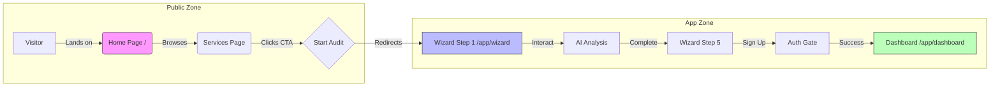

# Sun AI Agency — Sitemap & Architecture Analysis

## 1. Short Summary

**Current State:**
The application is currently a **Monolithic Single Page Application (SPA)** using **State-Based Routing**.
- **URL Structure:** There is effectively only one URL: `domain.com/`. The browser path never changes.
- **Routing Logic:** `App.tsx` acts as a manual router, checking `state.step` and `state.completed` to decide whether to render a Wizard Step or the Dashboard.
- **Marketing:** There are no marketing pages. The "Home Page" is currently the first step of the functional Wizard.

**Main Issues:**
1.  **No SEO:** Search engines cannot index "Services" or "About" pages because they do not exist.
2.  **No Deep Linking:** Users cannot bookmark the Dashboard or share a specific Wizard step.
3.  **Browser History:** The "Back" button may exit the site instead of going to the previous wizard step, as state changes don't push history entries.

**Production-Ready Vision:**
To scale, the app requires a client-side routing library (like `react-router`) to strictly separate the **Marketing Site** (Public, SEO-heavy) from the **Web Application** (Private, Functional).

---

## 2. Current Sitemap (AS-IS)

The current structure exists purely in React Memory.

```text
/ (index.html)
└── App.tsx (The State Router)
    │
    ├── Condition: New User (state.completed == false)
    │   └── Wizard Flow
    │       ├── Step 1: Business Context (Entry Point)
    │       ├── Step 2: Industry Diagnostics
    │       ├── Step 3: System Selection
    │       ├── Step 4: Readiness Check
    │       └── Step 5: Strategic Plan
    │
    └── Condition: Completed User (state.completed == true)
        └── Dashboard View
            ├── Tab: Overview
            ├── Tab: Roadmap
            ├── Tab: Tasks
            └── Tab: Systems
```

---

## 3. Current Routes & Files

Since there is no routing library, "Routes" are virtual concepts mapped to components.

| Virtual Route | Type | Logic Handler | Physical Component |
| :--- | :--- | :--- | :--- |
| `/` | App Entry | `App.tsx` | `components/wizard/Step1Context.tsx` |
| `/step-[2-5]` | Wizard | `App.tsx` (State change) | `components/wizard/*.tsx` |
| `/dashboard` | Product | `App.tsx` (State change) | `components/Dashboard.tsx` |
| `/services` | Marketing | ❌ Missing | N/A |
| `/about` | Marketing | ❌ Missing | N/A |

---

## 4. Where Home & Marketing Pages Should Go

To establish authority as an agency, you must separate the **Sales Pitch** (Marketing) from the **Tool** (App).

### Strategic Separation

1.  **Marketing Site (`/`, `/about`, `/services`)**
    *   **Goal:** Conversion. Convince the user to start the audit.
    *   **Content:** Value proposition, case studies, industry pack details, pricing.
    *   **Layout:** Standard Website (Navigation Bar, Footer, SEO Meta tags).
    *   **Tech:** Static content, fast load times.

2.  **The Application (`/app/*`)**
    *   **Goal:** Utility. Execute the audit and manage the project.
    *   **Content:** The Wizard, The Dashboard, Settings.
    *   **Layout:** App Shell (Sidebar, Focus Mode, Auth checks).
    *   **Tech:** Dynamic state, heavy logic, AI streaming.

### Real-World Example Flow
1.  **Visitor (SEO/Ads):** Lands on `sunai.agency` (Home). Reads about "AI for Real Estate".
2.  **Lead:** Clicks CTA **"Start Free Audit"**.
3.  **Transition:** Router moves them to `sunai.agency/app/wizard` (The App).
4.  **User:** Completes Step 1. URL becomes `sunai.agency/app/wizard/step-2`.
5.  **Client:** Completes wizard, signs up. Redirected to `sunai.agency/app/dashboard`.

---

## 5. Production-Ready Sitemap (TO-BE)

This structure utilizes a router to manage navigation and access control.

```text
/ (Root Domain)
│
├── Public Marketing Routes (Layout: PublicWebsite)
│   ├── /                  # Home (Hero, Value Prop, CTA)
│   ├── /services          # Industry Packs explanation
│   ├── /about             # Agency background & "Why Sun AI"
│   └── /contact           # General inquiry form
│
└── Application Routes (Layout: AppShell)
    ├── /app               # Redirects to /app/wizard
    │
    ├── /app/wizard        # The 5-Step Logic
    │   ├── /step/1        # Business Context
    │   ├── /step/2        # Diagnostics
    │   ├── /step/3        # Systems
    │   ├── /step/4        # Readiness
    │   └── /step/5        # Plan (The "Hook")
    │
    ├── /app/auth          # Sign Up / Login / Magic Link
    │
    └── /app/dashboard     # Protected Route (Requires Auth)
        ├── /overview      # KPI Command Center
        ├── /roadmap       # Interactive Gantt
        ├── /tasks         # Kanban Board
        └── /systems       # Agent Monitor
```

---

## 6. Simple User Journey Flow

