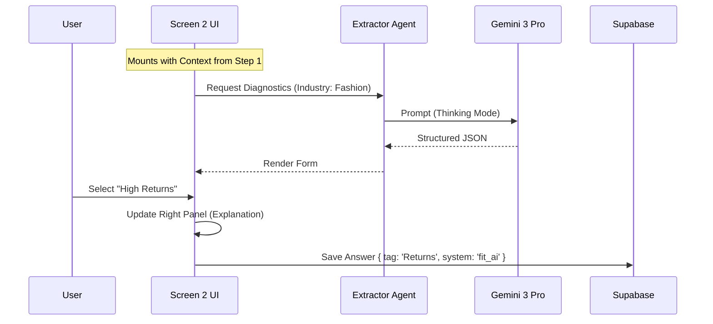
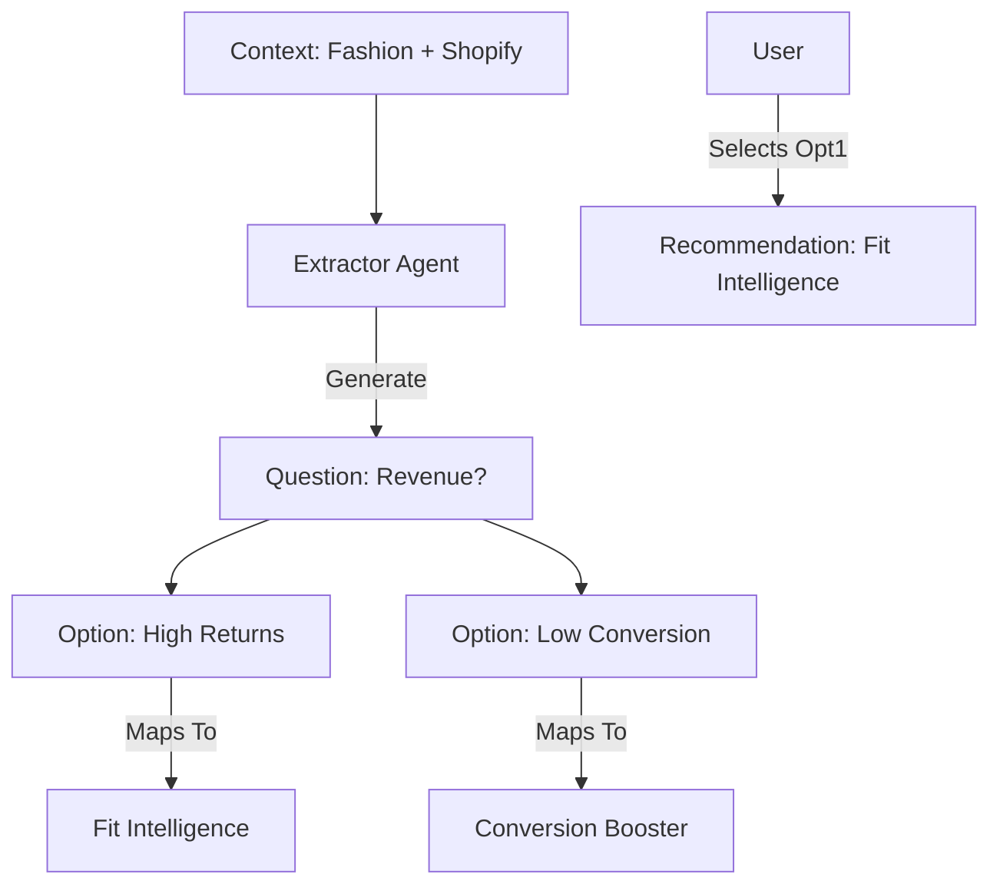

# Screen 2: Industry Diagnostics (Deep Dive)

**Status:** Planning
**Role:** The Consultant
**Goal:** Transform generic business context into specific, actionable pain points.
**Input:** Step 1 Context (Industry, URL Analysis, Services).
**Output:** A structured "Symptom Profile" mapped to AI Systems.

---

## 1. Executive Summary

Screen 2 is the **Diagnostic Phase**. Having verified *who* the business is in Screen 1, we now determine *what is holding them back*.

Instead of a static form, this screen uses **Gemini 3 Pro (Thinking Mode)** to generate a dynamic questionnaire tailored to the user's specific Industry and Tech Stack. The questions are designed to be high-signal: every answer selected by the user directly triggers a specific System Recommendation in Screen 3.

---

## 2. 3-Panel Layout Strategy

### Left Panel (20%) — Verified Context
*   **Purpose:** Anchoring. Shows the user that the AI "remembers" them.
*   **Visuals:**
    *   **Industry Badge:** (e.g., "Fashion E-commerce").
    *   **Tech Stack:** Icons of services selected in Step 1 (e.g., Shopify, Instagram).
    *   **Maturity Score:** The calculated score from Step 1.
*   **Behavior:** Sticky / Fixed.

### Center Panel (50%) — The Diagnostic Form
*   **Purpose:** Data Collection via Progressive Disclosure.
*   **Structure:** 4 Distinct Blocks (Vertical Scroll).
    1.  **Block A: Primary Focus** (Single Select).
    2.  **Block B: Revenue Friction** (Multi-Select, Industry Specific).
    3.  **Block C: Time & Automation** (Multi-Select, Service Specific).
    4.  **Block D: Confidence** (Single Select).
*   **Interaction:** Cards with hover states. Selection updates the Right Panel.

### Right Panel (30%) — Consultant Logic
*   **Purpose:** Education ("The Why").
*   **Content:**
    *   **Dynamic Insight:** When a user hovers over a question options (e.g., "High Returns"), the panel explains *why* this matters for their specific industry.
    *   **Example:** "In Fashion, returns are often a data problem, not a product problem. Addressing this protects margins."

---

## 3. The 4 Diagnostic Blocks (Content Plan)

### Block A: Primary Focus (The North Star)
*   **Question:** "What is the biggest priority for your business right now?"
*   **Type:** Single Select.
*   **Options (Standardized):**
    *   Increase sales & revenue.
    *   Save time through automation.
    *   Improve marketing performance.
    *   Improve sales follow-up & conversion.
    *   Prepare the business to scale.

### Block B: Industry Pain Points (The Money Leaks)
*   **Question:** "Where do you feel stuck today?"
*   **Logic:** Generated dynamically by **Extractor Agent** based on Industry.
*   **Example (Fashion):**
    *   "Visitors browse but don't buy" (Conversion).
    *   "Content creation takes too much time" (Marketing).
    *   "Customers ask sizing questions repeatedly" (Support).
    *   "Sales depend too much on paid ads" (Acquisition).
*   **Example (Real Estate):**
    *   "Leads respond too slowly" (Speed).
    *   "Follow-ups are manual and inconsistent" (Operations).
    *   "Low-quality leads waste time" (Qualification).

### Block C: Time & Automation (The Efficiency Gap)
*   **Question:** "What is consuming time your team shouldn’t be spending?"
*   **Logic:** Generated dynamically based on **Selected Services** (Step 1).
*   **Example (If 'WhatsApp' Selected):** "Repetitive customer questions."
*   **Example (If 'CRM' Selected):** "Manual data entry and lead routing."

### Block D: Readiness Check (The Calibration)
*   **Question:** "How comfortable are you with automating parts of your business?"
*   **Type:** Single Select.
*   **Options:**
    *   Ready to automate now.
    *   Interested but need guidance.
    *   Exploring options.
    *   Just researching.

---

## 4. AI Architecture & Gemini 3 Features

### Agent: Extractor Agent
*   **Model:** `gemini-3-pro-preview`
*   **Trigger:** Screen Mount.
*   **Input:** `industry`, `selectedServices`, `docInsights` (from Step 1).

### Feature Usage
| Feature | Implementation Purpose |
| :--- | :--- |
| **Structured Outputs** | **CRITICAL.** Forces Gemini to return a strict JSON schema (`DiagnosticSection[]`) that the React frontend can render without error. |
| **Gemini Thinking** | Used to reason about the relationship between *Tech Stack* and *Potential Problems*. (e.g., "They use Shopify but no Email tool -> Ask about Retention"). |
| **URL Context** | Used in Step 1 to inform Step 2. If the URL analysis showed "No Chatbot", Step 2 creates a question about "Support Volume". |

### JSON Schema (Output)
```typescript
interface DiagnosticSchema {
  sections: {
    id: string; 
    title: string;
    questions: {
      id: string;
      text: string;
      type: 'single' | 'multi';
      options: {
        label: string;
        mapped_system_id: string; // The specific AI System this pain point maps to
        pain_point_tag: string;   // For the dashboard analytics
        ai_explanation: string;   // Text for the Right Panel
      }[];
    }[];
  }[];
}
```

---

## 5. Workflows & Wiring

### Frontend (React)
*   **Component:** `Step2Diagnostics.tsx`.
*   **State:** `useWizardState`.
*   **Action:** On selection, update `diagnosticAnswers` in local state.
*   **Persistence:** Debounce save to Supabase `wizard_answers` table.

### Backend (Edge Functions)
*   **Function:** `supabase/functions/extractor/index.ts`.
*   **Logic:**
    1.  Receive `industry` and `services`.
    2.  Load specific **Industry Pack** prompts (e.g., `packs/fashion.ts`).
    3.  Call Gemini 3 Pro with `responseSchema`.
    4.  Return JSON.

### Database (Supabase)
*   **Table:** `wizard_answers`
    *   `session_id` (UUID)
    *   `question_id` (String)
    *   `answer_value` (JSONB Array)
    *   `metadata` (JSONB - stores the `mapped_system_id`)

---

## 6. Mermaid Diagrams

### User Journey & Data Flow


### Logic Mapping


---

## 7. Next Steps for Implementation

1.  **Update Industry Packs:** Ensure `data/industryPacks.ts` contains the high-quality question templates for Block B.
2.  **Enhance Edge Function:** Update `extractor` function to support the 4-Block structure.
3.  **Update UI:** Refactor `Step2Diagnostics.tsx` to render the 4 blocks distinctively (Cards vs Checkboxes).
4.  **Wiring:** Ensure `mapped_system_id` is saved to the database for use in Screen 3.
