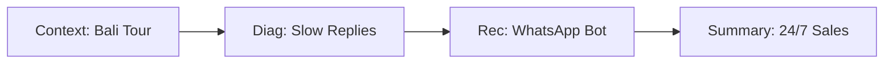
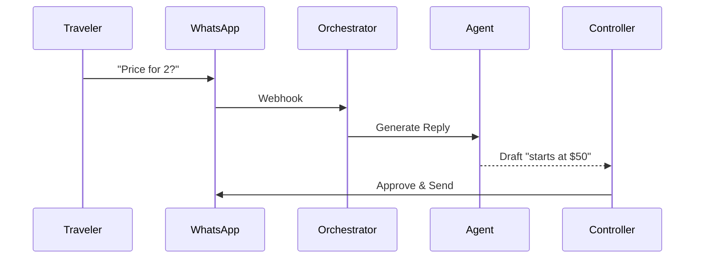
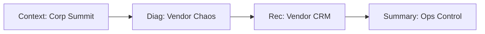
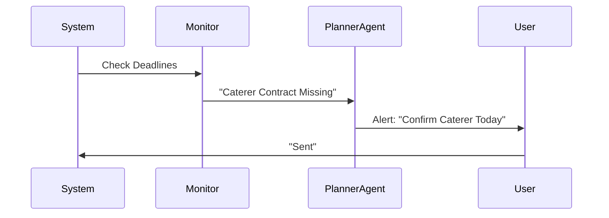
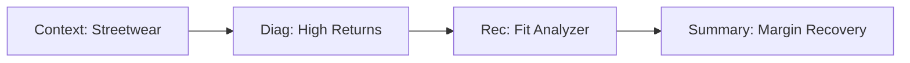
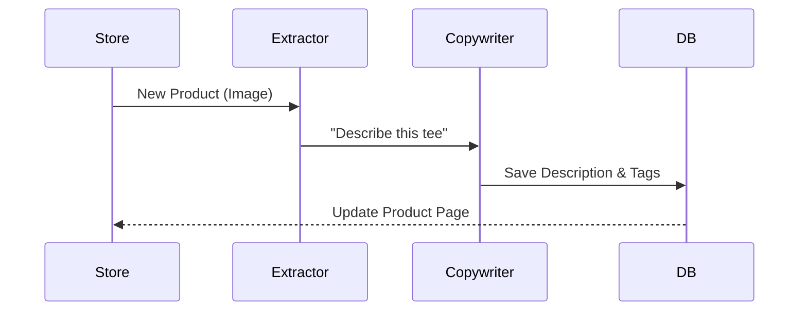
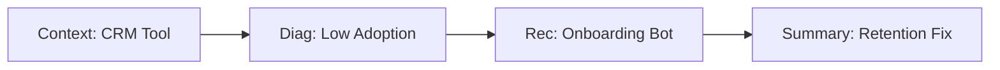
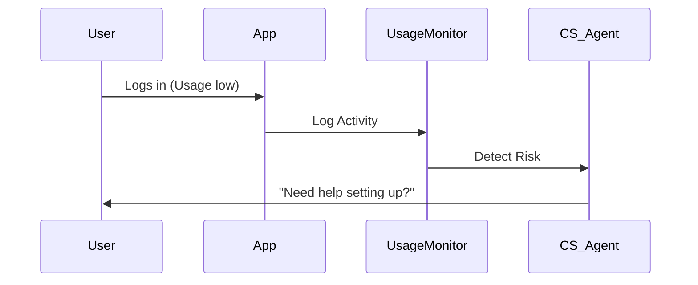
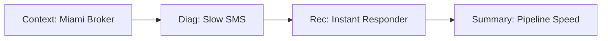
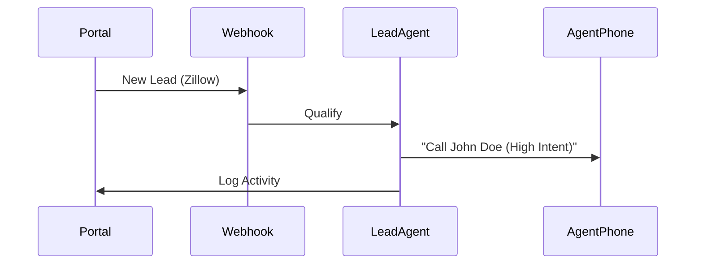

# Sun AI Agency — Industry Implementation Plans

**Date:** Current
**Status:** Approved Specification
**Scope:** Travel, Events, Fashion, SaaS, Real Estate

---

## 0. GLOBAL PRODUCT MODEL

### 3-Panel Layout Logic
*   **Left (Context):** Sticky sidebar. Shows "Who we are solving for" (Identity/Industry).
*   **Main (Work):** Scrollable focus area. Forms, cards, interactions.
*   **Right (Intelligence):** Sticky sidebar. Shows "Why we are doing this" (AI reasoning/Streams).

**Responsive Behavior:**
*   **Desktop (>1024px):** Full 3-Panel view.
*   **Tablet (768px–1023px):** 2-Panel view. Right Panel (Intelligence) collapses into a togglable "Insights" drawer. Left Panel remains visible for navigation context.
*   **Mobile (<768px):** Single column stack. Order: Left (collapsed header) → Main (Work) → Right (Bottom sheet/Modal triggered by "AI Analysis" floating button).

---

## 1. INDUSTRY: TRAVEL & EXPERIENCES

### 1.1 Industry Summary
*   **Description:** Businesses selling time-based experiences, tours, or stays. High volume, low margin, heavy customer service load.
*   **Models:** Boutique Hotels, Tour Operators, Travel Agencies, DMCs.
*   **Primary Constraints:** Time (24/7 inquiries), Staffing (seasonal), Review dependency.

### 1.2 Wizard Plan (Screens 1–4)

#### Screen 1: Context & Truth Baseline
*   **Purpose:** Verify the destination and booking model.
*   **Data:**
    *   *Left:* Progress.
    *   *Main:* Inputs: Agency Name, Website, Main Destination(s).
    *   *Right:* AI verifies location seasonality and current travel trends via **Google Search Grounding**.
*   **Continuity:** Passes `Location` and `BookingPlatform` (e.g., Viator, Direct) to Screen 2.
*   **Agent:** **Analyst** (Flash).

#### Screen 2: Industry Diagnostics
*   **Purpose:** Identify service bottlenecks.
*   **Data:**
    *   *Left:* "Analysis for [Destination] Operator".
    *   *Main:*
        *   **Revenue:** "Where do you lose bookings?" (e.g., "Response time too slow").
        *   **Ops:** "What eats your day?" (e.g., "Manually building itineraries").
    *   *Right:* AI explains impact of slow response on traveler conversion.
*   **Agent:** **Extractor** (Pro). Uses structured output to map "Slow Response" to "Concierge Bot".

#### Screen 3: System Recommendations
*   **Purpose:** Prescribe the automated workforce.
*   **Data:**
    *   *Left:* Selected Pain Points.
    *   *Main:* 3 Cards (e.g., "24/7 WhatsApp Concierge", "Itinerary Builder", "Review Automator").
    *   *Right:* ROI Calculator (Hours saved per week).
*   **Agent:** **Optimizer** (Pro).

#### Screen 4: Strategic Summary
*   **Purpose:** Decision & Confidence.
*   **Data:**
    *   *Left:* Business Profile.
    *   *Main:* Executive Brief. "Your current manual process limits you to X bookings. Automation opens 24/7 sales." **Readiness Score**.
    *   *Right:* "Why this works": Seasonal logic and scalability.
*   **Agent:** **Scorer** + **Summary** (Pro).

### 1.3 Dashboard Plan
*   **Tab 1: Overview:** Active Travelers, Upcoming Departures, Sentiment Score.
*   **Tab 2: Inquiries (CRM):** Unified inbox (Email/WhatsApp). AI drafts replies based on FAQs.
*   **Tab 3: Itineraries:** Drag-and-drop builder using AI to fill details.
*   **Tab 4: Reviews:** Monitoring Tripadvisor/Google. Auto-draft responses.

### 1.4 Workflows & Automations

**Core (MVP)**
1.  **Inquiry Auto-Reply:** Trigger: Email/WhatsApp. Action: AI checks availability -> Sends draft reply.
2.  **Review Response:** Trigger: New Review. Action: AI drafts gratitude/apology. Controller: Human approval.
3.  **Itinerary Gen:** Trigger: Booking confirmed. Action: Generate PDF with local weather/tips.
4.  **Pre-Trip Nudge:** Trigger: 3 days before. Action: Send packing list + WhatsApp check-in.
5.  **Post-Trip Survey:** Trigger: 1 day after. Action: Request review.

**Advanced**
1.  **Dynamic Pricing Alert:** Trigger: Local demand spike. Action: Notify owner to raise rates.
2.  **Weather Rerouting:** Trigger: Rain forecast. Action: Suggest indoor alternatives to guide.
3.  **Supplier Confirm:** Trigger: 24h before. Action: WhatsApp local driver to confirm pickup.
4.  **Language Localization:** Trigger: Inquiry language. Action: Translate all comms.
5.  **Lost Lead Reactivation:** Trigger: 30 days no book. Action: Send discount offer.

### 1.5 Data Model & Supabase
*   **Tables:** `bookings`, `itineraries`, `destinations`, `travelers`.
*   **RLS:** Strict isolation by `org_id`.
*   **Audit:** Log all AI-sent messages to `communication_logs`.

### 1.6 Edge Functions & Wiring
*   `travel-analyst`: (Flash) Search grounding for local events/weather.
*   `itinerary-planner`: (Pro) Generates day-by-day plans.
*   `inquiry-responder`: (Flash) fast drafting.

### 1.7 Production Readiness
*   **Safety:** Human must approve all Review responses (Controller).
*   **Data:** Verify timezone handling for global travelers.

### 1.8 Diagrams

---

## 2. INDUSTRY: EVENTS & ENTERTAINMENT

### 2.1 Industry Summary
*   **Description:** Planning, marketing, and executing live or virtual gatherings.
*   **Models:** Wedding Planners, Corporate Conferences, Music Venues.
*   **Primary Constraints:** Deadlines (Hard dates), Vendor coordination, Cash flow timing.

### 2.2 Wizard Plan (Screens 1–4)

#### Screen 1: Context & Truth Baseline
*   **Purpose:** Define event scale and type.
*   **Data:**
    *   *Main:* Agency Name, Event Types (Wedding/Corp), Avg Attendance.
    *   *Right:* AI researches past events/venues to gauge scale.
*   **Agent:** **Analyst** (Flash).

#### Screen 2: Industry Diagnostics
*   **Purpose:** Find logistic friction.
*   **Data:**
    *   *Main:*
        *   **Sales:** "Ticket velocity vs. target?"
        *   **Ops:** "Vendor coordination chaos level?"
    *   *Right:* AI correlates attendee count with admin hours.
*   **Agent:** **Extractor** (Pro).

#### Screen 3: System Recommendations
*   **Purpose:** Stabilize the chaos.
*   **Data:**
    *   *Main:* Cards: "Vendor CRM", "Attendee Support Bot", "Run-of-Show Generator".
*   **Agent:** **Optimizer** (Flash).

#### Screen 4: Strategic Summary
*   **Purpose:** Operational confidence.
*   **Data:**
    *   *Main:* "Operational Blueprint". Readiness Score based on timeline to next event.
*   **Agent:** **Scorer** (Pro).

### 2.3 Dashboard Plan
*   **Tab 1: Timeline:** Master Gantt chart (Critical Path).
*   **Tab 2: Vendors:** CRM for caterers/AV. Contract status.
*   **Tab 3: Attendees:** Ticket sales, RSVP tracking, Seating charts.
*   **Tab 4: Run of Show:** Minute-by-minute script generator.

### 2.4 Workflows & Automations

**Core (MVP)**
1.  **Vendor Chase:** Trigger: Contract unsigned 5 days. Action: Auto-reminder email.
2.  **RSVP Sort:** Trigger: Form submit. Action: Categorize dietary restrictions in DB.
3.  **FAQ Auto-Reply:** Trigger: "Where is parking?". Action: Reply with map.
4.  **Invoice Gen:** Trigger: Milestone reached. Action: Send invoice.
5.  **Feedback Loop:** Trigger: Event end. Action: Send NPS survey.

**Advanced**
1.  **Timeline Crisis:** Trigger: Vendor cancels. Action: Suggest replacements from DB.
2.  **Budget Watch:** Trigger: Line item overage. Action: Alert planner.
3.  **Sponsor Match:** Trigger: New event. Action: Suggest sponsors based on audience.
4.  **Seating AI:** Trigger: Guest list final. Action: Optimize seating layout.
5.  **Social Wall:** Trigger: Event hashtag. Action: Curate photos for recap.

### 2.5 Data Model & Supabase
*   **Tables:** `events`, `vendors`, `attendees`, `contracts`.
*   **RLS:** Event-specific access (Contractors see only their event).

### 2.6 Edge Functions & Wiring
*   `event-planner`: (Pro) Generates timelines using **Thinking**.
*   `vendor-matcher`: (Flash) Vector search on vendor DB.

### 2.7 Production Readiness
*   **Reliability:** Offline mode for "Day of Event" dashboard access.
*   **UX:** High contrast for use in dark venues.

### 2.8 Diagrams

---

## 3. INDUSTRY: FASHION & RETAIL

### 3.1 Industry Summary
*   **Description:** Selling physical goods with high aesthetic value and turnover.
*   **Models:** DTC (Shopify), Wholesale, Boutique.
*   **Primary Constraints:** Inventory deadstock, Returns, Content creation fatigue.

### 3.2 Wizard Plan (Screens 1–4)

#### Screen 1: Context & Truth Baseline
*   **Purpose:** Verify brand aesthetic and platform.
*   **Data:**
    *   *Main:* Brand Name, Store URL, Platform (Shopify/Woo).
    *   *Right:* **URL Context** scrapes site to identify vibe (Luxury vs Streetwear).
*   **Agent:** **Analyst** (Flash).

#### Screen 2: Industry Diagnostics
*   **Purpose:** Margin analysis.
*   **Data:**
    *   *Main:*
        *   **Profit:** "Return rate status?"
        *   **Growth:** "Ad fatigue?"
    *   *Right:* AI benchmarks return rates against industry avg.
*   **Agent:** **Extractor** (Pro).

#### Screen 3: System Recommendations
*   **Purpose:** Visual and profit optimization.
*   **Data:**
    *   *Main:* "Product Desc Generator", "Returns/Fit Analyzer", "Ad Creative AI".
*   **Agent:** **Optimizer** (Flash).

#### Screen 4: Strategic Summary
*   **Purpose:** Brand alignment.
*   **Data:**
    *   *Main:* "Brand Scaling Strategy". Readiness Score based on product data structure.
*   **Agent:** **Summary** (Pro).

### 3.3 Dashboard Plan
*   **Tab 1: Merch:** Product catalog, AI descriptions, Tagging.
*   **Tab 2: Marketing:** Content calendar, Ad copy generator.
*   **Tab 3: Customers:** VIP segmentation, Return analysis.
*   **Tab 4: Trends:** Competitor visual monitoring.

### 3.4 Workflows & Automations

**Core (MVP)**
1.  **Product Launch:** Trigger: New photo upload. Action: Generate description + SEO tags.
2.  **Abandoned Cart:** Trigger: 1hr inactive. Action: Personalized email.
3.  **Review Analysis:** Trigger: New review. Action: Tag "Fit Issue" or "Quality Issue".
4.  **Social Post:** Trigger: Calendar date. Action: Draft caption + hashtag.
5.  **VIP Welcome:** Trigger: Spend > $500. Action: Notify owner to send personal note.

**Advanced**
1.  **Visual Search:** Trigger: Competitor image. Action: Find similar item in catalog.
2.  **Inventory Pred:** Trigger: Sales velocity. Action: Reorder alert.
3.  **Dynamic Pricing:** Trigger: Deadstock > 60 days. Action: Suggest discount.
4.  **Fit Recommender:** Trigger: Customer browsing. Action: Suggest size based on history.
5.  **Trend Watch:** Trigger: Viral TikTok trend. Action: Suggest product bundle.

### 3.5 Data Model & Supabase
*   **Tables:** `products`, `collections`, `returns`, `marketing_assets`.
*   **Embedding:** Vectorize product descriptions/images for search.

### 3.6 Edge Functions & Wiring
*   `visual-analyzer`: (Pro) Multimodal analysis of product photos.
*   `copywriter`: (Flash) Brand voice text generation.

### 3.7 Production Readiness
*   **Visuals:** Ensure high-res image handling in dashboard.
*   **Safety:** Filter generated content for brand safety.

### 3.8 Diagrams

---

## 4. INDUSTRY: SAAS & TECH

### 4.1 Industry Summary
*   **Description:** Software as a Service. Recurring revenue models.
*   **Models:** B2B, B2C, Enterprise, PLG (Product Led Growth).
*   **Primary Constraints:** Churn, CAC (Cost of Acquisition), Feature adoption.

### 4.2 Wizard Plan (Screens 1–4)

#### Screen 1: Context & Truth Baseline
*   **Purpose:** Identify growth stage.
*   **Data:**
    *   *Main:* Product Name, URL, Target Customer (SMB/Ent).
    *   *Right:* AI analyzes public documentation/pricing page.
*   **Agent:** **Analyst** (Flash).

#### Screen 2: Industry Diagnostics
*   **Purpose:** Funnel analysis.
*   **Data:**
    *   *Main:*
        *   **Leak:** "Where do users drop off?" (Onboarding vs Retention).
        *   **Dev:** "Feature shipping velocity?"
    *   *Right:* AI calculates theoretical LTV impact.
*   **Agent:** **Extractor** (Pro).

#### Screen 3: System Recommendations
*   **Purpose:** Growth engine.
*   **Data:**
    *   *Main:* "Onboarding Concierge", "Churn Predictor", "Docu-Search (RAG)".
*   **Agent:** **Optimizer** (Flash).

#### Screen 4: Strategic Summary
*   **Purpose:** Scale logic.
*   **Data:**
    *   *Main:* "Growth Architecture". Readiness Score based on data cleanliness.
*   **Agent:** **Summary** (Pro).

### 4.3 Dashboard Plan
*   **Tab 1: Metrics:** MRR, Churn, NPS live view.
*   **Tab 2: Users:** Active user list, Health scores.
*   **Tab 3: Support:** Ticket triage, RAG documentation search.
*   **Tab 4: Roadmap:** Feature requests clustered by AI.

### 4.4 Workflows & Automations

**Core (MVP)**
1.  **Onboarding Assist:** Trigger: Signup. Action: Send personalized "Getting Started" email.
2.  **Support Triage:** Trigger: New ticket. Action: Tag priority + suggest KB article.
3.  **Feedback Cluster:** Trigger: New survey. Action: Group into "Feature Requests".
4.  **Churn Alert:** Trigger: Usage drop 50%. Action: Notify CS rep.
5.  **Release Note:** Trigger: Code merge. Action: Draft changelog item.

**Advanced**
1.  **Usage Pricing:** Trigger: Limit reached. Action: Upsell email.
2.  **Sentiment Watch:** Trigger: G2/Twitter mention. Action: Alert Slack channel.
3.  **Lead Scoring:** Trigger: Site activity. Action: Update CRM score.
4.  **Docs Updater:** Trigger: Support answer. Action: Suggest update to public docs.
5.  **Competitor Alert:** Trigger: Competitor pricing change. Action: Notify strategy team.

### 4.5 Data Model & Supabase
*   **Tables:** `subscriptions`, `features`, `tickets`, `usage_logs`.
*   **Security:** High-grade RLS (PII protection).

### 4.6 Edge Functions & Wiring
*   `metrics-analyst`: (Flash) **Code Execution** to calculate churn rates.
*   `rag-search`: (Flash) Vector search over documentation.

### 4.7 Production Readiness
*   **Observability:** Detailed audit logs for all data access.
*   **Security:** Encryption for API keys and user data.

### 4.8 Diagrams

---

## 5. INDUSTRY: REAL ESTATE

### 5.1 Industry Summary
*   **Description:** Buying, selling, and leasing property. High value, low frequency transactions.
*   **Models:** Residential Brokerage, Commercial, Property Management.
*   **Primary Constraints:** Speed-to-lead, Follow-up consistency, Market knowledge.

### 5.2 Wizard Plan (Screens 1–4)

#### Screen 1: Context & Truth Baseline
*   **Purpose:** Define territory and asset class.
*   **Data:**
    *   *Main:* Agency Name, City/Region, Asset Type (Res/Comm).
    *   *Right:* AI verifies local market heat via Search.
*   **Agent:** **Analyst** (Flash).

#### Screen 2: Industry Diagnostics
*   **Purpose:** Pipeline blocks.
*   **Data:**
    *   *Main:*
        *   **Lead:** "Response time to Zillow leads?"
        *   **Nurture:** "Database size vs. active contacts?"
    *   *Right:* "Speed-to-lead under 5 mins increases conversion 9x."
*   **Agent:** **Extractor** (Pro).

#### Screen 3: System Recommendations
*   **Purpose:** Commission defense.
*   **Data:**
    *   *Main:* "Instant Lead SMS", "Listing Description Writer", "Nurture Sequencer".
*   **Agent:** **Optimizer** (Flash).

#### Screen 4: Strategic Summary
*   **Purpose:** Deal flow logic.
*   **Data:**
    *   *Main:* "Pipeline Acceleration Plan". Readiness Score based on CRM usage.
*   **Agent:** **Summary** (Pro).

### 5.3 Dashboard Plan
*   **Tab 1: Pipeline:** Kanban of active deals/listings.
*   **Tab 2: Listings:** Property details, AI description generator.
*   **Tab 3: Leads:** Hot leads sorted by AI score.
*   **Tab 4: Market:** Local sold data, Interest rate news.

### 5.4 Workflows & Automations

**Core (MVP)**
1.  **Instant Reply:** Trigger: New lead. Action: SMS "Hi, saw you looked at X. Free to chat?"
2.  **Listing Description:** Trigger: New address + photos. Action: Generate MLS text.
3.  **Viewing Follow-up:** Trigger: 2 hours after showing. Action: "What did you think?"
4.  **Anniversary:** Trigger: 1 year after close. Action: Send home valuation.
5.  **Task Remind:** Trigger: Contract date. Action: "Inspection due tomorrow."

**Advanced**
1.  **Lead Scoring:** Trigger: Behavior (Clicks). Action: Rank "Likely to Sell".
2.  **Market Report:** Trigger: Monthly. Action: Email newsletter with local stats.
3.  **Matchmaker:** Trigger: New listing. Action: Find matching buyers in DB.
4.  **Social Teaser:** Trigger: "Coming Soon" status. Action: Create Instagram Story.
5.  **Offer Analyzer:** Trigger: Offer PDF. Action: Summarize key terms/contingencies.

### 5.5 Data Model & Supabase
*   **Tables:** `properties`, `leads`, `deals`, `showings`.
*   **Maps:** Integration with Google Maps API for location context.

### 5.6 Edge Functions & Wiring
*   `listing-writer`: (Pro) Creative text generation.
*   `lead-qualifier`: (Flash) Structured output parsing of lead intent.

### 5.7 Production Readiness
*   **Compliance:** Ensure housing discrimination laws (FHA) are respected in AI copy.
*   **Safety:** Controller gate for all automated SMS.

### 5.8 Diagrams

