# Wizard Screen 1: Business Context & "Truth Baseline"

## 1. SCREEN DESCRIPTION
**Purpose:** To establish an unshakeable "Truth Baseline" for the session. We do not ask the user generic questions; we *verify* their existence and digitally "fingerprint" their business (Industry, Maturity, Model) using AI.

**Business Goal:** Build immediate trust. If the AI knows they use "Shopify" and are a "DTC Brand" without being told, the user converts.

**Enables Next Screen:** The detected `IndustryType` determines which **Industry Pack** (Questions/Logic) is loaded in Screen 2.

---

## 2. INPUTS (ENTRY STATE)
*   **User Input:** Business Name, Website URL (Optional), Raw Description.
*   **File Upload:** Documents (PDF/TXT) for deep context (RAG).

---

## 3. 3-PANEL LAYOUT CONTENT

### Left — Context
*   **Progress:** Step 1 of 5.
*   **Status:** "Waiting for input..." -> "Verifying..." -> "Truth Established".
*   **Anchors:** Uploaded files list.

### Main — Work
*   **Form:** Clean inputs for Name/URL.
*   **Service Select:** Multi-select pills for Tech Stack (e.g., "Shopify", "Salesforce").
*   **Action:** "Analyze Business" (Triggers AI).

### Right — Intelligence
*   **Behavior:** Terminal-style streaming text.
*   **Content:**
    *   "Searching Google for [Business Name]..."
    *   "Detected Industry: [Industry]"
    *   "Maturity Signal: [High/Low]"
    *   *Why it matters:* "Your tech stack suggests you are ready for Level 2 automation."

---

## 4. INDUSTRY STRATEGY
*   **Universal:** All industries undergo the same verification process.
*   **Adaptation:** The *search queries* generated by the AI adapt based on initial keywords (e.g., searching "Reviews" for Tourism vs "G2 Ratings" for SaaS).

---

## 5. GEMINI 3 FEATURES & TOOLS USED

| Feature | Why? |
| :--- | :--- |
| **Google Search Grounding** | **CRITICAL.** To verify the business actually exists and isn't a hallucination. |
| **URL Context Tool** | To scrape the landing page for brand voice and specific service keywords. |
| **Gemini 3 Flash** | Low latency (<3s) is required for the initial "handshake". |
| **Streaming** | To mask the search latency and show "work is happening". |

---

## 6. AI AGENTS INVOLVED

### **🕵️ Analyst Agent**
*   **Trigger:** `onBlur` of URL field OR "Analyze" button click.
*   **Input:** Name, URL, Description, Uploaded Docs.
*   **Output:** JSON `{ industry, business_model, maturity_score, summary }`.
*   **Storage:** `wizard_sessions` (JSONB), `projects` (Metadata).

---

## 7. WORKFLOWS & AUTOMATIONS

1.  **User Enters URL:** Frontend debounces input.
2.  **Analyst Invocation:** Calls `supabase/functions/analyst`.
3.  **Search & Verify:** Agent searches Google.
4.  **Classification:** Agent maps findings to `IndustryType` Enum.
5.  **Stream:** UI updates Right Panel in real-time.
6.  **Auto-Fill:** Center Panel "Industry" dropdown automatically selects the detected industry.
7.  **Persistence:** Data saved to DB.

---

## 8. USER JOURNEY
*   **Entry:** Landing page -> Start Audit.
*   **Action:** Types "Acme Corp".
*   **Wow Moment:** AI says "I see you are a B2B SaaS in Fintech."
*   **Exit:** User confirms "Yes, that's me" -> Click Continue.

---

## 9. DATA, SCHEMA & WIRING
*   **Table:** `projects` (stores `industry`, `website`).
*   **Table:** `context_snapshots` (stores the full analysis object).
*   **Edge Function:** `analyst`.
*   **Security:** RLS ensures user can only update their own project.

---

## 10. MERMAID DIAGRAM

```mermaid
sequenceDiagram
    participant User
    participant UI
    participant Analyst as 🕵️ Analyst (Flash)
    participant Search as Google Search
    participant DB as Supabase

    User->>UI: Input URL
    UI->>Analyst: Invoke(url, name)
    Analyst->>Search: Query("Business Model of " + name)
    Search-->>Analyst: Results
    Analyst->>Analyst: Classify Industry
    Analyst-->>UI: Stream "Intelligence Notes"
    Analyst->>DB: Save Snapshot
    Analyst-->>UI: Return JSON { industry: 'saas' }
    UI->>User: Auto-select Industry Dropdown
```

---

## 11. IMPROVEMENT PROMPTS

### Prompt 1 — Enhance Search Grounding
**Goal:** Ensure the Analyst agent strictly uses Google Search to verify the business model.
**Why:** Prevents generic "It's a business" responses.
**Change:** Update `supabase/functions/analyst/index.ts`.
**Criteria:**
1.  Add `tools: [{ googleSearch: {} }]`.
2.  Update system prompt to: "First verify if this business exists via Search. If yes, classify. If no, infer from description."
3.  Return `verified: boolean` flag in JSON.

### Prompt 2 — Service Context Injection
**Goal:** Use the "Selected Services" to refine Maturity Score.
**Why:** A user using "HubSpot + Salesforce" is more mature than "Excel".
**Change:** Update `analyst` agent prompt logic.
**Criteria:**
1.  Pass `selectedServices` array to Agent.
2.  Logic: "If stack includes CRM/API tools, boost Maturity Score."
3.  Reflect this logic in the "Intelligence Panel" stream output.
