# Wizard Screen 2: Industry Diagnostics

## 1. SCREEN DESCRIPTION
**Purpose:** To demonstrate **Expertise**. We stop asking generic questions ("What is your problem?") and start asking *consultant-grade* questions specific to their vertical.

**Business Goal:** High-signal data collection. Get the user to admit to specific pain points that map 1:1 to our products.

**Enables Next Screen:** The selected "Pain Points" directly dictate the "System Recommendations" in Screen 3.

---

## 2. INPUTS FROM PREVIOUS SCREEN
*   **Locked Industry:** (e.g., `Fashion`).
*   **Verified Model:** (e.g., `DTC`).
*   **Tech Stack:** (e.g., `Shopify`).

---

## 3. 3-PANEL LAYOUT CONTENT

### Left — Context
*   **Anchor:** "Analysis for [Business Name]".
*   **Visual:** Industry Icon + Stack Icons (Shopify, etc.).

### Main — Work
*   **Dynamic Form:** 4 Distinct Blocks generated by the Industry Pack.
    1.  **North Star:** "What is your Q1 Priority?"
    2.  **Revenue Leaks:** "Where are you losing money?" (Multi-select).
    3.  **Time Sinks:** "What burns your team's time?" (Multi-select).
    4.  **Readiness:** "How fast do you want to move?"

### Right — Intelligence
*   **Contextual Help:**
    *   *Hover on "Return Rates":* -> "AI Insight: Returns in Fashion usually signal a sizing data gap, not a product quality issue."
    *   **Logic:** Explains *why* we are asking this question based on their Industry.

---

## 4. INDUSTRY STRATEGY
*   **Fashion:** Asks about Returns, Inventory, UGC.
*   **Real Estate:** Asks about Speed-to-Lead, Weekend Coverage, Showings.
*   **SaaS:** Asks about Churn, Onboarding, Demo Shows.
*   **Events:** Asks about Ticket Velocity, Sponsor Sales.

---

## 5. GEMINI 3 FEATURES & TOOLS USED

| Feature | Why? |
| :--- | :--- |
| **Structured Outputs** | **CRITICAL.** To generate a strict JSON UI schema (`DiagnosticQuestion[]`) that React can render without breaking. |
| **Gemini 3 Pro** | Complex reasoning is needed to map "Vague Pain" -> "Specific System ID". |
| **Industry Packs** | Static data injection ensures the AI uses our specific terminology. |

---

## 6. AI AGENTS INVOLVED

### **🔬 Extractor Agent**
*   **Trigger:** Screen Mount.
*   **Input:** Industry, Services, Doc Summary.
*   **Output:** `DiagnosticSchema` JSON.
*   **Storage:** `wizard_answers` (User selections).

---

## 7. WORKFLOWS & AUTOMATIONS

1.  **Load Pack:** Extractor Agent loads `FASHION_PACK`.
2.  **Generate:** Agent generates 4 questions.
    *   *Constraint:* Options must map to valid `SystemIDs`.
3.  **Render:** UI renders cards.
4.  **User Selects:** "I have high return rates."
5.  **Save:** Answer saved to DB with metadata `pain_point_tag: "Returns"`.

---

## 8. USER JOURNEY
*   **Entry:** Completes S1.
*   **Interaction:** "Oh, they know I struggle with returns." (Validation).
*   **Decision:** Selects 3 top pains.
*   **Exit:** Click "Analyze Pains".

---

## 9. DATA, SCHEMA & WIRING
*   **Table:** `wizard_answers` (stores `question_id`, `answer_value`).
*   **Edge Function:** `extractor`.
*   **Wiring:** Frontend receives JSON -> Renders Form -> Saves User Input.

---

## 10. MERMAID DIAGRAM

```mermaid
graph TD
    Context[S1: Fashion / Shopify] --> Extractor[🔬 Extractor Agent]
    Pack[(Fashion Pack)] --> Extractor
    
    Extractor -->|Generate| Questions[Dynamic Questions]
    Questions --> UI[Render Screen 2]
    
    User -->|Selects| Pain[High Returns]
    Pain -->|Maps To| SystemID[Fit Intelligence]
    SystemID --> DB[(Wizard Answers)]
```

---

## 11. IMPROVEMENT PROMPTS

### Prompt 1 — Strict System Mapping
**Goal:** Ensure every diagnostic option generated by the AI maps to a real product we sell.
**Why:** Prevents recommending "Magic Wands" that don't exist.
**Change:** Update `supabase/functions/extractor/index.ts`.
**Criteria:**
1.  Load `IndustryPack.systemNames`.
2.  System Prompt: "Every option you generate MUST include a `mapped_system_id` from the provided list."
3.  Validation: If AI returns an invalid ID, fallback to generic mapping.

### Prompt 2 — Context-Aware Hints
**Goal:** Populate the Right Panel with "Why this matters".
**Why:** Educates the user and builds authority.
**Change:** Update `extractor` agent schema.
**Criteria:**
1.  Add `ai_explanation` field to the `DiagnosticOption` schema.
2.  Prompt: "For each option, write a 1-sentence consultant insight explaining the business impact of this pain point."
