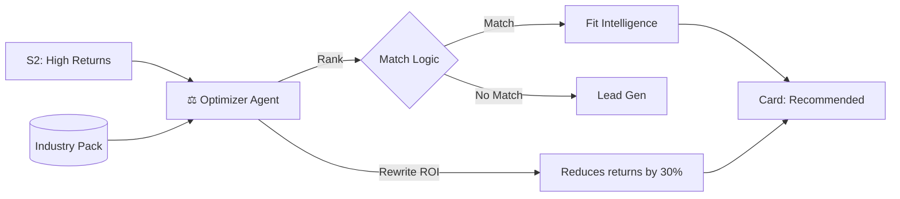

# Wizard Screen 3: System Recommendations

## 1. SCREEN DESCRIPTION
**Purpose:** The "Prescription". To map the user's diagnosed pain points (Screen 2) to specific AI Systems (Solutions).

**Business Goal:** Increase perceived value. We aren't selling "AI"; we are selling "The Cure" for the specific pain they just admitted to.

**Enables Next Screen:** Defines the *scope* of the implementation plan in Screen 5.

---

## 2. INPUTS FROM PREVIOUS SCREEN
*   **Pain Points:** (e.g., "High Returns").
*   **Priorities:** (e.g., "Save Time").
*   **Industry:** (e.g., "Fashion").

---

## 3. 3-PANEL LAYOUT CONTENT

### Left — Context
*   **List:** "Your Priorities" (Summary of S2 answers).
*   **Visual:** Connection lines implying "Problem -> Solution".

### Main — Work
*   **Grid:** 5-6 System Cards.
*   **Badges:**
    *   **"Recommended":** For systems matching S2 Pain Points.
    *   **"High Impact":** For systems matching S2 North Star Priority.
*   **Content:** Dynamic Title, Description, and **Custom ROI**.

### Right — Intelligence
*   **ROI Calculator:** "By fixing [Pain Point], you reclaim [X] hours/revenue."
*   **Stream:** "Analyzing stack synergy..." -> "Recommendation generated."

---

## 4. INDUSTRY STRATEGY
*   **Naming:** The *same* system has different names per industry.
    *   *Generic:* "Lead Gen Bot".
    *   *Real Estate:* "WhatsApp Concierge".
    *   *Fashion:* "VIP Drop Waitlist".
*   **Logic:** Uses `IndustryPack.systemNames` for labeling.

---

## 5. GEMINI 3 FEATURES & TOOLS USED

| Feature | Why? |
| :--- | :--- |
| **Gemini 3 Pro** | To reason about *ranking*. "Which 3 systems are most critical?" |
| **Text Generation** | To rewrite the "ROI Text" specifically for this user's context. |
| **Structured Output** | To return `{ system_id, recommended, custom_roi }` JSON. |

---

## 6. AI AGENTS INVOLVED

### **⚖️ Optimizer Agent**
*   **Trigger:** Screen Mount.
*   **Input:** Industry, Pain Points, Services.
*   **Output:** Ranked List + Custom Text.
*   **Storage:** `project_systems` (Selected IDs).

---

## 7. WORKFLOWS & AUTOMATIONS

1.  **Ingest:** Optimizer reads S2 Answers.
2.  **Rank:** Scores each system (1-10) based on relevance to pain points.
3.  **Customize:** Rewrites the generic description to match the user's industry language.
4.  **Present:** UI shows cards; User selects max 3.
5.  **Persist:** Saves selection to `project_systems`.

---

## 8. USER JOURNEY
*   **Entry:** "Analyze Pains" clicked.
*   **View:** See 2 systems marked "Recommended".
*   **Read:** "This system solves your High Return Rate."
*   **Action:** Selects the 2 recommended + 1 extra.
*   **Exit:** Click "Check Readiness".

---

## 9. DATA, SCHEMA & WIRING
*   **Table:** `project_systems` (junction table).
*   **Edge Function:** `optimizer`.
*   **Wiring:** `wizard_answers` -> `Optimizer` -> `UI`.

---

## 10. MERMAID DIAGRAM

---

## 11. IMPROVEMENT PROMPTS

### Prompt 1 — Contextual ROI Rewriting
**Goal:** The ROI text on the card must talk to the user's specific pain.
**Why:** Generic ROI ("Saves time") is weak. Specific ROI ("Reduces sizing queries by 50%") converts.
**Change:** Update `supabase/functions/optimizer/index.ts`.
**Criteria:**
1.  Prompt: "For each recommended system, write a 1-sentence ROI projection based on the user's specific pain point: [User Pain]."
2.  Replace the static string from the Industry Pack with this dynamic string.

### Prompt 2 — Ranking Logic
**Goal:** Ensure the "Recommended" badge logic is sound.
**Why:** If we recommend random things, we lose trust.
**Change:** Update `optimizer` agent.
**Criteria:**
1.  Input `priority_weight` from Step 2 answers.
2.  Logic: If a system maps to a "Critical" pain point, it MUST be recommended.
3.  Constraint: Recommend max 3 systems.
