# Wizard Screen 4: Strategic Summary (Executive Brief)

## 1. SCREEN DESCRIPTION
**Purpose:** The "Pivot". To validate the user's choices and assess their *readiness* to execute. It transforms from a "Checklist" (Old S4) to a "Strategic Brief" (New S4).

**Business Goal:** Close the "Sales Gap". Validate that the selected solution matches the problem, and provide an honest assessment of their infrastructure.

**Enables Next Screen:** Provides the constraints (Gaps/Risks) used to generate the Timeline in Screen 5.

---

## 2. INPUTS FROM PREVIOUS SCREEN
*   **Solution Stack:** (Selected Systems from S3).
*   **Infrastructure:** (Service List from S1).
*   **Pain Points:** (from S2).

---

## 3. 3-PANEL LAYOUT CONTENT

### Left — The Brief
*   **Profile:** Business Name, Industry, Model.
*   **Mission:** "Goal: [Primary Focus]".
*   **Stack:** Icons of selected systems.

### Main — Strategic Analysis
*   **Pulse:** Large Radial Score (Readiness).
*   **Narrative:** 2 paragraphs generated by AI explaining *why* this stack works for them.
*   **Impact Scorecard:** Bar charts showing projected gains (Efficiency, Speed, Revenue).
*   **CTA:** "Reveal Execution Roadmap".

### Right — The Consultant
*   **Logic Stream:** "Calculating readiness..."
*   **Reasoning:** "Why 78/100? Your data is strong, but lack of API access creates a risk."
*   **Quick Wins:** "Verify Meta Business Account (1hr)."

---

## 4. INDUSTRY STRATEGY
*   **Analysis:** The "Narrative" uses industry-specific tone (e.g., "Guest Experience" for Tourism vs "Lead Velocity" for Real Estate).
*   **Scoring:** Weighted differently. Data is more critical for Fashion (Returns) than for Events.

---

## 5. GEMINI 3 FEATURES & TOOLS USED

| Feature | Why? |
| :--- | :--- |
| **Code Execution** | **CRITICAL.** To calculate the Readiness Score and Impact % mathematically. LLMs cannot add; Python can. |
| **Gemini 3 Pro** | Required for writing the persuasive "Strategic Narrative". Flash is too robotic. |
| **Thinking Mode** | To reason through dependencies: "If System A needs Data, and user has no Data, Score must drop." |

---

## 6. AI AGENTS INVOLVED

### **💯 Scorer Agent** (Internal Logic)
*   **Role:** The Auditor.
*   **Input:** Checklist, Systems.
*   **Output:** Score (0-100), Risks[].

### **📝 Summary Agent** (Narrative Writer)
*   **Role:** The Partner.
*   **Input:** Full Context + Score.
*   **Output:** Headline, Narrative, Impact Metrics.
*   **Storage:** `context_snapshots` (The Brief).

---

## 7. WORKFLOWS & AUTOMATIONS

1.  **Audit:** Scorer agent runs Python script to calculate weighted readiness.
2.  **Draft:** Summary agent takes the score + context and writes the narrative.
3.  **Project:** Agent estimates "Impact" (Before/After metrics).
4.  **Render:** UI displays the Brief.
5.  **Persist:** Saves the snapshot to DB.

---

## 8. USER JOURNEY
*   **Entry:** "Next: Readiness".
*   **Wait:** "Synthesizing Strategy..." (Skeleton UI).
*   **Review:** Reads the Brief. "They get me."
*   **Action:** "Reveal Roadmap".

---

## 9. DATA, SCHEMA & WIRING
*   **Table:** `context_snapshots` (stores `readiness_score`, `narrative`, `risks`).
*   **Edge Function:** `summary` (calls `scorer` internally).

---

## 10. MERMAID DIAGRAM

```mermaid
sequenceDiagram
    participant User
    participant UI
    participant Summary as 📝 Summary Agent
    participant Scorer as 💯 Scorer (Code Exec)
    
    User->>UI: Submit Systems
    UI->>Summary: Invoke(Context)
    
    rect rgb(240, 248, 255)
        note right of Summary: Thinking Mode
        Summary->>Scorer: Request Audit
        Scorer->>Scorer: Execute Python Math
        Scorer-->>Summary: Score: 78
        Summary->>Summary: Draft Narrative
    end
    
    Summary-->>UI: JSON { score, narrative, impact }
    UI->>User: Display Executive Brief
```

---

## 11. IMPROVEMENT PROMPTS

### Prompt 1 — Python Scoring Logic
**Goal:** Move scoring from "Vibes" to "Math".
**Why:** Reliability. The score shouldn't change if I refresh.
**Change:** Update `supabase/functions/scorer/index.ts`.
**Criteria:**
1.  Enable `codeExecution` tool.
2.  Prompt: "Write a Python script to calculate readiness. Inputs: Checklist (Bool array), Industry Weights (Dict). Output: Integer."
3.  Pass this Integer to the Summary Agent.

### Prompt 2 — Persuasive Narrative
**Goal:** Make the text sound like a $500/hr consultant.
**Change:** Update `supabase/functions/summary/index.ts`.
**Criteria:**
1.  Use `gemini-3-pro-preview`.
2.  System Prompt: "You are a Senior Strategic Partner. Write a 2-paragraph executive summary. Paragraph 1: Diagnosis. Paragraph 2: Strategy. Use specific data points from the user's input."
