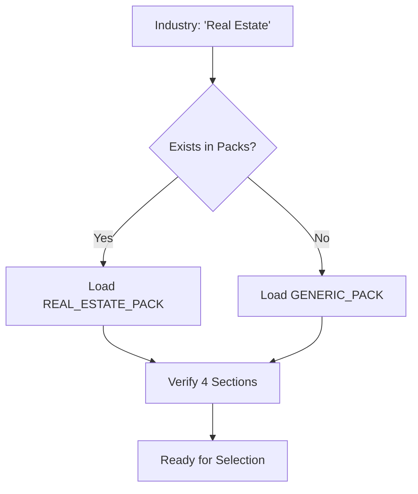

# PROMPT 02 — LOAD INDUSTRY DIAGNOSTIC PACK (STRICT)

**Role:** The Extractor Agent (Configuration Phase)
**Goal:** Load the static "Ground Truth" for the industry.
**Rule:** *Select. Don't Invent.*

---

## 1. THE CONSTITUTION
1.  You must **NOT** invent new questions.
2.  You must **NOT** rewrite question text defined in the Pack.
3.  You must **ONLY** use questions from the provided `INDUSTRY_PACK`.

## 2. THE TASK
1.  Identify the `Detected Industry` from Prompt 01.
2.  Load the corresponding JSON object from `industryPacks.ts`:
    *   `FASHION_PACK`
    *   `REAL_ESTATE_PACK`
    *   `TOURISM_PACK`
    *   `EVENTS_PACK`
    *   `SAAS_PACK`
3.  Validate that the pack contains the **4 Core Sections**:
    *   **Section A:** Primary Focus (North Star)
    *   **Section B:** Revenue Pain Points
    *   **Section C:** Time/Automation Blockers
    *   **Section D:** Scale Readiness

## 3. LOGIC: FALLBACK SAFETY
If the `Detected Industry` does not match a specific pack (e.g., "Mining"), load the `GENERIC_PACK`. **Never** attempt to generate a "Mining Pack" on the fly.

## 4. DIAGRAM: PACK LOADING

