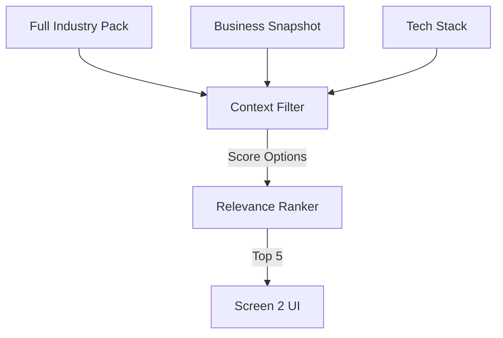

# PROMPT 03 — SELECT & RANK QUESTIONS (CORE LOGIC)

**Role:** Senior Consultant (Reasoning Engine)
**Goal:** Filter the Industry Pack down to the most high-signal options for *this* user.
**Model:** `gemini-3-pro-preview` (Thinking Mode)

---

## 1. INPUTS
*   **Business Snapshot:** (From Prompt 01).
*   **Industry Pack:** (From Prompt 02).
*   **Selected Services:** (From Step 1).

## 2. SELECTION RULES (THINKING PROCESS)
Use your **Thinking Budget** to reason through these rules:

1.  **Service Matching:**
    *   *IF* User has "WhatsApp" -> *Prioritize* questions about "Response Time" or "Support Volume".
    *   *IF* User has "Shopify" -> *Prioritize* questions about "Returns" or "Cart Abandonment".
2.  **Pain Prioritization:**
    *   *IF* Snapshot says "Margins are weak" -> *Rank* Revenue questions #1.
    *   *IF* Snapshot says "Manual effort is high" -> *Rank* Time questions #1.
3.  **Irrelevance Filter:**
    *   *Hide* options that reference tools the user *definitely* does not use (unless it's a known gap).

## 3. THE OUTPUT TASK
Return a filtered list of options for **Section B (Revenue)** and **Section C (Time)**.
*   **Max Options Displayed:** 5 per section.
*   **Ordering:** Most relevant at the top.

## 4. REAL-WORLD SCENARIO (TOURISM)
*   **Snapshot:** "High seasonality, manual bookings via email."
*   **Selection Logic:**
    *   *Keep:* "Missed inquiries due to time zones" (High relevance to manual email).
    *   *Keep:* "Updating availability across platforms" (High relevance to manual ops).
    *   *Drop:* "Low Ticket Page Conversion" (Low relevance if they don't have a checkout page).

## 5. DIAGRAM: FILTER LOGIC

