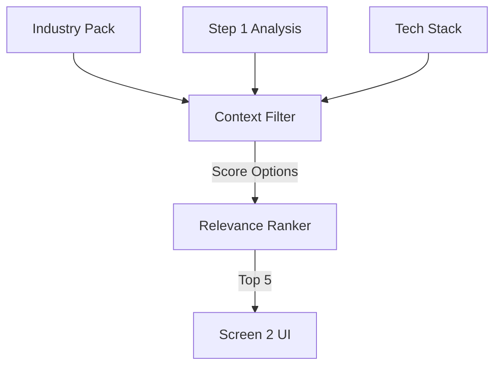

# PROMPT 03 — SELECT & RANK QUESTIONS (CORE LOGIC)

**Role:** Senior Consultant (Reasoning Engine)
**Goal:** Filter the Industry Pack down to the most high-signal options using FULL context.
**Model:** `gemini-3-pro-preview` (Thinking Mode)

---

## 1. INPUTS (UPDATED)
The Extractor Agent must receive:
1.  **Industry:** (e.g., "Fashion")
2.  **Selected Services:** (e.g., "Shopify")
3.  **Business Analysis:** (The object from Prompt 01, containing `maturity_score` and `observations`).

## 2. SELECTION LOGIC (Filter vs Generate)
**Clarification:** We are **Selecting** from the Industry Pack templates, but **Tailoring** the phrasing based on context.

**Rules:**
1.  **Maturity Check:**
    *   *IF* `maturity_score` < 3: Select questions about "Foundations" (e.g., "Do you have a CRM?").
    *   *IF* `maturity_score` >= 3: Select questions about "Optimization" (e.g., "Is your CAC too high?").
2.  **Service Matching:**
    *   *IF* `services` includes "WhatsApp" -> **Prioritize** the "Response Time" question from the pack.
    *   *IF* `services` includes "Shopify" -> **Prioritize** the "Returns/Cart" question.
3.  **Limit Options:**
    *   **MAX 5 OPTIONS** per question. Do not overwhelm the user.

## 3. THE OUTPUT TASK
Return a `DiagnosticSchema` JSON where:
*   Questions are sorted by relevance.
*   Options are filtered to match the user's Tech Stack.
*   **Validation:** Ensure every option has a valid `mapped_system_id`.

## 4. REAL-WORLD SCENARIO (TOURISM)
*   **Context:** "High seasonality, manual bookings via email." (From Step 1 Analysis).
*   **Logic:**
    *   *Keep:* "Missed inquiries due to time zones" (High relevance to manual email).
    *   *Drop:* "Low Ticket Page Conversion" (Irrelevant if they don't have a checkout page).

## 5. DIAGRAM: FILTER LOGIC

