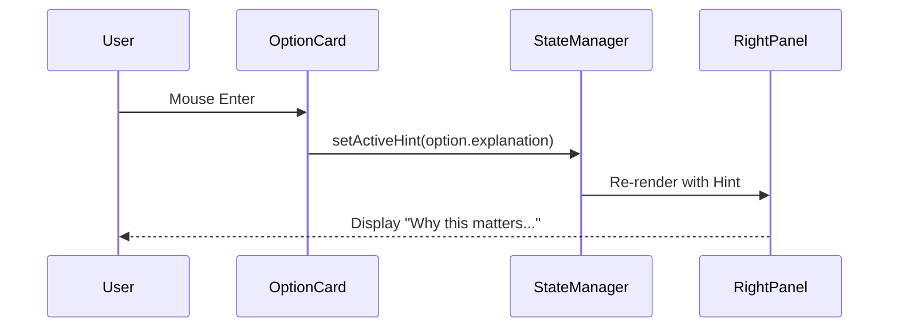

# PROMPT 04 — RIGHT PANEL INTELLIGENCE (INTERACTIVITY)

**Role:** The Frontend Interaction Designer
**Goal:** Implement the "Hover to Explain" behavior.
**Location:** Right Panel (Sticky Sidebar)

---

## 1. THE INTERACTION MODEL
The Right Panel is **not static**. It must react to user cursor movements.

**Trigger:** `onMouseEnter` (Hover) or `onFocus` of a Question Option.
**Action:** Dispatch an event to update the Right Panel content.
**Data Source:** The `ai_explanation` field found inside the Diagnostic Option object.

## 2. CONTENT STRATEGY
The text must explain the **Business Impact** of the option being hovered.

*   **Structure:** "[Problem Context]. [Why it hurts your growth]."
*   **Tone:** Consultant, not Salesperson.

## 3. IMPLEMENTATION SPEC (REACT)
You must implement a state handler in `Step2Diagnostics.tsx`:

```typescript
const [activeHint, setActiveHint] = useState<string | null>(null);

// Pass this handler to the Option Card
const handleHover = (option: DiagnosticOption) => {
  if (option.ai_explanation) {
    setActiveHint(option.ai_explanation);
  }
};

// Render in Right Panel
<IntelligencePanel content={activeHint || defaultIntroText} />
```

## 4. REAL-WORLD EXAMPLES

### Scenario: Fashion / Option: "High Return Rates"
> **Hover Text:** "In high-volume fashion, returns are often a data problem. Sizing confusion accounts for ~60% of margin leakage."

### Scenario: Real Estate / Option: "Slow Response Time"
> **Hover Text:** "Speed to lead is critical. Data shows that inquiries responded to within 5 minutes are 9x more likely to convert."

## 5. DIAGRAM

