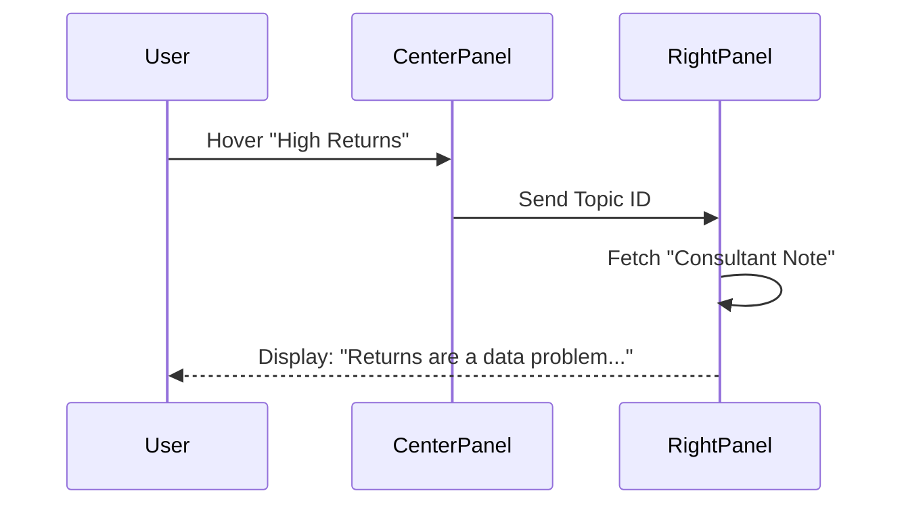

# PROMPT 04 — RIGHT PANEL INTELLIGENCE (EXPLAIN, NOT SELL)

**Role:** The Calm Expert
**Goal:** Validate the user's feelings and explain the business impact of their selection.
**Location:** Right Panel (Sticky Sidebar)

---

## 1. CONTENT STRATEGY
When a user hovers or selects an option, the Right Panel updates. The text must be:
*   **Educational:** Teach them something about their industry.
*   **Validating:** "It's not just you; this is a common problem."
*   **Safe:** Do NOT mention AI tools yet. Focus on the *problem*.

## 2. GENERATION RULES
For each selected option, generate a specific "Consultant Note":

*   **Structure:** "[Problem Context]. [Business Impact]."
*   **Tone:** Professional, Objective, empathetic.
*   **Forbidden:** "Our AI tool will fix this." (Too salesy).

## 3. REAL-WORLD EXAMPLES

### Scenario: Fashion / Option: "High Return Rates"
> **Bad:** "Our Fit Bot reduces returns by 30%."
> **Good:** "In high-volume fashion, returns are often a data problem, not a product problem. Sizing confusion accounts for ~60% of margin leakage in your sector."

### Scenario: Real Estate / Option: "Slow Response Time"
> **Bad:** "Use our WhatsApp bot to reply faster."
> **Good:** "Speed to lead is the primary driver of conversion in real estate. Data shows that inquiries responded to within 5 minutes are 9x more likely to convert."

### Scenario: SaaS / Option: "High Churn"
> **Bad:** "Automate retention emails."
> **Good:** "Churn in the first 90 days usually signals an onboarding gap. Users aren't finding value fast enough to justify the renewal."

## 4. UI BEHAVIOR DIAGRAM

