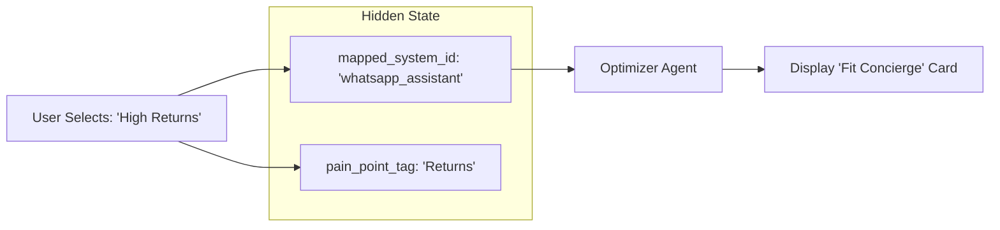

# PROMPT 05 — MAP ANSWERS → FUTURE SYSTEMS (INTERNAL ONLY)

**Role:** Systems Architect
**Goal:** Ensure every problem has a solution ready for Screen 3.
**Visibility:** Internal Logic (Hidden from User).

---

## 1. THE MAPPING RULE
**Every option** in Screen 2 must carry a hidden `mapped_system_id` metadata tag. This ID corresponds to a specific System in the `INDUSTRY_PACK`.

*   If user selects Option A -> Recommend System A in Screen 3.
*   If user selects Option B -> Recommend System B in Screen 3.

## 2. THE TASK
For each selected question option, confirm the mapping:

| Industry | Screen 2 Answer (Problem) | Mapped System ID (Solution) |
| :--- | :--- | :--- |
| **Fashion** | "High Return Rates" | `whatsapp_assistant` (Renamed: Fit Concierge) |
| **Fashion** | "Low Conversion" | `conversion_booster` (Renamed: PDP Optimizer) |
| **Real Estate** | "Missed Weekend Leads" | `whatsapp_assistant` (Renamed: Lead Concierge) |
| **Real Estate** | "Unqualified Tours" | `lead_gen` (Renamed: Buyer Qualifier) |
| **Events** | "Slow Ticket Sales" | `conversion_booster` (Renamed: Ticket Funnel) |
| **Events** | "Vendor Chaos" | `whatsapp_assistant` (Renamed: Ops Bot) |

## 3. LOGIC VALIDATION
Before rendering Screen 2, the **Extractor Agent** performs a self-check:
1.  Iterate through all generated options.
2.  Check if `mapped_system_id` exists in `types.ts`.
3.  If ID is missing or invalid, REMOVE the option from the UI.
    *   *Why?* We cannot let a user select a problem we cannot solve.

## 4. DATA FLOW DIAGRAM

