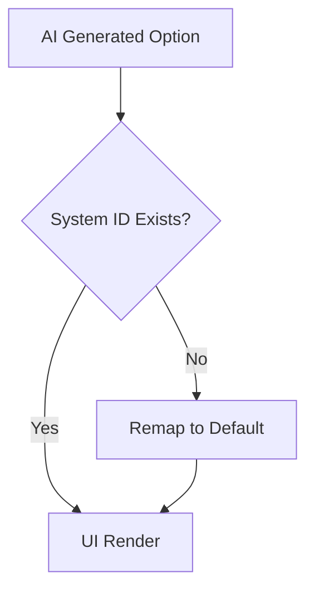

# PROMPT 05 — MAP ANSWERS → FUTURE SYSTEMS (VALIDATION)

**Role:** Systems Architect
**Goal:** Ensure every problem has a valid solution. **Prevent Runtime Crashes.**
**Visibility:** Internal Logic.

---

## 1. THE MAPPING RULE
Every option in Screen 2 must carry a `mapped_system_id`. This ID **MUST** exist in the `SYSTEMS` constant in `types.ts`.

**CRITICAL:** If an ID refers to a system that does not exist, the application will crash on Screen 3.

## 2. VALIDATION LOGIC
The `extractor` Edge Function must perform a final validation pass before returning JSON:

1.  Load the master list of `VALID_SYSTEM_IDS` (e.g., `['lead_gen', 'crm_autopilot', 'whatsapp_assistant', ...]`).
2.  Iterate through all generated options.
3.  **Check:** `if (!VALID_SYSTEM_IDS.includes(option.mapped_system_id))`
4.  **Action:**
    *   *If Invalid:* Remap to a fallback system (e.g., `conversion_booster`) OR remove the option entirely.
    *   *If Valid:* Pass through.

## 3. MAPPING TABLE (REFERENCE)

| Industry | Pain Point | System ID (MUST MATCH `types.ts`) |
| :--- | :--- | :--- |
| **Fashion** | "High Return Rates" | `whatsapp_assistant` |
| **Fashion** | "Low Conversion" | `conversion_booster` |
| **Real Estate** | "Missed Leads" | `whatsapp_assistant` |
| **Real Estate** | "Unqualified Tours" | `lead_gen` |
| **Events** | "Slow Ticket Sales" | `conversion_booster` |

## 4. DATA FLOW

