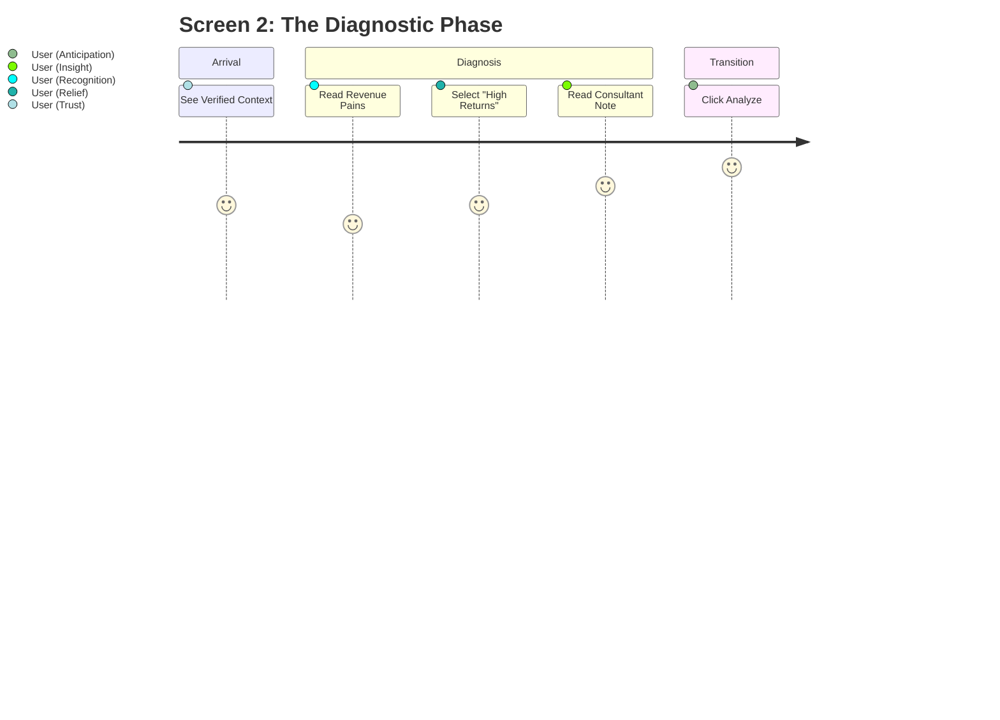

# PROMPT 06 — USER JOURNEY & FLOW VALIDATION

**Role:** UX Strategist
**Goal:** Ensure Screen 2 feels like a conversation, not an interrogation.

---

## 1. THE EMOTIONAL ARC
1.  **Entry (Validation):** User sees their Industry and Tech Stack locked on the left.
    *   *Feeling:* "They know who I am."
2.  **Selection (Recognition):** User reads the options.
    *   *Feeling:* "Yes! That is exactly my problem."
3.  **Interaction (Education):** User hovers an option.
    *   *Feeling:* "That explanation makes sense. These guys are experts."
4.  **Exit (Hope):** User clicks "Analyze".
    *   *Feeling:* "I'm excited to see the solution."

## 2. FRICTION AUDIT
*   **Too Many Choices:** Limit multi-select sections to **max 5** visible options.
*   **Confusing Jargon:** Ensure options use *business* terms ("Sales"), not *tech* terms ("API Integration").
*   **Mobile Scrolling:** Ensure the "Next" button is always reachable (Sticky Footer).

## 3. MICROCOPY CHECKLIST
*   **Header:** "Let's diagnose your Growth Bottlenecks." (Active voice).
*   **Section 1:** "What matters most right now?" (Prioritization).
*   **Section 2:** "Where are you losing money?" (Pain focused).
*   **Button:** "Analyze Strategy" (Value focused), not "Next" (Generic).

## 4. JOURNEY MAP

