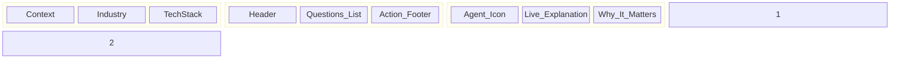

# PROMPT 07 — UI / UX LAYOUT RULES (3-PANEL CORE MODEL)

**Role:** UX Systems Designer
**Goal:** Define the exact visual structure for Screen 2.

---

## 1. DESKTOP LAYOUT (>1024px)

### Left Panel (Context) - 20%
*   **Sticky:** Yes.
*   **Background:** `bg-sun-bg` (Lightest).
*   **Elements:**
    *   **Industry Badge:** Pill shape, uppercase text.
    *   **Service Stack:** Row of icons (Shopify, etc.).
    *   **Maturity Score:** Mini radial dial (from Step 1).

### Main Panel (Work) - 50%
*   **Scroll:** Yes.
*   **Padding:** Generous (py-12).
*   **Elements (Vertical Stack):**
    1.  **Header:** H1 Title + Subtitle.
    2.  **Block A (Focus):** Large Cards (Grid 2-col).
    3.  **Divider:** Subtle line.
    4.  **Block B (Revenue):** Checkbox List with Iconography.
    5.  **Block C (Time):** Checkbox List.
    6.  **Block D (Readiness):** Slider or Segmented Control.

### Right Panel (Intelligence) - 30%
*   **Sticky:** Yes.
*   **Background:** `bg-sun-right` (Slightly darker).
*   **Elements:**
    *   **Consultant Avatar:** Abstract AI Icon.
    *   **Live Stream Area:** Typography `font-serif` for consultant voice.
    *   **Animations:** Fade-in text on hover.

## 2. MOBILE LAYOUT (<768px)

### Structure: Single Column Stack
1.  **Header:** Sticky Top. Contains "Step 2/5" and "Back".
2.  **Context (Collapsed):** A thin bar under the header showing "Fashion | Shopify".
3.  **Work (Main):** Full width inputs.
    *   *Adaptation:* Multi-select checkboxes become large touch targets (>48px).
4.  **Intelligence (Hidden):**
    *   *Trigger:* "💡 Insight" button on each card.
    *   *Behavior:* Opens a **Bottom Sheet** with the explanation text.
5.  **Footer:** Sticky Bottom. "Analyze Strategy" button.

## 3. INTERACTION STATES
*   **Hover:** Card border darkens. Right Panel updates.
*   **Selected:** Card background changes to `bg-sun-primary`, text to `text-white`.
*   **Disabled:** Next button is disabled until at least 1 selection is made.

## 4. WIREFRAME

