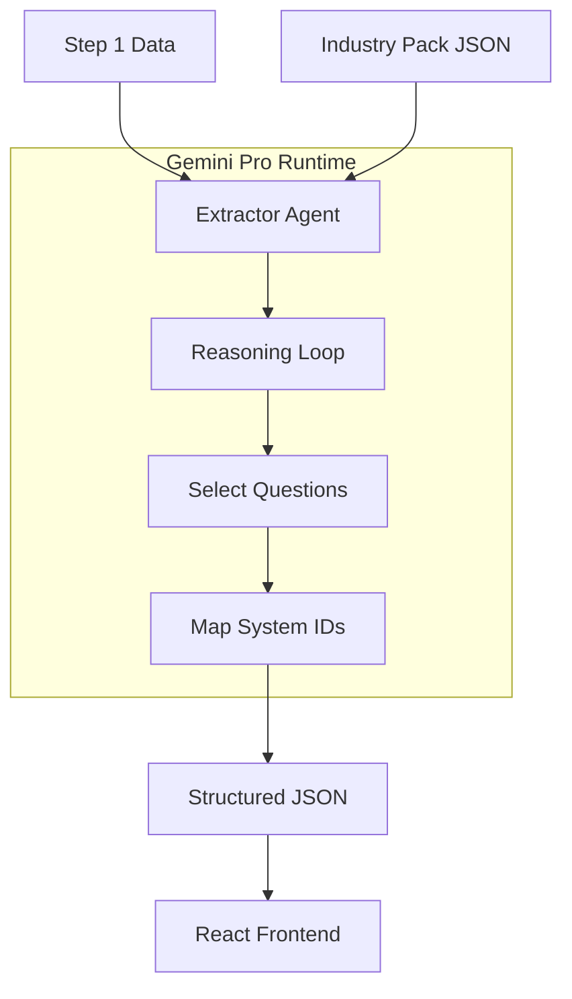

# PROMPT 08 — AI AGENTS & GEMINI 3 FEATURES USED

**Role:** AI Systems Planner
**Goal:** Define the technical AI implementation for Screen 2.

---

## 1. AGENT ROSTER

### 🔬 **Extractor Agent** (Primary)
*   **Model:** `gemini-3-pro-preview`.
*   **Role:** The Consultant.
*   **Responsibility:** Generates the dynamic form structure based on context.
*   **Trigger:** Component Mount (or pre-fetch on Step 1 completion).

### 🕵️ **Analyst Agent** (Background)
*   **Model:** `gemini-3-flash-preview`.
*   **Role:** The Researcher.
*   **Responsibility:** Continues to verify business details (e.g., "Do they have a cart page?") to inform the Extractor.

---

## 2. GEMINI 3 FEATURES

### A. Gemini Thinking (Reasoning)
*   **Why?** To make the "Pain" -> "System" connection logical, not random.
*   **Usage:**
    *   *Input:* "User uses Shopify."
    *   *Thought:* "Shopify users often struggle with Returns."
    *   *Output:* "Generate question about Return Rates."
*   **Budget:** `2048` tokens (Medium depth).

### B. Structured Outputs (Reliability)
*   **Why?** The UI breaks if the AI returns messy text.
*   **Usage:** Enforce `DiagnosticSchema` JSON.
    *   Must return array of `sections`.
    *   Must return `mapped_system_id` string.

### C. Search Grounding (Relevance)
*   **Why?** To ensure questions fit the *current* market.
*   **Usage:** Check industry trends. (e.g., "Is UGC a trend in Fashion right now?" -> Yes -> Include UGC question).

---

## 3. SAFETY & BOUNDARIES
*   **No Function Calling:** Screen 2 does NOT take actions (no emails sent, no DB updates). It is purely data collection.
*   **No PII:** Do not ask for sensitive financial data (exact revenue) yet.
*   **Constraint:** The Agent is forbidden from generating options that do not map to a `SystemID`.

## 4. AGENT ARCHITECTURE

