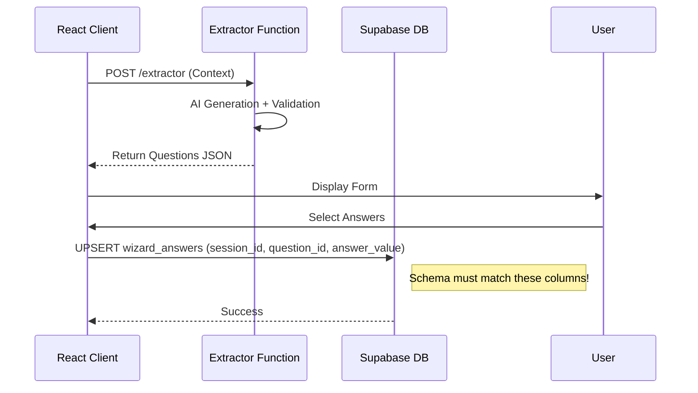

# PROMPT 09 — SUPABASE & EDGE FUNCTIONS IMPACT (SCHEMA FIX)

**Role:** Backend Architect
**Goal:** Define the server-side logic and ensure DB schema alignment.

---

## 1. EDGE FUNCTIONS

### `extractor` (The Core Function)
*   **Endpoint:** `/functions/v1/extractor`
*   **Method:** POST
*   **Input Body:**
    ```typescript
    {
      industry: string;
      selectedServices: string[];
      docInsights?: string;
      analysisContext?: any; // The Snapshot from Step 1
    }
    ```
*   **Logic:**
    1.  **Import:** Load `INDUSTRY_PACKS`.
    2.  **Prompt:** Use Prompt 03 rules.
    3.  **Validate:** Ensure `mapped_system_id`s are valid.
    4.  **Return:** JSON `DiagnosticResponse`.

---

## 2. DATABASE SCHEMA (CRITICAL FIX)

**Current Status:** There is a mismatch between code (`question_id`, `answer_value`) and some DB definitions.
**Required Schema:** The code **MUST** write to the `wizard_answers` table using the following structure.

### Table: `wizard_answers`
**Policy:** Upsert on `(session_id, question_id)`.

| Column | Type | Description |
| :--- | :--- | :--- |
| `id` | uuid | Primary Key |
| `session_id` | uuid | FK to `wizard_sessions` |
| `question_id` | text | **FIX:** Ensure this column exists. (e.g. "fashion_revenue_pain") |
| `answer_value` | jsonb | **FIX:** Ensure this column exists. Stores array of selected strings. |
| `metadata` | jsonb | Stores `mapped_system_id` and `priority_weight` |
| `updated_at` | timestamp | |

**Migration Requirement:**
If the database currently uses `screen_id` or `data`, **YOU MUST RUN A MIGRATION** to rename/add columns to match the code's expectation of `question_id` and `answer_value`. Do not change the code to match a broken schema; fix the schema to match the logical domain model.

---

## 3. WIRING DIAGRAM

